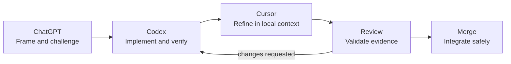

# Development Workflow

The project uses a human-governed workflow in which conversational design, repository execution, local refinement, and peer review have distinct responsibilities.

Tools assist the workflow; accountable humans own scope, architecture approval, review, and merge.

## 1. ChatGPT — frame the work

ChatGPT is used for discovery and design dialogue before repository mutation.

**Responsible for**

- clarifying the problem, user, decision, and non-goals;
- testing the proposal against product positioning and research-first principles;
- identifying the bounded context, lifecycle impact, and evidence needs;
- drafting acceptance criteria, risks, alternatives, and ADR candidates; and
- turning ambiguous requests into a reviewable brief.

**Not responsible for**

- declaring unverified repository facts;
- silently changing frozen architecture;
- approving its own proposal; or
- making governance or investment decisions.

**Output:** a scoped issue, architecture question, or change brief with acceptance criteria.

## 2. Codex — execute in the repository

Codex works against the actual worktree and carries the brief through implementation and verification.

**Responsible for**

- inspecting current files, history, tooling, and local changes;
- preserving unrelated work and following repository rules;
- implementing the smallest complete vertical slice;
- updating tests, documentation, and ADRs together;
- running proportionate checks and reporting exact results; and
- handing off changed files, risks, assumptions, and follow-ups.

**Not responsible for**

- expanding scope without authority;
- bypassing architecture for speed;
- inventing successful test results; or
- committing, pushing, deploying, or merging unless explicitly requested.

**Output:** a reviewable worktree change with verification evidence.

## 3. Cursor — refine with interactive context

Cursor supports focused local iteration using the versioned rules in `.cursor/rules/`.

**Responsible for**

- navigating and explaining nearby code during hands-on development;
- applying small follow-up edits inside the approved scope;
- keeping naming, UI, backend, testing, and documentation conventions visible; and
- helping a developer inspect diagnostics and review diffs.

**Not responsible for**

- treating generated code as inherently correct;
- creating parallel architectural conventions; or
- overriding the Project Bible, ADRs, or review feedback.

**Output:** locally refined code or documentation that still passes the same checks.

## 4. Review — validate the change

Review is an evidence-based engineering gate, not a style ceremony.

**Responsible for**

- confirming the problem and acceptance criteria are satisfied;
- checking domain ownership, invariants, dependency direction, data provenance, and AI guardrails;
- assessing tests, security, accessibility, operations, migration, and rollback;
- distinguishing blocking findings from optional improvements; and
- requiring architecture review when a frozen or accepted decision changes.

**Output:** approval or actionable, prioritized findings.

## 5. Merge — integrate safely

Merge occurs only after required reviews and automated checks pass.

**Responsible for**

- confirming the branch is current and the diff contains no unrelated or sensitive files;
- using the repository’s merge policy and preserving understandable history;
- recording release or migration notes where needed; and
- monitoring the result when the change affects an operated system.

**Output:** a traceable change on the protected branch.

## Handoff contract

Every stage passes forward:

| Field | Required content |
|---|---|
| Objective | one sentence describing the outcome |
| Scope | files, bounded context, and explicit non-goals |
| Authority | Project Bible chapter and ADRs used |
| Acceptance | observable conditions of success |
| Evidence | tests, builds, screenshots, or document validation |
| Risk | known uncertainty, migration, compatibility, or rollback concern |
| Decision needed | any unresolved human choice |

## Change classes

| Class | Examples | Minimum review |
|---|---|---|
| Documentation | wording, links, diagrams with no decision change | documentation owner |
| Local implementation | refactor or defect within accepted boundaries | code owner |
| Domain behavior | invariant, transition, policy, event | domain + code owner |
| Architecture | context, aggregate, dependency, topology, provider class | ADR + architecture owner |
| High risk | auth, sensitive data, governance authority, deployment | architecture + security/operations owners |

## Failure rules

- If repository reality conflicts with the brief, stop and surface the evidence.
- If a test cannot run, report the exact blocker; do not convert “not run” to “passed.”
- If a tool produces a broad or opaque change, inspect and narrow it before review.
- If AI output is used in a durable research artifact, preserve provenance and require the designated human review.

