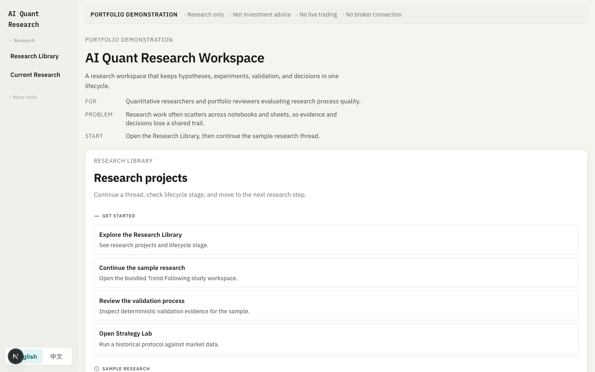

# AI Quant Research Workspace

**A research operating system for turning quantitative hypotheses into reproducible evidence, robustness review, controlled paper observation, and governed decisions.**

Research and portfolio demonstration only. Not investment advice. No broker integration. No live execution.

[Product](docs/PRODUCT.md) · [Workflow](docs/RESEARCH_WORKFLOW.md) · [Authenticity](docs/AUTHENTICITY.md) · [Demo script](docs/DEMO_SCRIPT.md) · [Stable demo modes](docs/DEMO_MODE.md) · [Project story](docs/PROJECT_STORY.md) · [Architecture](docs/ARCHITECTURE.md) · [Contributing](CONTRIBUTING.md)

> **Research First. AI Second. Decisions Last.**



## Why this exists

Quantitative research often fails when hypotheses, experiments, validation, and decisions live in disconnected tools. This workspace keeps one visible lifecycle:

```text
Research
→ Experiment
→ Validation
→ Robustness
→ Paper Trading
→ Decision
→ Archive
```

Unlike a backtest dashboard, the product is organised around research process integrity: deterministic validation, honest empty states, and governed next steps — not charts alone.

## What is implemented

| Surface | Status |
| --- | --- |
| Research Library | Implemented — homepage entry for research projects |
| Research Workspace | Implemented — lifecycle tabs for one research thread |
| Experiment | Implemented — historical execution for the canonical MA study |
| Validation | Implemented — deterministic OOS, sensitivity, cost, data-quality evidence |
| Robustness Center | Implemented — organises completed / pending / planned / blocked checks |
| Paper Trading (Research Deployment) | Implemented — observation staging and readiness; empty when no real session |
| Decision Center | Implemented — approval staging from existing evidence |
| Risk Review | Implemented — five-level risk assessment from backtest metrics; deterministic and explainable (`component_levels` + `risk_reasons`) |
| Compare Models | Implemented — rule strategies vs XGBoost/LightGBM and other ML models on the same out-of-sample window with leakage controls; compares Return / Sharpe / Drawdown / Turnover / Cost, plus feature importance and directional accuracy |
| Archive | Implemented as a lifecycle stage — durable archive workflows remain limited |

**Secondary / legacy tools** (reachable, not the product spine): Strategy Lab, Markets, Compare (rules-only), Data Center, Saved Runs, and older demo routes.

**Planned / not implemented:** full stress and regime engines, broker connectivity, production OMS, autonomous trading, cross-browser durable research definitions without browser-local storage.

Details: [docs/ROADMAP.md](docs/ROADMAP.md).

## Demo journey

Canonical executable experiment: **Trend Following Study** (`ma-crossover-spy`) — SPY MA20/MA60 vs buy-and-hold.

```text
Research Library
→ Open Trend Following Study
→ Review Experiment
→ Inspect Validation Evidence
→ Review Robustness
→ Inspect Paper Trading Readiness
→ Review Decision
→ Archive
```

Backend evidence for the sample flows through:

- `POST /api/v1/research/execution`
- `POST /api/v1/research/validation`
- `POST /api/v1/research/evaluation` (summarises validation only; not a lifecycle stage)
- `POST /api/v1/research/copilot/query` (optional evidence-grounded explanation; supporting tool)

Keep one browser session and wake the Render service before demos if using the free tier.

The frontend includes a cold-start readiness gate: concurrent API calls share one backend wakeup, remain in a startup state for a bounded period, and continue automatically after `/health` succeeds. The scheduled GitHub warmup is an optimization, not the only recovery mechanism.

For interviews where the backend may be cold or unavailable, use the documented [frontend-safe walkthrough](docs/DEMO_MODE.md). It demonstrates the product structure and honest evidence boundaries without inventing calculated output.

## Authenticity

- No fabricated PnL
- No fake trades
- No fake confidence scores
- No fake paper-trading sessions
- Calculated metrics come from backend responses only
- Unimplemented capabilities stay Planned or Not Started — never implied complete

Policy: [docs/AUTHENTICITY.md](docs/AUTHENTICITY.md) · [docs/data/AUTHENTICITY_POLICY.md](docs/data/AUTHENTICITY_POLICY.md)

## Screenshots

Captured from the live local workspace using `ma-crossover-spy` — not mocked or edited.

| Screen | What it shows |
| --- | --- |
|  | Research Workspace overview — question, lifecycle progress, next action |
|  | Validation evidence from backend checks (OOS, sensitivity, provenance) |
|  | Robustness Center — completed / pending / planned / blocked organisation |
|  | Paper Trading research deployment — observation staging, no fake session |
|  | Decision Center — approval staging from existing evidence |

Walkthrough: [docs/DEMO_SCRIPT.md](docs/DEMO_SCRIPT.md). Narrative: [docs/PROJECT_STORY.md](docs/PROJECT_STORY.md).

## Current architecture

```text
Browser (Next.js on Vercel)
  → FastAPI (Render)
    → Market data (Yahoo / AkShare)
    → Deterministic backtesting and validation
    → Optional evidence-grounded LLM explanation (backend secrets only)
    → Optional Supabase Postgres for durable legacy experiment records
```

| Layer | Technology |
| --- | --- |
| Frontend | Next.js 15, React 19, TypeScript |
| Backend | FastAPI, Pydantic, pandas |
| Tests | Vitest (frontend), pytest (backend) |
| Deploy | Vercel + Render |

Portfolio overview: [docs/ARCHITECTURE.md](docs/ARCHITECTURE.md) · [docs/TECH_STACK.md](docs/TECH_STACK.md) · [docs/API.md](docs/API.md)

## Current limitations

- Research definitions may use browser-local persistence (`localStorage`); another browser will not see them
- Paper Trading is a research observation interface, not live execution
- No broker connection and no production OMS
- Some robustness methods remain Planned
- Validation run state may be process-local on Render; a restart can invalidate in-memory run ids
- Copilot requires backend `LLM_*` configuration; without it the route fails honestly

## Getting started

### Prerequisites

- Python 3.9+
- Node.js 18+ and npm

### Backend

```bash
cd backend
python3 -m venv .venv
source .venv/bin/activate
pip install -r requirements.txt -r requirements-dev.txt
cp .env.example .env
uvicorn app.main:app --reload --port 8000
```

### Frontend

```bash
cd frontend
npm ci
cp .env.example .env.local
npm run dev
```

Open [http://localhost:3000](http://localhost:3000). API docs: [http://127.0.0.1:8000/docs](http://127.0.0.1:8000/docs).

### Checks

```bash
cd backend && source .venv/bin/activate && PYTHONPATH=. python -m pytest tests -m "not live" -q
cd frontend && npm test && npx tsc --noEmit && npm run build
```

CI: [`.github/workflows/ci.yml`](.github/workflows/ci.yml). Live provider checks are optional and manual — [docs/deployment/LIVE_DATA_VERIFICATION.md](docs/deployment/LIVE_DATA_VERIFICATION.md).

More detail: [docs/DEVELOPMENT.md](docs/DEVELOPMENT.md) · [docs/DEPLOYMENT.md](docs/DEPLOYMENT.md).

## Environment (summary)

| Variable | Scope | Purpose |
| --- | --- | --- |
| `NEXT_PUBLIC_API_BASE_URL` | frontend | Production backend URL (local default `http://127.0.0.1:8000`) |
| `ALLOWED_ORIGINS` | backend | CORS origins |
| `SUPABASE_DB_URL` | backend | Optional Postgres |
| `LLM_PROVIDER` / `LLM_API_KEY` / `LLM_BASE_URL` / `COPILOT_MODEL` | backend | Copilot only; never `NEXT_PUBLIC_*` |

Use checked-in `.env.example` files. Never commit secrets. Production API wiring: [docs/deployment/PRODUCTION_API_WIRING.md](docs/deployment/PRODUCTION_API_WIRING.md).

## Repository map

```text
.
├── frontend/                 # Next.js workspace
├── backend/                  # FastAPI demonstrable runtime
├── apps/api/                 # target modular API reference (not the live path)
├── docs/                     # product, workflow, authenticity, architecture, slices, ADRs
├── CONTRIBUTING.md
├── ROADMAP.md
└── PROJECT_STRUCTURE.md
```

## Architecture migration (deeper context)

Longer-term design uses a modular monolith, DDD, Clean Architecture, and vertical slices. Frozen authority lives in the [Project Bible](docs/PROJECT_BIBLE.md) and [Architecture Bible](docs/Architecture-Bible/). The `apps/api/` tree is an early reference for that shape; `backend/` + `frontend/` remain the demonstrable runtime.

Migration notes: [MIGRATION_REPORT.md](MIGRATION_REPORT.md) · [PROJECT_STRUCTURE.md](PROJECT_STRUCTURE.md) · [ROADMAP.md](ROADMAP.md) · [docs/ROADMAP.md](docs/ROADMAP.md).

## Contributing and governance

- [CONTRIBUTING.md](CONTRIBUTING.md)
- [DEVELOPMENT_WORKFLOW.md](DEVELOPMENT_WORKFLOW.md)
- [CODE_OF_CONDUCT.md](CODE_OF_CONDUCT.md)
- [SECURITY.md](SECURITY.md)
- [CHANGELOG.md](CHANGELOG.md)
- [docs/adr/](docs/adr/)

## Responsible use

This software supports research demonstration and paper observation staging. It is not financial advice, does not guarantee results, and is not designed for live order execution. Historical results can differ from real outcomes.

## License

[MIT License](LICENSE). Copyright (c) 2026 Joseph Wang.
