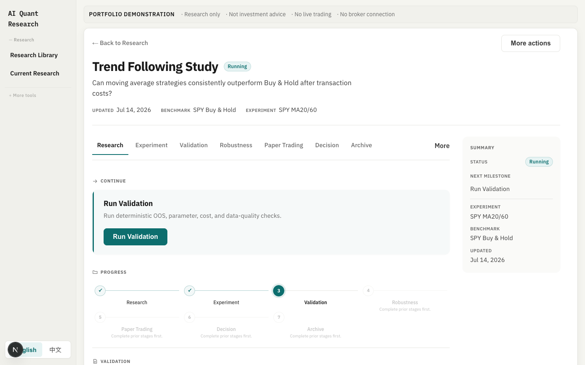
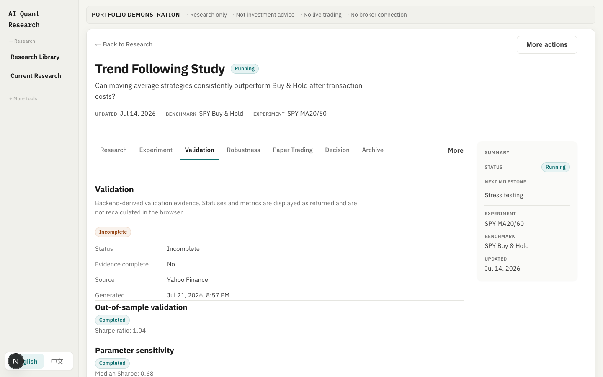
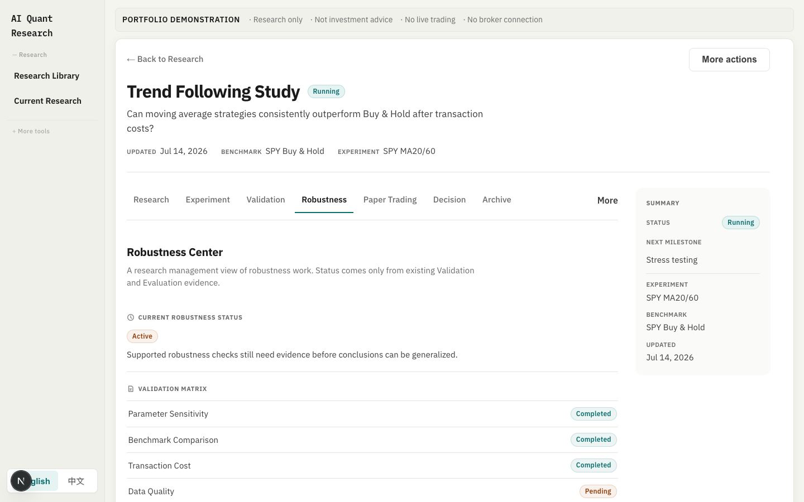
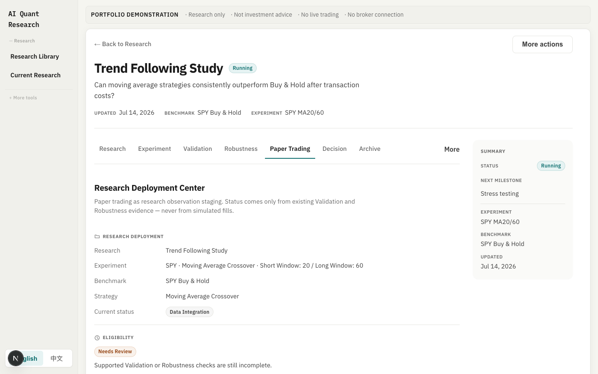
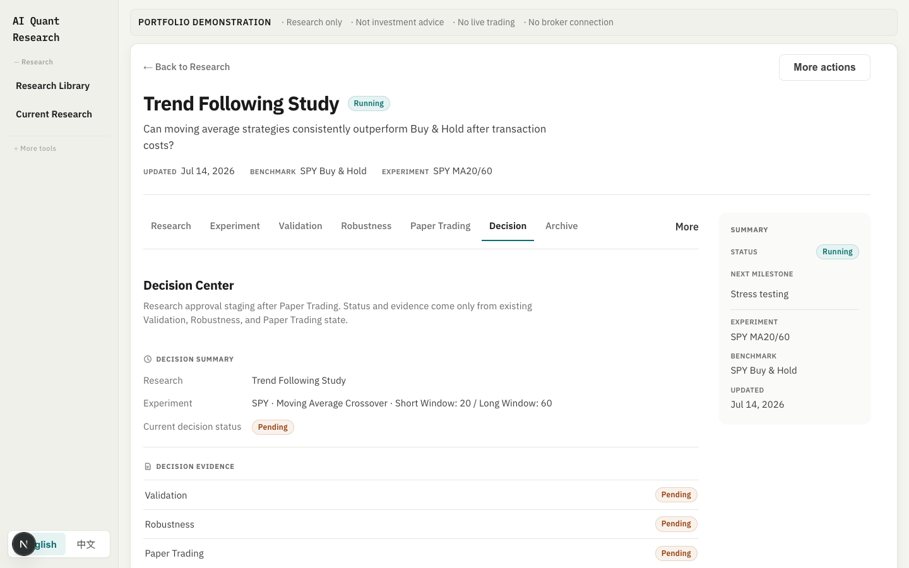

# AI Quant Research Workspace

**A research operating system for turning quantitative hypotheses into reproducible evidence, robustness review, controlled paper observation, and governed decisions.**

Research and portfolio demonstration only. Not investment advice. No broker integration. No live execution.

[Product](docs/PRODUCT.md) · [Workflow](docs/RESEARCH_WORKFLOW.md) · [Authenticity](docs/AUTHENTICITY.md) · [Demo script](docs/DEMO_SCRIPT.md) · [Stable demo modes](docs/DEMO_MODE.md) · [Project story](docs/PROJECT_STORY.md) · [Architecture](docs/ARCHITECTURE.md) · [Contributing](CONTRIBUTING.md)

> **Research First. AI Second. Decisions Last.**

## Review it in three minutes

Open the Research Library and choose **Start guided review**. The product walks through one sample study as four proof points:

1. **Question** — a falsifiable hypothesis and fixed research protocol
2. **Evidence** — backend-calculated results and deterministic validation
3. **Challenge** — four implemented robustness checks are separated from unsupported methods and limitations
4. **Decision** — evidence informs a decision record; a human retains authority

This is the shortest path for customers, reviewers, and hiring teams. It demonstrates the product judgment, quantitative controls, and engineering boundaries without requiring prior knowledge of the repository.

## Why this exists

Quantitative research often fails when hypotheses, experiments, validation, and decisions live in disconnected tools. This workspace keeps one visible lifecycle:

```text
Research
→ Experiment
→ Validation
→ Robustness
→ Paper Observation
→ Decision
```

Unlike a backtest dashboard, the product is organised around research process integrity: deterministic validation, honest empty states, and governed next steps — not charts alone.

## What makes this project different

| Typical quant portfolio demo | This workspace |
| --- | --- |
| Starts with a ticker or a promising chart | Starts with a falsifiable question and a fixed protocol |
| Highlights one best backtest | Exposes OOS, sensitivity, cost, data-quality, and missing checks |
| Uses AI to produce the answer | Establishes facts deterministically before AI may explain them |
| Mixes roadmap ideas with completed evidence | Keeps implemented checks, blockers, and unsupported methods visibly separate |
| Ends with a signal | Ends with an evidence trail and a human-owned decision |

The initiative was not “add more screens.” It was to reframe the product from a signal dashboard into a reviewable research system, then carry that decision through the data contract, validation rules, UI states, cold-start recovery, and three-minute reviewer path.

The visual system adapts the MIT-licensed [Apple Bento Grid](https://github.com/hubeiqiao/apple-bento-grid) principles for an interactive product: a `#f5f5f7` canvas, full-height white cards, 6px grid rhythm, restrained accent colors, and a small number of dark or gradient highlight cards. It uses the system font stack, so the production build does not depend on remote font downloads.

## What is implemented

| Surface | Status |
| --- | --- |
| Research Library | Implemented — homepage entry for research projects |
| Research Workspace | Implemented — lifecycle tabs for one research thread |
| Experiment | Implemented — historical execution for the canonical MA study |
| Validation | Implemented — deterministic OOS, sensitivity, cost, data-quality evidence |
| Robustness Center | Implemented — four evidence-backed checks; unsupported regime, walk-forward, Monte Carlo, and capacity methods are disclosed as scope boundaries |
| Paper Observation | Implemented — creates a browser-local plan, records dated human notes, and closes the session; no trades or P&L |
| Decision Center | Implemented — saves a browser-local human outcome and rationale against the evidence review |
| Risk Review | Implemented — five-level risk assessment from backtest metrics; deterministic and explainable (`component_levels` + `risk_reasons`) |
| Compare Models | Implemented — rule strategies vs XGBoost/LightGBM and other ML models on the same out-of-sample window with leakage controls; compares Return / Sharpe / Drawdown / Turnover / Cost, plus feature importance and directional accuracy |
| Cold-start recovery | Implemented — one shared readiness gate, visible startup state, bounded retry, and automatic continuation |
| Archive | Implemented as a real action for browser-local research; no empty Archive page |

**Secondary / legacy tools** (reachable, not the product spine): Strategy Lab, Markets, Compare (rules-only), Data Center, Saved Runs, and older demo routes.

**Not implemented:** regime analysis, rolling walk-forward validation, Monte Carlo analysis, liquidity/capacity modelling, broker connectivity, production OMS, autonomous trading, and cross-browser durable research records.

Details: [docs/ROADMAP.md](docs/ROADMAP.md).

## Demo journey

Canonical executable experiment: **Trend Following Study** (`ma-crossover-spy`) — SPY MA20/MA60 vs buy-and-hold.

```text
Research Library
→ Open Trend Following Study
→ Review Experiment
→ Inspect Validation Evidence
→ Review Robustness
→ Create or review Paper Observation
→ Record the Human Decision
```

Backend evidence for the sample flows through:

- `POST /api/v1/research/execution`
- `POST /api/v1/research/validation`
- `POST /api/v1/research/evaluation` (summarises validation only; not a lifecycle stage)
- `POST /api/v1/research/copilot/query` (optional evidence-grounded explanation; supporting tool)

### Cold-start behaviour

Open the product normally, even when the Render free-tier backend may be asleep. The frontend:

- starts one shared `/health` readiness request instead of letting every panel fail independently;
- shows a visible **Starting research backend** state for a bounded three-minute window;
- merges concurrent API callers behind the same wakeup request;
- continues pending requests automatically after the backend responds — no refresh required;
- preserves local research content and offers **Retry and resume** if the backend remains unavailable;
- automatically reruns research evidence panels that failed before the shared connection recovered.

The `keep-warm` GitHub workflow requests an offset five-minute schedule, retries transient connection failures, and touches `/api/database/status` after the process is awake. GitHub scheduled workflows are best-effort and can be delayed or skipped, so observed runs may be much farther apart than the cron expression. A failed health check marks the workflow red so an outdated `BACKEND_URL`, suspended Render service, or disabled schedule is visible. Scheduled warmup is an optimization, not a correctness dependency.

Before an interview, confirm the latest `keep-warm` run is green and open [`/health`](https://ai-quant-signal-platform.onrender.com/health). If the startup notice appears, wait for it to clear rather than refreshing repeatedly. For a no-cold-start public portfolio, use an always-on paid instance; changing the existing Render service to Starter is the lowest-migration option.

For interviews where the backend may be cold or unavailable, use the documented [frontend-safe walkthrough](docs/DEMO_MODE.md). It demonstrates the product structure and honest evidence boundaries without inventing calculated output.

## Authenticity

- No fabricated PnL
- No fake trades
- No fake confidence scores
- No fake paper-observation sessions, trades, or P&L
- Calculated metrics come from backend responses only
- Unimplemented methods are explicit scope boundaries — never implied complete or counted as workflow tasks

Policy: [docs/AUTHENTICITY.md](docs/AUTHENTICITY.md) · [docs/data/AUTHENTICITY_POLICY.md](docs/data/AUTHENTICITY_POLICY.md)

## Screenshots

Captured from the live local workspace using `ma-crossover-spy` — not mocked or edited.

| Screen | What it shows |
| --- | --- |
|  | Research Workspace overview — question, lifecycle progress, next action |
|  | Validation evidence from backend checks (OOS, sensitivity, provenance) |
|  | Robustness Review — four implemented checks plus an explicit scope boundary |
|  | Paper Observation — bounded plan and dated notes, no fake session |
|  | Decision Center — human-authored outcome and rationale |

Walkthrough: [docs/DEMO_SCRIPT.md](docs/DEMO_SCRIPT.md). Narrative: [docs/PROJECT_STORY.md](docs/PROJECT_STORY.md).

## Current architecture

```text
Browser (Next.js on Vercel)
  → FastAPI (Render)
    → Market data (Yahoo / AkShare)
    → Deterministic backtesting and validation
    → Optional evidence-grounded LLM explanation (backend secrets only)
    → Optional Supabase Postgres for durable legacy experiment records
```

| Layer | Technology |
| --- | --- |
| Frontend | Next.js 15, React 19, TypeScript |
| Backend | FastAPI, Pydantic, pandas |
| Tests | Vitest (frontend), pytest (backend) |
| Deploy | Vercel + Render |

Portfolio overview: [docs/ARCHITECTURE.md](docs/ARCHITECTURE.md) · [docs/TECH_STACK.md](docs/TECH_STACK.md) · [docs/API.md](docs/API.md)

## Current limitations

- Research definitions may use browser-local persistence (`localStorage`); another browser will not see them
- Paper Observation is a browser-local research log, not live execution
- No broker connection and no production OMS
- Regime, walk-forward, Monte Carlo, and liquidity/capacity methods are not implemented
- Validation run state may be process-local on Render; a restart can invalidate in-memory run ids
- Copilot requires backend `LLM_*` configuration; without it the route fails honestly

## Getting started

### Prerequisites

- Python 3.9+
- Node.js 18+ and npm

### Backend

```bash
cd backend
python3 -m venv .venv
source .venv/bin/activate
pip install -r requirements.txt -r requirements-dev.txt
cp .env.example .env
uvicorn app.main:app --reload --port 8000
```

### Frontend

```bash
cd frontend
npm ci
cp .env.example .env.local
npm run dev
```

Open [http://localhost:3000](http://localhost:3000). API docs: [http://127.0.0.1:8000/docs](http://127.0.0.1:8000/docs).

### Checks

```bash
cd backend && source .venv/bin/activate && PYTHONPATH=. python -m pytest tests -m "not live" -q
cd frontend && npm test && npx tsc --noEmit && npm run build
```

CI: [`.github/workflows/ci.yml`](.github/workflows/ci.yml). Live provider checks are optional and manual — [docs/deployment/LIVE_DATA_VERIFICATION.md](docs/deployment/LIVE_DATA_VERIFICATION.md).

More detail: [docs/DEVELOPMENT.md](docs/DEVELOPMENT.md) · [docs/DEPLOYMENT.md](docs/DEPLOYMENT.md).

## Environment (summary)

| Variable | Scope | Purpose |
| --- | --- | --- |
| `NEXT_PUBLIC_API_BASE_URL` | frontend | Production backend URL (local default `http://127.0.0.1:8000`) |
| `ALLOWED_ORIGINS` | backend | CORS origins |
| `SUPABASE_DB_URL` | backend | Optional Postgres |
| `LLM_PROVIDER` / `LLM_API_KEY` / `LLM_BASE_URL` / `COPILOT_MODEL` | backend | Copilot only; never `NEXT_PUBLIC_*` |

Use checked-in `.env.example` files. Never commit secrets. Production API wiring: [docs/deployment/PRODUCTION_API_WIRING.md](docs/deployment/PRODUCTION_API_WIRING.md).

## Repository map

```text
.
├── frontend/                 # Next.js workspace
├── backend/                  # FastAPI demonstrable runtime
├── apps/api/                 # target modular API reference (not the live path)
├── docs/                     # product, workflow, authenticity, architecture, slices, ADRs
├── CONTRIBUTING.md
├── ROADMAP.md
└── PROJECT_STRUCTURE.md
```

## Architecture migration (deeper context)

Longer-term design uses a modular monolith, DDD, Clean Architecture, and vertical slices. Frozen authority lives in the [Project Bible](docs/PROJECT_BIBLE.md) and [Architecture Bible](docs/Architecture-Bible/). The `apps/api/` tree is an early reference for that shape; `backend/` + `frontend/` remain the demonstrable runtime.

Migration notes: [MIGRATION_REPORT.md](MIGRATION_REPORT.md) · [PROJECT_STRUCTURE.md](PROJECT_STRUCTURE.md) · [ROADMAP.md](ROADMAP.md) · [docs/ROADMAP.md](docs/ROADMAP.md).

## Contributing and governance

- [CONTRIBUTING.md](CONTRIBUTING.md)
- [DEVELOPMENT_WORKFLOW.md](DEVELOPMENT_WORKFLOW.md)
- [CODE_OF_CONDUCT.md](CODE_OF_CONDUCT.md)
- [SECURITY.md](SECURITY.md)
- [CHANGELOG.md](CHANGELOG.md)
- [docs/adr/](docs/adr/)

## Responsible use

This software supports research demonstration and paper observation staging. It is not financial advice, does not guarantee results, and is not designed for live order execution. Historical results can differ from real outcomes.

## License

[MIT License](LICENSE). Copyright (c) 2026 Joseph Wang.
