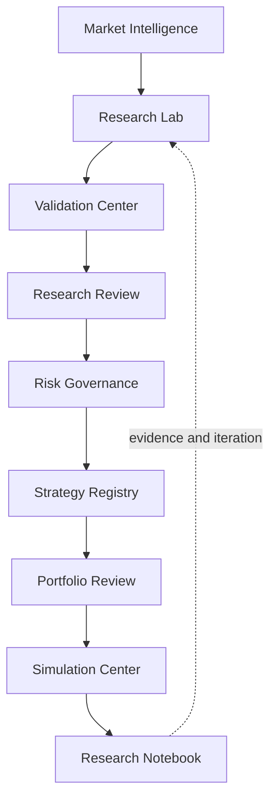
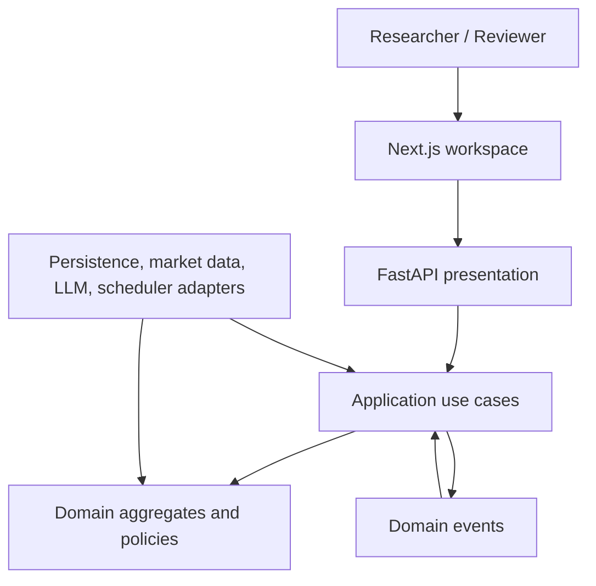
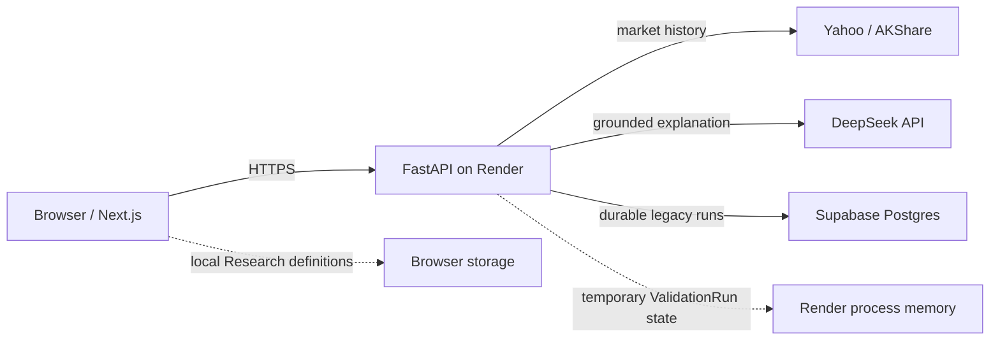

# AI Quant Research Workspace

**A research operating system for moving quantitative ideas into evidence and governed decisions.**

[Architecture](docs/PROJECT_BIBLE.md) · [Roadmap](ROADMAP.md) · [Contributing](CONTRIBUTING.md) · [Security](SECURITY.md) · [Changelog](CHANGELOG.md)

> **Research First. AI Second. Decisions Last.**

AI Quant Research Workspace is a Strategy-centric environment for quantitative research, validation, review, risk governance, portfolio analysis, simulation, and monitoring. It is not a trading bot, stock prediction model, broker, or live execution platform.

The repository is evolving from a working quant-research demonstration into a production-quality modular platform. Existing runtime behavior remains available while the frozen architecture is adopted through deliberate vertical slices.

## Why this exists

Quant research rarely fails because one more chart is missing. It fails when hypotheses, datasets, assumptions, experiments, validation, reviews, and decisions become disconnected.

This workspace keeps the full chain visible:

```text
Idea → Research → Validation → Paper Simulation → Monitoring → Review → Retirement
```

Every durable conclusion should trace to metrics, evidence, and source provenance. AI can explain and compare that evidence; deterministic quantitative and risk rules retain authority.

## Product overview

The intended workspace connects nine research capabilities:



Current implementation includes a Next.js research workspace and a FastAPI backend for market data, deterministic backtests, validation, governance evaluation, evidence-grounded AI explanation, experiment persistence, risk monitoring, and paper simulation. A configurable moving-average research definition can travel through four real backend slices: execution (`POST /api/v1/research/execution`), validation (`POST /api/v1/research/validation`), evaluation (`POST /api/v1/research/evaluation`), and Research Copilot (`POST /api/v1/research/copilot/query`). Evaluation summarizes validation evidence into `completed`, `incomplete`, or `blocked`; it does not recalculate metrics or issue recommendations. Copilot uses an OpenAI-compatible provider to explain existing evidence and cannot override deterministic validation.

Research market data routes by asset class behind one `MarketDataPort` (Yahoo for global assets and AkShare for mainland A-shares). See [`docs/slices/multi-provider-market-data.md`](docs/slices/multi-provider-market-data.md) and the other [`docs/slices/`](docs/slices/) notes. The newer `apps/api/` tree is an early reference slice for the target architecture, not the deployed runtime.

## Demonstrable vertical slice

The primary reviewer journey is intentionally narrow and complete:

```text
Research List
  → Create MA research definition
  → Backend historical execution
  → Calculated metrics and provenance
  → Deterministic validation
  → Governance evaluation
  → Evidence-grounded Copilot explanation
```

The creation form accepts a symbol, date range, short and long moving-average windows, transaction cost, owner, and tags. The browser never fabricates quantitative evidence: calculated metrics, validation results, evaluation state, and Copilot citations all originate from backend responses.

For the most reliable demonstration, start with one browser session, keep the Render service awake, and follow the workspace actions in order: **Run Experiment → Run Validation → Request Evaluation → Open Research Copilot**.

## Screenshots

| Workspace view | Publication slot |
|---|---|
| Research List | Capture the Strategy-linked research portfolio with lifecycle, owner, and evidence confidence. |
| Research Workspace | Capture hypothesis, experiments, validation state, and next governed action. |
| Decision Review | Capture quantitative evidence, AI interpretation, risk gate, and decision provenance. |

Screenshots will be added after the workspace information architecture stabilizes; the descriptions above are intentional capture requirements, not missing product specifications.

## Architecture

The frozen architecture combines a **modular monolith**, **Domain-Driven Design**, **Clean Architecture**, **vertical slices**, and **event-driven workflows**.



Strict dependency direction:

```text
Presentation → Application → Domain
Infrastructure ───────────→ inward-owned ports
```

Bounded contexts are Research, Validation, Governance, Portfolio, and Market Intelligence. Strategy is the central lifecycle identity; contexts own their records and integrate through stable contracts and events.

Read the [Project Bible](docs/PROJECT_BIBLE.md) for the engineering constitution and the [Architecture Bible](docs/Architecture-Bible/) for the detailed product, domain, state-machine, and runtime design.

## Tech stack

| Area | Current technology | Architectural role |
|---|---|---|
| Web | Next.js 15, React 19, TypeScript 5 | workspace presentation |
| Visualization | Recharts | research charts and quantitative views |
| API | FastAPI, Pydantic | HTTP boundary and composition |
| Quantitative computation | pandas | indicators, backtests, and metrics |
| Persistence | PostgreSQL via psycopg; Supabase-compatible configuration | durable legacy backtest runs and trades |
| Market data | AKShare, Yahoo/yfinance, Stooq | external provider adapters |
| AI explanation | DeepSeek through an OpenAI-compatible backend adapter | evidence interpretation only |
| Testing | pytest | domain, service, and API verification |
| Deployment | Vercel-compatible web, Render descriptor for current backend | current operational topology |

Technology is an adapter choice. Domain behavior must remain independent of FastAPI, databases, providers, schedulers, and LLM SDKs.

## Getting started

### Prerequisites

- Python 3.9 or newer for the current backend
- Node.js 18 or newer and npm for the web application

### 1. Start the current backend

```bash
cd backend
python3 -m venv .venv
source .venv/bin/activate
pip install -r requirements.txt
pip install -r requirements-dev.txt
cp .env.example .env
uvicorn app.main:app --reload --port 8000
```

The backend runs without a database connection; persistence-dependent capabilities report their unavailable state. For local Copilot testing, configure the backend-only `LLM_*` variables in `backend/.env`. Never commit real credentials, and never expose provider credentials through `NEXT_PUBLIC_*` variables.

### 2. Start the web application

In a second terminal:

```bash
cd frontend
npm ci
cp .env.example .env.local
npm run dev
```

Open [http://localhost:3000](http://localhost:3000). The current API documentation is at [http://127.0.0.1:8000/docs](http://127.0.0.1:8000/docs).

### 3. Run checks

```bash
cd backend
source .venv/bin/activate
PYTHONPATH=. python -m pytest tests -m "not live" -q
```

```bash
cd apps/api
source .venv/bin/activate
python -m pytest -q
```

```bash
cd frontend
npm test
npx tsc --noEmit
npm run build
```

GitHub Actions runs the same offline gates on every pull request and push to
`main` via [`.github/workflows/ci.yml`](.github/workflows/ci.yml): backend
offline tests, `apps/api` tests, frontend tests/typecheck/build, and
repository authenticity policy checks. Live Yahoo and AkShare verification is
optional and manual only — see
[`docs/deployment/LIVE_DATA_VERIFICATION.md`](docs/deployment/LIVE_DATA_VERIFICATION.md).
Deployed end-to-end evidence (operator-run, not required CI) is recorded in
[`docs/reviews/DEPLOYED-E2E-VERIFICATION.md`](docs/reviews/DEPLOYED-E2E-VERIFICATION.md).

The target API reference slice lives under `apps/api/`. See [`apps/api/README.md`](apps/api/README.md) for dependencies, entrypoint, startup, and development commands.

## Deployment topology and operational closure

The current demo topology keeps browser concerns, quantitative execution, AI interpretation, and credentials on explicit boundaries:



### Render configuration

[`render.yaml`](render.yaml) declares the deployment contract. Values marked `sync: false` must be entered in the Render dashboard and must never be committed.

| Variable | Required value or rule |
|---|---|
| `ALLOWED_ORIGINS` | exact Vercel/custom-domain origins, comma-separated; no wildcard |
| `SUPABASE_DB_URL` | Supabase transaction-pooler URI; backend only |
| `LLM_PROVIDER` | `deepseek` |
| `LLM_API_KEY` | DeepSeek secret; backend only |
| `LLM_BASE_URL` | `https://api.deepseek.com` |
| `COPILOT_MODEL` | `deepseek-v4-flash` |

DeepSeek's current API contract is documented in the [official API guide](https://api-docs.deepseek.com/), and Render explains `sync: false` behavior in its [Blueprint environment-variable documentation](https://render.com/docs/blueprint-spec#environment-variables). For an existing Blueprint service, add newly declared `sync: false` secrets manually in Render before redeploying.

### Database bootstrap and verification

Apply [`backend/db/schema.sql`](backend/db/schema.sql) through the Supabase SQL editor, then verify the deployed backend without exposing the connection string:

```bash
curl "$API_BASE_URL/health"
curl "$API_BASE_URL/api/database/status"
```

The status endpoint reports only configuration and connectivity state. The browser must never connect to Supabase with the backend database URI.

### Current persistence boundary

The deployed workflow is a complete single-browser demo, but it is not yet a durable multi-user research system:

| Artifact | Current lifetime |
|---|---|
| Research Definition | browser-local repository (`localStorage`) |
| Experiment execution | synchronous request/response projection |
| ValidationRun | one Render process, in memory |
| Evaluation | deterministically derived from the referenced ValidationRun |
| Copilot answer | request-scoped, grounded in supplied evidence |
| Legacy backtest runs and trades | durable Supabase Postgres records |

A Render restart can invalidate a ValidationRun ID, and another browser cannot see locally created Research definitions. The next persistence slice should add `PostgresResearchRepository`, `PostgresValidationResultStore`, durable evaluation lineage, and an API-backed frontend Research repository, followed by restart, cross-browser, and concurrent-write tests. Until that slice lands, this README deliberately describes the deployed boundary rather than implying durability that does not exist.

## Environment

| Variable | Scope | Purpose |
|---|---|---|
| `ALLOWED_ORIGINS` | backend | comma-separated browser origins for CORS |
| `SUPABASE_DB_URL` | backend | optional PostgreSQL transaction-pooler connection |
| `LLM_PROVIDER` | backend | one configured LLM adapter; use `deepseek` for the Render deployment |
| `LLM_API_KEY` | backend | provider secret; never expose it to the frontend |
| `LLM_BASE_URL` | backend | OpenAI-compatible provider base URL |
| `COPILOT_MODEL` | backend | explicit deployed model identifier |
| `NEXT_PUBLIC_API_BASE_URL` | frontend | required production backend URL; local development falls back to `http://127.0.0.1:8000` |

Use the checked-in `.env.example` files as the source for variable names. Keep secrets in local or deployment environment configuration only.
Production has no hardcoded API fallback. See the
[Production API Wiring runbook](docs/deployment/PRODUCTION_API_WIRING.md) for
Vercel, Render CORS, timeout, endpoint-semantics, and troubleshooting details.

## Repository safety

- Commit example environment files only; never commit local or production `.env*` files.
- Never commit provider keys, database URLs, private keys, certificates, local database files, build output, or deployment-state directories.
- Keep every secret in backend or deployment configuration. A variable prefixed with `NEXT_PUBLIC_` is public by design.
- If a secret ever reaches Git history, rotate it immediately; removing it from the latest commit is not sufficient.
- Review `git status`, the staged diff, and the repository-policy checks before every push.
- Keep CI deterministic and offline. Live provider verification is an explicit operator-run smoke test.

## Repository structure

```text
.
├── apps/api/                  # target modular-monolith reference slices
├── backend/                   # current FastAPI runtime
├── frontend/                  # current Next.js workspace
├── docs/
│   ├── Architecture-Bible/    # frozen architecture
│   ├── adr/                   # architectural decisions
│   ├── slices/                # vertical-slice notes
│   ├── PROJECT_BIBLE.md       # single source of truth
│   └── STYLE_GUIDE.md
├── .cursor/rules/             # repository-aware AI engineering rules
├── CONTRIBUTING.md
├── ROADMAP.md
└── PROJECT_STRUCTURE.md
```

See [PROJECT_STRUCTURE.md](PROJECT_STRUCTURE.md) for folder ownership, naming, dependency rules, and the staged target layout.

## Roadmap

The roadmap advances through engineering foundation, domain core, research workspace, validation and governance, portfolio and monitoring, governed AI, and production readiness.

Near-term engineering priorities are:

1. establish repeatable quality gates and dependency-boundary checks;
2. normalize the reference `apps/api/` slice and migration contract;
3. encode the frozen lifecycle state machines in the Domain layer;
4. connect research artifacts through Strategy identity and Evidence provenance; and
5. preserve current runtime behavior during incremental migration.

See the complete [ROADMAP.md](ROADMAP.md). Planned work is not implemented behavior.

## Engineering principles

- Strategy-centric, not page-centric
- Research-first, not execution-first
- Quantitative evidence before AI interpretation
- Deterministic validation before probabilistic explanation
- Domain rules independent of frameworks and providers
- Explicit lifecycle transitions and immutable history
- Small, complete vertical slices
- Secure, observable, reversible change

## Contributing

Start with [CONTRIBUTING.md](CONTRIBUTING.md). All changes should identify their bounded context, preserve inward dependencies, include proportionate tests, and update documentation or ADRs when decisions change.

The AI-assisted handoff is documented in [DEVELOPMENT_WORKFLOW.md](DEVELOPMENT_WORKFLOW.md): ChatGPT frames, Codex implements and verifies, Cursor supports local refinement, reviewers validate, and maintainers merge.

Use the repository’s structured GitHub forms for [bug reports](https://github.com/josephwang-ds/ai-quant-signal-platform/issues/new?template=bug_report.yml), [feature requests](https://github.com/josephwang-ds/ai-quant-signal-platform/issues/new?template=feature_request.yml), epics, and stories. Every participant must follow the [Code of Conduct](CODE_OF_CONDUCT.md). Security-sensitive findings belong in the private process described by [SECURITY.md](SECURITY.md), never in a public issue.

## Governance

| Document | Purpose |
|---|---|
| [Project Bible](docs/PROJECT_BIBLE.md) | product and engineering constitution |
| [Architecture Decision Records](docs/adr/) | durable decisions and consequences |
| [Roadmap](ROADMAP.md) | capability sequence and milestone outcomes |
| [Contributing Guide](CONTRIBUTING.md) | issue, branch, review, and Definition of Done |
| [Code of Conduct](CODE_OF_CONDUCT.md) | community participation and enforcement |
| [Security Policy](SECURITY.md) | private vulnerability reporting and disclosure |
| [Changelog](CHANGELOG.md) | notable repository changes and release history |

## Project status

This repository is under active architectural migration. The `backend/` and `frontend/` paths contain the current demonstrable runtime; the Render + DeepSeek + Supabase topology is deployable when its environment contract is configured. Research definitions and validation lineage still require the documented durable-persistence slice before the platform can claim restart-safe, cross-browser continuity. `apps/api/` begins the production-shaped modular structure. See [MIGRATION_REPORT.md](MIGRATION_REPORT.md) before moving, renaming, or deleting legacy assets.

## Responsible use

This software supports research and paper simulation. It is not financial advice, does not guarantee results, and is not designed for live order execution. Historical and simulated performance can differ materially from real outcomes.

## License

This repository is licensed under the [MIT License](LICENSE). Copyright (c) 2026 Joseph Wang.
