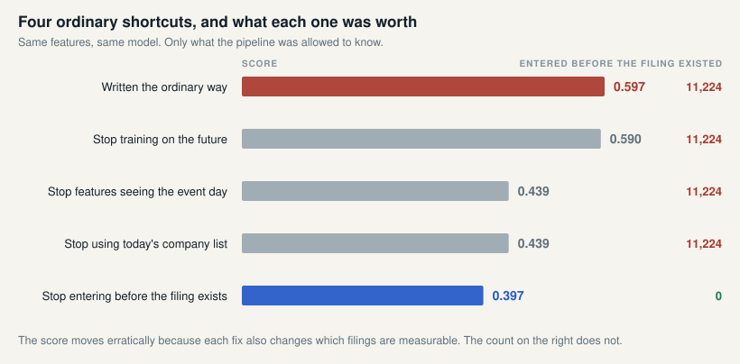

# Filing Triage — and Company Lens

**Every trading day, US public companies file legally-required disclosures with
the government. Most are routine. A few move the stock. An analyst has time to
read about five before the opening bell.**

This ranks them, so the five they read are the right five. It runs on 11,716 real
filings from 193 companies over four years, and there is a live site built on top
of it: **[lens.josephjwang.com](https://lens.josephjwang.com)**.

Reading the top five each morning finds a market-moving filing **19.8%** of the
time. Reading five at random finds one 11.6% of the time. A perfect ranker would
reach 28.3% — most days simply do not contain five important filings — so this
captures about **half of everything there is to capture**.



## The part worth reading about is what happened before that number

The first working version scored far better. It was wrong, and not in a way that
announced itself.

In **11,224 cases** it had bought a stock at a price printed *before* the
disclosure it was reacting to had been filed. Not a bug in the model — a
one-line assumption about what a timestamp meant. Three other mistakes of the
same family were hiding beside it, each one flattering the result, none of them
visible in any score.

Removing all four costs a **third of the apparent performance**. Both numbers are
published side by side, along with the tooling that found the problem and the
tests that now fail the build if it comes back.

| | Written the ordinary way | After the audit |
|---|---|---|
| Score on the standard measure | 0.597 | **0.397** |
| Filings entered before they existed | 11,224 | **0** |

That is the whole argument of the project: **a result you are pleased with
deserves more suspicion than one you are not**, and the difference is measurable.
Three later experiments were measured the same way and reported the same way —
a financial language model, a foundation forecasting model, and the project's own
issuer-relative features all failed to earn their place, and all three say so on
the public page rather than quietly not shipping.

## What this is, in one paragraph

A point-in-time event dataset built from SEC timestamps; a reusable audit library
that fails the build rather than logging a warning; a ranker; and a
source-backed company page with a controlled AI question-answering box that
refuses to answer beyond its evidence. 671 tests. No price predictions, no
trading strategy, no buy or sell recommendations anywhere — the model predicts
*how big* a reaction will be, never which direction, because direction is a bet
against desks with faster data and more capital.

**Technical detail starts below.** Method: [docs/METHODOLOGY.md](docs/METHODOLOGY.md) ·
Leakage: [docs/LEAKAGE.md](docs/LEAKAGE.md) ·
Audited findings, generated from the evidence package:
[the research page](https://lens.josephjwang.com/research.html)

---

## The leakage ladder, in full

The chart above with the two columns it leaves out: ROC AUC, and how many of the
audit's own guards were failing at each stage.

| Stage | Avg precision | ROC AUC | Impossible entries | Guards failing |
|---|---|---|---|---|
| Naive pipeline | **0.597** | **0.841** | 11,224 | 1 |
| + purged, embargoed CV | 0.590 | 0.838 | 11,224 | 1 |
| + trailing windows shifted | 0.439 | 0.782 | 11,224 | 1 |
| + point-in-time universe | 0.439 | 0.782 | 11,224 | 1 |
| + point-in-time entry | **0.397** | **0.764** | **0** | **0** |

The audited numbers carry intervals, because a point estimate is a claim with its
error bar deleted: average precision **0.397 [0.365, 0.430]**, ROC AUC
**0.764 [0.745, 0.781]**, 95% cluster bootstrap over 957 sessions.

Two rows move the wrong way or not at all, and the impossible-entry column is why
that is not a contradiction. Purged CV *raises* the score slightly here, and the
universe row does not move at all — a metric is not the thing being fixed. The
count is: 11,224 entries that used a price printed before the filing existed,
reduced to zero. That column is an invariant, comparable across rows in a way the
metric is not, because each fix also changes which filings are measurable.

---

## Two things live here

**Filing Triage** is the point-in-time event dataset, the leakage-audit library
that fails the build rather than logging, and the ranker that triages a daily
filing queue. It is the part with a measured result, and most of this README.

**Company Lens** is a source-backed company overview for ordinary investors,
built on that same foundation — a live page per issuer with performance history,
filing changes, cited evidence, and a controlled grounded-LLM Q&A. It is a
product surface over the pipeline, not a generic research agent.

Its grounded Q&A lets a reader choose the **evidence scope** — core financials
(SEC filings and long-term fundamentals), plus company news, plus market
context, or all of it. Each scope carries its own citation and number
allow-lists, so a model answering from the narrow scope cannot cite a headline it
was never shown; the validator rejects it and the answer is withheld.

Live Company Lens: <https://lens.josephjwang.com>
Build and operations: **[docs/COMPANY_LENS.md](docs/COMPANY_LENS.md)** ·
[scope](docs/SCOPE.md) · [architecture](docs/ARCHITECTURE.md) ·
[deployment](docs/DEPLOYMENT.md)

---

## Filing Triage foundation

**Which of today's SEC filings deserve a human read?**

At each market open, an analyst faces the 8-Ks accepted since the prior queue and
has time for five. This ranks them by the magnitude of the abnormal reaction after
that decision point — *magnitude, not direction*.

Predicting direction is a bet against people with faster data, better models and
more capital. Predicting which disclosures matter is a triage problem, and triage
is answerable.

---

> [!NOTE]
> **The figures below come from a real EDGAR pull**: 11,716 8-K filings from 193
> issuers, 2022 to 2026, with prices from yfinance. Reproduce them with
> `make universe && make ingest && make run` (about 40 minutes).
>
> Two caveats the page states in its own banner, because everything else on it is
> real and these are exactly the ones a reader would assume away. **The universe
> is a survivor sample** — 200 hand-picked large caps that still exist — so
> survivorship bias is *not* controlled on this path; leak 3 is measured on the
> synthetic corpus instead. And the demo run uses a fixed ticker list rather than
> point-in-time index membership, for reasons in [docs/LEAKAGE.md](docs/LEAKAGE.md).
> The small committed package in [`evidence/real_run`](evidence/real_run) contains
> the metrics, fold results, OOS importance, audit, leakage ladder, and provenance
> behind the claims below; it contains no raw filing text or price history.

---

## Reading the ladder

Two rows in the table at the top deserve their explanation, because both look
wrong.

**The universe row does not move at all** — 0.423916 before and after, to six
decimals. That is the survivor sample confessing: when every issuer in the file
still exists, switching on a point-in-time membership filter has nothing to
remove. The pipeline is reporting its own blind spot rather than hiding it.

**The entry row also changes the measured population.** The filing-date rule uses
that date's opening print even when acceptance came hours later. In this sample it
creates 11,224 impossible entries—95.8% of measurable filings—with a median 10.6
hours of hindsight. The corrected rule places every filing in the first market-open
queue after its acceptance time and reduces that count to zero. Because it also
changes the outcome window and class balance, its metric movement is not a clean
estimate of one leak's cost; the zero impossible-entry count is the invariant.

The real sample has 63.2% of acceptances outside regular market hours. The larger
95.8% impossible-entry share under the naive rule also includes intraday filings:
that day's opening print still predates a filing accepted at 10 a.m.

**What the audited model is worth.** Filings arrive at a median of 9 a session,
and reading the model's top five surfaces material reactions at **19.8%**
precision over the 766 sessions crowded enough for ranking to matter. That number
needs two things attached before it means anything.

**It cannot be read against 100%.** A session holding one material filing caps
precision@5 at 20% however good the ranking is, and on this sample **37% of
eligible sessions hold none at all** — on those days a perfect ranker scores
zero. The achievable ceiling is **28.3%**, the floor is 11.6%, and the model
captures **49% of the gap between them**.

**And `k = 5` was assumed, not derived.** It came from a reader's supposed
capacity, which is a product constraint; quoting one `k` as *the* metric promotes
it to a scientific one. The lift is precisely the reading that does not survive
that promotion:

| Read k | Sessions | Random | Model | Ceiling | Lift | Span captured |
|---|---|---|---|---|---|---|
| 1 | 942 | 11.7% | 31.6% | 58.3% | 2.71× | 43% |
| 2 | 920 | 11.7% | 26.5% | 45.9% | 2.26× | 43% |
| 3 | 887 | 11.8% | 23.5% | 37.8% | 1.99× | 45% |
| **5** | **766** | **11.6%** | **19.8%** | **28.3%** | **1.70×** | **49%** |
| 10 | 365 | 13.6% | 18.7% | 22.7% | 1.38× | 56% |
| 20 | 60 | 16.0% | 18.5% | 19.7% | 1.16× | 68% |

The lift runs from 2.71× to 1.16× on an unchanged model; the share of achievable
span barely moves. Sessions fall away with `k` because a capacity above the day's
filing count is not triage, it is reading everything — which is the real limit on
how far this can be pushed, and why `k = 20` covers 6% of days and is reported
anyway. Full sweep in
[`capacity_profile.csv`](evidence/real_run/capacity_profile.csv).

The baseline comparison below fixes `k = 5` to stay comparable. Every one is a
*paired* bootstrap over the same sessions — model and baseline are rescored on
one shared resample, because they see the same days and treating them as separate
experiments would widen the interval on their difference for no reason.

| Read the top five by | Precision | Model lift | 95% interval | Draws favouring the baseline |
|---|---|---|---|---|
| the model | 19.8% | — | — | — |
| random selection | 11.6% | 1.70× | [1.62, 1.79] | 0 / 2000 |
| arrival order | 9.3% | 2.12× | [1.91, 2.36] | 0 / 2000 |
| “Item 2.02 earnings first” | 13.4% | 1.47× | [1.37, 1.59] | 0 / 2000 |

The last column is the one worth reading first, and it is the one the earlier
version of this README could not answer. A lift of 1.47× over an item heuristic
that a reader could implement in an afternoon is only a result if it survives
resampling; here it does, in every draw. Useful triage, not a trading strategy —
and the next section says exactly how much that caveat is worth.

**How much of it was already gone.** "Useful triage, not a trading strategy" was
a disclaimer in earlier versions of this README. It is now a measurement, and it
is the most uncomfortable number here.

The label is a market-model event study, so the reaction is measured
close-to-close — which means the entry session's return is anchored at the
*previous* close. For the 63.2% of filings accepted outside market hours, that
price was printed before the filing existed. None of the leakage guards can see
this: `causal(acceptance_time <= entry_open)` passes on every row precisely
because the label never touches `entry_open`.

Measuring the same filings both ways says what the difference is worth:

| Filings | Median share of the reaction already in the opening print |
|---|---|
| all | 6.4% |
| not material | 3.1% |
| **material (≥ 2.0σ)** | **27.7%** |
| material, accepted after the close | **45.7%** |

The decomposition is the finding. Across all 8-Ks the gap barely matters, because
most filings move nothing and a ratio of two small numbers is noise. Restrict to
the ones that cleared the materiality cutoff and it jumps; restrict to those
accepted after the close and nearly half the move is gone before the bell. The
reaction concentrates in the overnight gap *exactly where the ranker is trying to
look*.

Close-to-close stays the label, because the question is which disclosures
mattered and the overnight gap is part of the answer, not contamination of it.
But the same pipeline scored against an open-anchored label — asking what was
still on the table at the open — drops from 0.397 average precision to 0.155.
That is not the ranker failing; it is a harder question. Both rows are in
[`evidence/real_run/anchoring_study.csv`](evidence/real_run/anchoring_study.csv)
and reproduced by `experiments.reaction_capture_profile`.

**Whether the model family matters.** The estimator is deliberately
unremarkable, and the project's argument rests on that being true rather than
convenient — so it is measured. Four families on the same folds, the same
events, the same purge:

| Family | Average precision | vs shipped | 95% interval on the difference | Draws favouring the shipped one |
|---|---|---|---|---|
| **random forest (shipped)** | **0.397** | — | — | — |
| hist gradient boosting | 0.373 | −0.024 | [−0.038, −0.009] | 1999 / 2000 |
| logistic regression | 0.356 | −0.041 | [−0.058, −0.024] | 2000 / 2000 |
| stratified dummy | 0.129 | −0.269 | [−0.298, −0.240] | 2000 / 2000 |

Differences are *paired* — the families saw the same events on the same days, so
the difference is measured within a resample, which is far better determined than
either level. Independently the intervals on random forest [0.365, 0.430] and
gradient boosting overlap substantially; paired, every difference clears zero.

**That was not true a commit earlier.** Before the reporting-cycle features the
same comparison put random forest 0.011 ahead of gradient boosting with an
interval of [−0.003, +0.024] — indistinguishable. Adding two features separated
two model families that the data could not previously tell apart, which is worth
more attention than the ranking itself: the families were never far apart, and
what moved them was the input, not the estimator.

Which is the point. Swapping the family moves average precision across
**0.041**; swapping the validation scheme moves it **0.199**, five times as far.
The interesting code was never the estimator.

**How the shipped family was chosen.** Not by reading the table and keeping the
top row — that is the selection leak the project refuses everywhere else, and it
stays a leak when the thing selected is a model. It was chosen by a *nested*
procedure that prices selection rather than performing it: an inner purged,
embargoed split inside each outer training block picks a winner using that block
alone, so no test fold informs the choice made for it. That procedure selected
random forest in all five folds and scores **0.397**, so the selection is stable
rather than noise-chasing and its premium over the descriptive table is zero.

It won carrying a handicap worth naming: gradient boosting is the only family
here that uses missing values natively, while the forest is handed
median-imputed columns — and several of these features are missing for a reason
the estimator could have used. See
[`model_comparison_paired.csv`](evidence/real_run/model_comparison_paired.csv)
and [`nested_selection.json`](evidence/real_run/nested_selection.json).

**Where the constants came from.** The estimator's settings are hard-coded, and
if they had been chosen by watching the out-of-sample metric that would be a
selection leak spanning the whole project — the one kind no guard can catch,
because every individual run is clean and the contamination lives in which run
was kept. Rather than answer with a promise, the answer is a spread: perturbing
each setting one at a time moves average precision across a range of **0.008**,
narrower than the **0.064** bootstrap interval on the default configuration. The
defaults are also not the best cell in the grid. No achievable amount of tuning
produced this headline. See
[`hyperparameter_sensitivity.csv`](evidence/real_run/hyperparameter_sensitivity.csv).

**How long it lasts.** Holding the model fixed and delaying the decision, the
ranking decays within a session. Whatever is being measured is mostly over by the
next open.

**Where the other filings went.** 11,716 were ingested and 9,721 were scored. The
gap is itemised rather than left as arithmetic for the reader, because an
unexplained drop is indistinguishable from a bug:

| | Filings |
|---|---|
| Scored out of sample | 9,721 |
| Held out by walk-forward as training-only | 1,944 |
| Event window ran past the end of the price data | 11 |
| Missing price bars inside the event window | 7 |
| Entry session had no price bar | 33 |

The large line is the honest cost of the split. Walk-forward tests folds 1..n, so
the earliest block is only ever training data and never receives an out-of-sample
score. Shuffled K-fold scores all 11,681 — by training on the future to do it. A
test asserts this ledger balances.

---

## The second question: is this filing unusual *for this company*?

A cross-sectional ranking asks which filing looks most like a mover. That
question quietly favours volatile small caps, which are not more newsworthy, only
noisier. So a second model asks whether a filing is loud **relative to the
issuer's own history** — above that company's prior 80th percentile of absolute
abnormal reaction, judged only against outcomes already resolved when the filing
arrived.

Two cutoffs, not one, and the distinction is the whole correctness argument:

```
knowledge-time features   prior.acceptance_time  < acceptance_time
outcome-derived features  prior.label_end_session < entry_session
```

A percentile of *what the issuer usually files* needs only the earlier filing to
exist. A percentile of *how the issuer usually reacts* needs the earlier
reaction to have finished resolving — strictly stronger, and the reason
`assert_no_outcome_features` raises if an outcome-derived column reaches the
feature matrix.

| | |
|---|---|
| Filings with enough of their own history | 10,674 of 11,665 |
| Base rate to beat | 21.5% |
| Median prior filings per issuer | 30 (max 153) |
| Issuers told their history is too short | 962 filings |

**And the issuer-relative columns add nothing measurable as model inputs.** The
obvious question, asked with the same machinery as the FinBERT ablation and
answered the same way:

| Features | Avg precision | Difference | 95% interval |
|---|---|---|---|
| Market state and filing metadata | 0.373 | — | reference |
| … plus issuer percentiles | 0.372 | −0.0016 | [−0.0068, +0.0038] |
| … plus issuer z-scores | 0.376 | +0.0026 | [−0.0027, +0.0080] |
| … plus both | 0.372 | −0.0013 | [−0.0079, +0.0051] |

Every interval contains zero, in both directions. What changed the problem was
the **target** — asking whether a filing is loud for its own issuer rather than
loud in the cross-section — not the columns encoding the same idea as features.
The percentiles still earn their place, just not there: they are what a
`Read now` cites, and a recommendation whose reason a reader cannot check is one
nobody should act on.

**The score is turned into a probability, and which calibrator does that was
measured rather than assumed.** Each fold splits its own training block in time
order — the earlier part fits the model, the later part fits the calibrator, and
the test fold sees neither. Isotonic regression is the usual choice for a tree
ensemble; here it made calibration worse (0.027 expected calibration error
against 0.011 for the raw scores), because averaging over trees is already a
calibrating operation. The raw scores ship, as a result rather than a default.

**A probability is not an instruction.** `Read now` fires only on a calibrated
probability above the selected threshold *and* at least one issuer-relative
signal a reader could check themselves. It runs at 42.2% precision against the
21.5% base rate on 9.1% of the queue. `Monitor` reaches almost the same
precision — the difference between the two states is not accuracy but whether
the card can name a reason, and requiring a citable one costs nothing measurable.
Thresholds are selected on training folds only.

### FinBERT was tried, measured, and does not ship

All 11,424 distinct 8-K disclosures were encoded with FinBERT — a 2019 model
whose training data ends in 2014, so scoring a 2022–2026 sample with it is not
hindsight. The features were then added a family at a time, each row scored on
the same folds, the difference bootstrapped over trading sessions:

| Features | Avg precision | Difference | 95% interval |
|---|---|---|---|
| Market state and filing metadata | 0.372 | — | reference |
| … plus the wording features | 0.370 | −0.0019 | [−0.0061, +0.0024] |
| … plus FinBERT instead | 0.366 | −0.0055 | [−0.0102, −0.0010] |
| … everything at once | 0.365 | −0.0070 | [−0.0127, −0.0020] |

The transformer's interval sits below zero. The reason is structural rather than
a defect in the model: FinBERT predicts the *direction* of sentiment, while the
target here is the *magnitude* of a reaction, which is direction-free by
construction — a very good announcement and a very bad one are both positives.
Tone is close to orthogonal to the question being asked.

So the columns are held *beside* the shipped feature matrix rather than inside
it, and a test asserts they cannot reach it. The encoder and its cache stay,
because a directional target would make them worth re-testing and the corpus is
already encoded. Build it with `make text-cache` after `pip install -e '.[nlp]'`;
everything else in the project runs without torch installed.

---

## A third question: how wide a range is the next month?

Separate from the ranker, and deliberately so &mdash; no forecast here is a
feature there. At the moment a filing becomes actionable, this forecasts the
issuer's annualised realized volatility over the next 20 sessions as a
distribution. History stops at the session before entry, so the forecaster has
seen nothing from the window it predicts.

Scored on pinball loss *and* on interval coverage, because either alone is easy
to game: an interval from zero to infinity has perfect coverage, and a sharp
forecast can win on loss while its bands mean nothing.

| Forecaster | Pinball loss | Vs HAR, 95% | 50% band holds | 80% band holds | Calibrated |
|---|---|---|---|---|---|
| Carry today forward | 0.0358 | +0.0074 [+0.0064, +0.0084] | 50.3% | 79.1% | yes |
| This issuer's own history | 0.0303 | +0.0019 [+0.0015, +0.0023] | 49.0% | 80.3% | yes |
| **HAR regression on log volatility** | **0.0284** | reference | 48.2% | 77.4% | **yes** |
| Chronos-2, zero-shot | 0.0298 | +0.0014 [+0.0010, +0.0018] | 45.0% | 75.5% | no |

Lower loss is better, so a positive difference is a loss. Chronos-2 was given its
best configuration &mdash; forecasting log volatility, the same space every
baseline works in &mdash; and still loses to a three-term linear regression by an
interval that does not contain zero, while its 80% band holds 75.5% of outcomes.
A pretrained foundation model lost to HAR, so HAR ships.

The card exists only because something passed the gate. `volatility_cards.json`
is written for a calibrated forecaster and **deleted** when none qualifies, so
the page's precondition lives in the place that has the numbers rather than as a
threshold repeated in the renderer.

Two honest limits, both on the page: HAR's coverage falls from 79.6% in the calm
third of the sample to 75.3% in the turbulent third &mdash; the band widens when
the issuer is already turbulent, just not enough &mdash; and the card states a
range and a horizon, never a direction.

```bash
make volatility-evidence
```

Chronos-2 is optional (`pip install -e '.[ts]'` then `make volatility-cache`).
Without it the baselines still run and the comparison table simply has one row
fewer.

---

## What this is, and is not

**Is:** a point-in-time event dataset built from EDGAR acceptance timestamps, a
reusable leakage-audit library that fails the build rather than logging, and a
ranker that triages a daily filing queue.

**Is:** also a set of intervals. Every headline number carries a 95% bootstrap
range, every baseline comparison is paired on the same resample of sessions, and
the estimator's constants come with a sensitivity grid — because a project whose
argument is "the flattering number is usually wrong" cannot make that argument
with bare point estimates.

**Is not:** a return predictor. Direction is never modelled. No strategy return,
Sharpe ratio, or P&L appears anywhere in this repository, because a project that
claims to beat institutional desks on public filings is claiming something untrue.

---

## Quickstart

No API key, no vendor account, no network:

Python 3.11 or newer. On macOS check this first — the interpreter that ships
with the Xcode command line tools is 3.9, and a venv built from it inherits both
that and a pip too old to install this project at all:

```bash
python3 --version
```

```bash
python3 -m venv .venv
source .venv/bin/activate          # Windows: .venv\Scripts\activate
make install
make demo                          # ~4 min -> data/build/report.html
```

Every `make` target picks up `.venv/bin/python` on its own if the virtualenv is
there, so a shell that forgot to activate still runs the right interpreter rather
than failing with a version error about a system Python nobody meant to use.

`make install` upgrades pip before installing: pip older than 21.3 cannot do an
editable install of a pyproject-only project, and the failure it prints blames a
missing `setup.py`, which sends you looking for the wrong problem.

A virtualenv is not ceremony here: on macOS with Homebrew Python, a bare
`pip install` fails outright with `externally-managed-environment`. If you would
rather not use one, every target takes an explicit interpreter —
`make demo PYTHON=/path/to/python3`.

Every report says at the top which of the two it is; a synthetic run is labelled
as one, and cannot be mistaken for a real pull at a glance.

`make demo` generates a synthetic corpus with the properties the project is about
— filings on the real NYSE calendar, 80% of them outside market hours, an index
that gains and loses members — then runs the pipeline, the leakage study and the
embargo sweep, and writes a self-contained HTML report.

```bash
make quick           # smaller, no leakage study, ~30s
make test            # 671 tests (~12 min; the nested model selection dominates)
make audit           # the leakage checks as an exit code
make llm-eval        # frozen English/Chinese grounded-output scorecard
make llm-eval-openai-dry-run  # inspect 20-case paid benchmark scope; sends nothing
```

### On real filings

The SEC requires an identifying User-Agent with a real name and email:

```bash
export EDGAR_USER_AGENT="Your Name you@example.com"
make universe
make doctor
make ingest
make run
make refresh-filings
```

`make universe` resolves the 200 tickers in `data/sample/demo_tickers.txt` to CIKs
through the SEC's own mapping. `make doctor` takes about five seconds. `make
ingest` pulls those issuers' 8-Ks from EDGAR and their prices from yfinance,
rate-limited and cached, in a few minutes.

**The demo universe is a survivor sample, and survivorship is not controlled on
this path.** It is a hand-picked list of issuers that still exist, so the
companies whose disclosures preceded a collapse are absent by construction. The
universe file records this in a sidecar, the ingest carries it into the run's
provenance, and the report says so in its banner — because everything else on
that page is real, which makes this exactly the caveat a reader would assume
away. Leak 3 is measured on the synthetic corpus, where membership is generated
with issuers that join and leave. `scripts/build_universe.py` reconstructs true
point-in-time S&P 500 membership from a dated changes table and stays in the
repository for when there is a stable source to point it at — Wikipedia's moved
off the page, and scraping a live page for a load-bearing input is what caused
three separate failures before this.

Prices come from yfinance with Stooq as a fallback. Free price data has no
service level — Stooq was the original single choice and started answering 404
for symbols it serves fine in a browser — so the layer tries sources in order and
reports which one answered.

Run `doctor` first. A full pull is tens of thousands of requests over an hour or
more, and finding out at minute fifty that the SEC rejected the User-Agent wastes
an afternoon and some of the SEC's patience. It checks the User-Agent, that the
SEC and the price source answer, and that the universe file actually contains
historical members — a membership file with zero of them is the survivorship trap
already sprung.

The ingest is cached per accession number and resumable: interrupt it and rerun,
and it picks up where it stopped. One issuer failing does not abort the run.
Submission heads are refreshed on a six-hour TTL; historical shards and accession
documents remain immutable caches. `make refresh-filings` performs a forced incremental
check, appends only unseen accessions, records the SEC check time, and rebuilds the
static Company Lens pages.

No pipeline code changes between the two paths — only where the frames come from.

---

## The four leaks

Every one of these produces a *better* number. That is what makes them dangerous:
the failure mode of leakage is not a crash, it is a result you are pleased with.
Full write-up in [docs/LEAKAGE.md](docs/LEAKAGE.md).

| # | The bug | How it is caught | What fixing it costs |
|---|---|---|---|
| 1 | `filing_date` (a date) used instead of the accepted timestamp, so the naive entry uses an opening print before the filing was accepted. | `guards.causal` asserts the entry open postdates the acceptance time, on every row | 11,224 impossible entries (95.8%) reduced to zero |
| 2 | `.rolling(20)` without `.shift(1)`, so a filing's "trailing" volatility contains the event day. Sharpest as relative volume, which unshifted is the reaction's own volume spike. | No guard is possible — one switch, one comment, and a test asserting the leaky config scores *better* | Average precision **0.599 → 0.430**, a 28% reduction |
| 3 | Screening on today's index constituents, which deletes every issuer dropped after a collapse — the ones whose 8-Ks moved most. | `guards.universe_pit` checks membership *as of the event date*; membership stored as intervals, never a list | Nothing on this universe, and that is the finding — see above |
| 4 | `KFold(shuffle=True)` on time-ordered events: trains on the future, and overlapping outcome windows carry test-period returns into training labels. | `PurgedWalkForward` + `guards.purged_split` re-checking the gap every fold | **0.598 → 0.599** average precision on a sample a fifth smaller — see below |

**Bug 4 costs nothing on this sample, and that is worth stating rather than
hiding.** Fixing it moves average precision from 0.598 to 0.599 — up, fractionally.
Two things are going on. Purging discards a fifth of the events, so the two rows
are not computed on the same sample and their difference is not an estimate of
anything; and the shuffled split's advantage here is small to begin with, because
the label's outcome window is two sessions rather than the weeks that make
overlap ruinous. Neither means the bug is harmless. It means *this metric cannot
see it*, which is the general shape of the problem: a shuffled split trains on
the future whether or not the score notices, and a reader who checks only the
score would conclude there was nothing to fix. The earlier estimator showed a
0.007 drop here — noise of the same size, pointing the other way.

There is a second trap inside bug 1. EDGAR serves acceptance times as
`2024-10-31T18:03:31.000Z` — but the clock is the SEC's, which runs on
America/New_York. Parsing that `Z` as UTC shifts every filing five hours earlier
and silently reclassifies the after-hours population as intraday.

### Guards that raise, not warn

A check that can be ignored is a comment. So:

- `LeakageAudit` raises `LeakageError`; it does not log.
- The audit runs on **every** pipeline execution, not in a notebook someone ran once.
- `python -m filing_triage.cli audit` is a CI job — a regression fails a build.
- The correct configuration is the **default**. A safe default you have to opt into
  is not a safe default.

The same rule applies outside the pipeline, and for a while it was not applied
there. Three operational steps could each produce a plausible artefact and report
success while being wrong — the leakage failure mode moved into the build. Two of
the three happened here before they were guarded:

| The step | What it did quietly | The guard |
|---|---|---|
| `make demo` after a real pull | wrote its synthetic world over the ingested panel — same three files — after which the pipeline runs fine on a simulation | refuses when `provenance.json` reads `edgar`; `FORCE=1` overrides |
| `make vercel-deploy` | the packager copies HTML rather than rendering it, so a deploy after a renderer change shipped the previous build | refuses when the pages predate the renderer; `--allow-stale` overrides |
| a stale `VERCEL_PROJECT_ID` | published to a different project than the bundle was linked to, successfully | names the target on every deploy, refuses on a mismatch |

Each override is a flag, so the safe path stays the default and the unsafe one is
typed on purpose.

---

## How it works

**Label.** Market-model event study. Regress the issuer on the market over
`[entry−139, entry−20]` sessions, measure abnormal return over `[entry, entry+1]`,
and express it as `|CAR| / residual sd`. A filing is labelled material when the
absolute reaction is at least **2.0 issuer-specific residual standard deviations**,
a cutoff fixed before the sample is observed. The 20-session gap stops
pre-announcement drift from contaminating the baseline.

**Features.** Only what a reader had at `decision_time`: 8-K item codes; release
timing (pre / open / post / closed); text novelty against the issuer's own previous
filings; trailing volatility, relative volume and filing cadence through the
session *before* entry.

Novelty uses a `HashingVectorizer` rather than TF-IDF, and that is a leakage
decision rather than a performance one — TF-IDF must be fitted, and a vectorizer
fitted over the whole corpus carries document frequencies from filings that had
not been written yet. Hashing is stateless.

**Validation.** Purged, embargoed walk-forward. Metrics are ranking metrics:
average precision leads, with mean daily precision@5 as the product metric.
Accuracy would be meaningless for a rare outcome. Daily lift uses the expected
random result on the same eligible sessions and is shown beside arrival order and
an Item 2.02-first heuristic.

Details in [docs/METHODOLOGY.md](docs/METHODOLOGY.md).

---

## The published site

`web/` is a static site published to GitHub Pages with no build step — what is
committed is what goes live, so there is nothing that can fail to build.

| | |
|---|---|
| `lens.josephjwang.com/research.html` | the audited findings, generated from `evidence/real_run` so they cannot drift |
| `lens.josephjwang.com/earnings.html` | expected reporting dates, inferred from each issuer's own cadence |
| `web/index.html` | a short landing page |
| `web/report.html` | the generated report from a run |

```bash
make run     # or make demo
make site    # copies data/build/report.html -> web/report.html
```

Then commit `web/report.html`. Reports carry their own provenance banner, so a
synthetic run published by accident says so on its own face rather than passing
as a real one.

**Pages is not currently enabled**, so `web/` is committed but not served. The
workflow is manual-only for that reason: `configure-pages` cannot find a Pages
site and fails, and a job that goes red on every push trains everyone to ignore
red. To publish, enable it under **Settings → Pages → Source: GitHub Actions**,
run the Pages workflow once from the Actions tab, then restore the push trigger
commented at the top of [`pages.yml`](.github/workflows/pages.yml).

The live Company Lens site is a separate Vercel deployment and is unaffected by
any of this.

## Layout

```
src/company_lens/
  contracts.py     versioned company, filing, and citation read models
  performance/     historical return, benchmark, drawdown, beta, correlation
  filings/         causal novelty, item taxonomy, passage and number extraction
  llm/             evidence packets, provider adapter, guards, cache and fallback
  snapshots/       one cacheable company-page payload
  cli.py            no-network snapshot entry point
src/filing_triage/
  pit.py           rule-generated NYSE calendar; acceptance time -> tradable session
  guards.py        the leakage checks, and purged/embargoed walk-forward CV
  uncertainty.py   cluster bootstrap; paired baseline intervals
  config.py        one config, four correctness switches
  ingest/          EDGAR client, Form 4 XML, prices, interval-based membership
  features.py      features, each computable at decision time
  labels.py        market-model event study on a numpy session grid
  insiders.py      Form 4: routine vs opportunistic, point-in-time
  self_relative.py issuer-relative percentiles and robust z, two cutoffs apart
  calibration.py   score -> probability, with the calibrator's own held-out slice
  recommend.py     Read now / Monitor / Routine, and when to abstain
  text_model.py    FinBERT features: optional, cached, and measured out again
  volatility.py    the 20-session forecast target, three baselines, pinball/coverage
  chronos_model.py Chronos-2, zero-shot and cached; measured against those baselines
  model.py         the ranker
  evaluate.py      ranking metrics
  experiments.py   the leakage study, embargo sweep, reaction-capture profile
                   and hyperparameter sensitivity grid
  report.py        self-contained HTML
  synth.py         the offline corpus
tests/             671 tests; test_guards, test_pipeline, test_uncertainty
                   and test_ingest_integration are the ones that matter
docs/              METHODOLOGY.md, LEAKAGE.md, COMPANY_LENS.md
```

About 17,994 lines under `src/`, plus 9,343 of tests. It is meant to be read
end to end, and a test asserts these figures have not drifted from the code.

---

## Caveats

- Daily bars. The entry rule — first *open* at or after the decision time — is the
  most conservative convention available at that resolution. Intraday data would
  allow a tighter measurement.
- Vendor-adjusted prices are not literally what a trader saw. Multiplicative and
  applied to both the issuer and its benchmark, so it does not bias the study, but
  it is a compromise worth naming.
- Headline figures on this README come from the real-data provenance described at
  the top. `make demo` produces a separately and visibly labelled synthetic report
  so the leakage mechanisms remain reproducible without credentials.
- EDGAR's accepted timestamp is the official knowledge-time field available here;
  it is not a measured timestamp of first public dissemination. The project uses it
  conservatively and does not claim sub-minute tradability.
- The real-data path runs end to end in the test suite with the network faked
  (`tests/test_ingest_integration.py`): EDGAR-shaped payloads through the
  per-issuer loop, the parquet round trip, and into the pipeline. Only the
  transport itself — rate limiting, backoff, resumability — has not been
  exercised against the live SEC.

## Who built this, and how

Joseph Wang. 193 commits across 30 working days, July to September 2026, on a
codebase of about 27,000 lines including tests.

**Built with AI assistance, and the git history says so.** The method choices are
mine and they are the part worth judging: what the label should be, which four
shortcuts to go looking for, that the impossible-entry count is a better argument
than the metric, that a foundation model has to clear a stated calibration bar
before it ships. The clearest evidence of that judgement is what the project
*refused* to ship — a financial language model, Amazon's Chronos-2, and its own
issuer-relative features all measured out, and all three are reported on the
public page instead of quietly dropped. A tool can write a feature extractor. It
cannot decide to go looking for the reason a number is too good, and it cannot
decide to publish the number that replaces it.

Data scientist (MS, Northwestern and Waterloo), working on machine learning,
predictive modelling and decision analytics.

**What it is meant to demonstrate:** point-in-time data design, event-study
methodology, honest evaluation under leakage, calibration and abstention, and the
engineering to keep a result reproducible — a fingerprinted evidence package,
generated pages that cannot drift from it, and a test suite that fails the build
when a leak returns.

**Contact:** [linkedin.com/in/josephwang-ds](https://www.linkedin.com/in/josephwang-ds) ·
[github.com/josephwang-ds](https://github.com/josephwang-ds) ·
live at [lens.josephjwang.com](https://lens.josephjwang.com)

## License

MIT — see [LICENSE](LICENSE).
