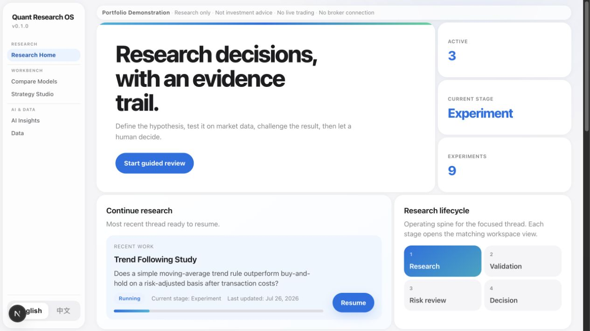
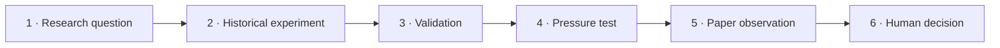
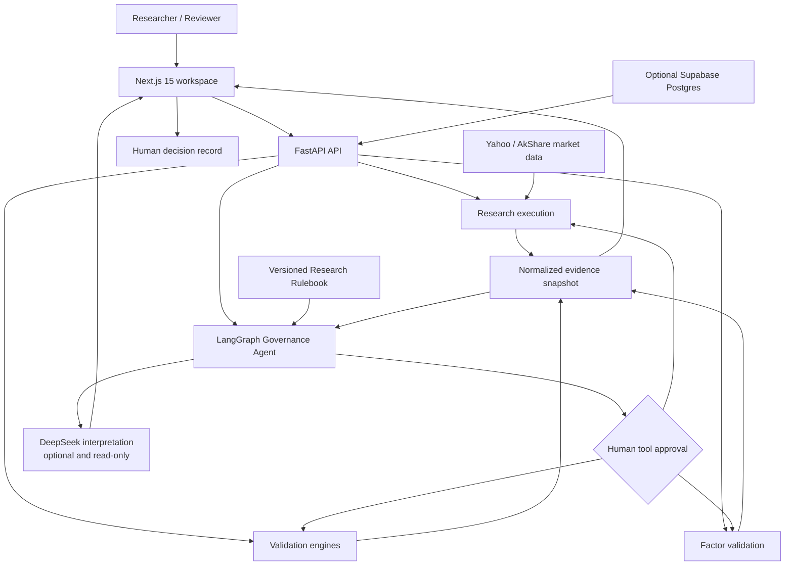
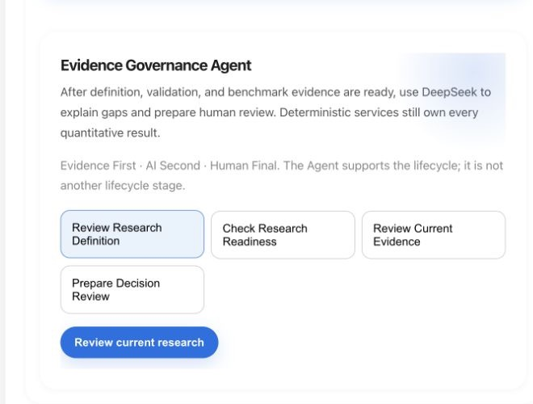

# AI Quant Research Workspace

**An evidence-governed research operating system for turning quantitative hypotheses into reproducible experiments, robustness review, and human-owned decisions.**

[Live demo](https://signals.josephjwang.com) · [Product story](docs/PROJECT_STORY.md) · [Architecture](docs/ARCHITECTURE.md) · [Governance Agent](docs/AGENT_GOVERNANCE.md) · [Three-minute demo](docs/DEMO_SCRIPT.md)

[](https://github.com/josephwang-ds/ai-quant-signal-platform/actions/workflows/ci.yml)
[](LICENSE)
[](frontend/package.json)
[](backend/app/main.py)
[](backend/app/research_agent)



> **Research First · Evidence Before Interpretation · Human Final**

This is not a signal dashboard and it does not place trades. It is a portfolio-grade demonstration of how research questions, deterministic calculations, AI-assisted review, approval gates, and final decisions can coexist without confusing their authority.

Research and portfolio demonstration only. Not investment advice. No broker integration. No live execution.

## Why this project is different

Most quant demos optimize for an impressive chart. This project optimizes for a conclusion that can be challenged.

| Typical quant demo | This workspace |
| --- | --- |
| Starts with a ticker and a promising backtest | Starts with a falsifiable question and a frozen protocol |
| Shows one best result | Exposes benchmark, OOS, sensitivity, cost, data-quality, and missing evidence |
| Lets AI produce the answer | Deterministic services own every metric; AI may only interpret supplied evidence |
| Mixes implemented work with roadmap language | Separates calculated checks, unavailable evidence, and unsupported methods |
| Ends with a signal | Ends with a cited evidence snapshot and a human decision record |

The main initiative was not “add an agent.” It was to define a credible research-control system and carry that decision through:

- separate evidence contracts for Trend and Factor research;
- research-type-specific, deterministic tool planning;
- approval before expensive or state-changing work;
- benchmark-aware `Promote / Hold / Reject` suggestions calculated outside the LLM;
- honest unavailable states instead of placeholder metrics;
- one shared cold-start recovery path for the deployed backend;
- a focused Apple-inspired Bento interface that makes the workflow easy to present;
- a persistent light, dark, and system appearance layer shared by research cards,
  forms, status states, and evidence charts.

## Review it in three minutes

Open the [live demo](https://signals.josephjwang.com), select **Trend Following Study**, and follow one question through four proof points:

1. **Question** — inspect the hypothesis, frozen protocol, benchmark, and success criteria.
2. **Evidence** — run the historical experiment and review deterministic validation.
3. **Challenge** — inspect OOS, fixed-protocol rolling walk-forward, parameter, cost, data-quality, and robustness evidence alongside explicit scope boundaries.
4. **Decision** — ask the Governance Agent to review the available evidence (expand Execution trace if needed), then record the human outcome and rationale.

The shortest interview route is documented in [docs/DEMO_SCRIPT.md](docs/DEMO_SCRIPT.md). If the Render backend is waking up, the UI queues the request and resumes automatically; the [frontend-safe walkthrough](docs/DEMO_MODE.md) remains available without invented results.

## Product workflow


```mermaid
flowchart LR
    Q["1 · Research question"] --> E["2 · Historical experiment"]
    E --> V["3 · Validation"]
    V --> R["4 · Pressure test"]
    R --> P["5 · Paper observation"]
    P --> D["6 · Human decision"]
```

Two canonical studies demonstrate different evidence contracts:

| Study | Research type | Benchmark | Required evidence |
| --- | --- | --- | --- |
| **Trend Following Study** | Single-asset time-series | SPY Buy & Hold | execution, aligned benchmark, OOS, parameter sensitivity, cost sensitivity, data quality |
| **Cross-Sectional Equity Factor Study** | Cross-sectional factor | Equal-Weight Universe plus zero RankIC / spread baselines | completed factor validation, benchmark result, calculated RankIC evidence |

## Architecture

The deployable runtime is a modular monolith: Next.js owns presentation, FastAPI owns application orchestration, and deterministic research services own quantitative truth.


```mermaid
flowchart TB
    U["Researcher / Reviewer"] --> UI["Next.js 15 workspace"]
    UI --> API["FastAPI API"]

    API --> EXEC["Research execution"]
    API --> VAL["Validation engines"]
    API --> FACTOR["Factor validation"]
    EXEC --> SNAP["Normalized evidence snapshot"]
    VAL --> SNAP
    FACTOR --> SNAP

    API --> AGENT["LangGraph Governance Agent"]
    RULES["Versioned Research Rulebook"] --> AGENT
    SNAP --> AGENT
    AGENT --> GATE{"Human tool approval"}
    GATE --> EXEC
    GATE --> VAL
    GATE --> FACTOR
    AGENT --> LLM["DeepSeek interpretation<br/>optional and read-only"]

    SNAP --> UI
    LLM --> UI
    UI --> HUMAN["Human decision record"]

    DATA["Yahoo / AkShare market data"] --> EXEC
    DB["Optional Supabase Postgres"] --> API
```

### Authority boundaries

| Layer | Owns | Must not do |
| --- | --- | --- |
| Deterministic research services | backtests, benchmarks, validation metrics, evidence availability | delegate calculations to an LLM |
| Governance Agent | workflow coordination, methodology retrieval, evidence review, approval pauses | invent metrics, choose arbitrary tools, trade, or approve deployment |
| DeepSeek adapter | explain a supplied normalized snapshot in a strict schema | change completeness, tool plans, or decision suggestions |
| Human reviewer | approve tools and record the final outcome and rationale | silently overwrite prior evidence |

Deeper design: [docs/ARCHITECTURE.md](docs/ARCHITECTURE.md) · [docs/RESEARCH_WORKFLOW.md](docs/RESEARCH_WORKFLOW.md) · [docs/adr/ADR-0010-quant-research-governance-agent.md](docs/adr/ADR-0010-quant-research-governance-agent.md)

## Evidence Governance Agent



The Agent is a controlled reviewer inside the research lifecycle, not a chatbot pasted beside a backtest.
It stays collapsed until a reviewer asks for it, keeping deterministic evidence and the human workflow visually primary.

```text
Classify intent
→ load saved research context
→ retrieve versioned methodology
→ normalize the current evidence snapshot
→ build a deterministic tool plan
→ pause for human approval when required
→ execute only registered deterministic tools
→ refresh evidence
→ optionally ask DeepSeek to interpret supplied facts
→ calculate a deterministic decision suggestion
→ wait for the human decision
```

Key controls:

- **Bounded graph:** maximum 24 nodes; no unbounded autonomous loop.
- **Registered tools only:** no arbitrary code execution or open-ended HTTP tools.
- **One model call at most:** planning and decision logic remain deterministic.
- **Approval gates:** expensive validation and write-sensitive actions pause.
- **Typed outputs:** LLM responses must satisfy strict Pydantic schemas.
- **Dual citations:** methodology citations and calculated evidence IDs are kept structurally distinct.
- **Safe degradation:** without an LLM key, the deterministic workflow still runs and AI interpretation is marked unavailable.
- **No chain-of-thought exposure:** the UI receives concise workflow events, not hidden reasoning.

Decision suggestions follow transparent rules:

| Evidence state | Deterministic suggestion |
| --- | --- |
| Failed validation or failed benchmark | `Reject` |
| Missing or incomplete required evidence | `Hold` |
| Complete evidence with a passing benchmark | `Promote` |
| Any remaining inconclusive state | `Hold` |

The suggestion is review input. Only the human decision record is authoritative.

Implementation: [`backend/app/research_agent/`](backend/app/research_agent) · API routes: [`backend/app/api/routes/research_agent.py`](backend/app/api/routes/research_agent.py) · Full policy: [docs/AGENT_GOVERNANCE.md](docs/AGENT_GOVERNANCE.md)

## Implemented product surfaces

| Surface | What is real today |
| --- | --- |
| Research Home | focused entry point for canonical Trend and Factor studies, guided review, and lifecycle orientation |
| Research Definition | editable question, hypothesis, null, mechanism, criteria, and limitation templates; usable without an LLM |
| Historical Experiment | reproducible MA crossover execution against same-asset Buy & Hold |
| Factor Validation | RankIC and Q1–Q5 cross-sectional validation with explicit baselines |
| Validation | chronological OOS, parameter sensitivity, cost sensitivity, and data-quality evidence |
| Pressure Test | four evidence-backed checks plus visible unsupported-method boundaries |
| Compare Models | rules vs XGBoost / LightGBM on the same OOS window with leakage controls |
| Risk Review | deterministic five-level risk assessment with component levels and reasons |
| Paper Observation | bounded, browser-local plan and dated human notes; no fake trades or P&L |
| Decision Record | deterministic readiness suggestion, human override rationale, and evidence snapshot reference |
| AI Research Reviewer | four focused strict-JSON actions for definition, hypothesis, supplied evidence, and missing steps |
| Evidence Governance Agent | controlled LangGraph workflow over normalized evidence and approved tools |
| Cold-start recovery | shared readiness gate, bounded retry, queued requests, and automatic continuation |
| Adaptive appearance | accessible light / dark / system themes with persisted preference, no-flash startup, responsive controls, and theme-aware Recharts |

Unsupported methods are documented rather than presented as empty product features: regime analysis, Monte Carlo, liquidity/capacity modelling, broker connectivity, production OMS, and autonomous trading. Canonical trend walk-forward is implemented as fixed-parameter chronological evidence; it reduces but does not eliminate overfitting risk and is not a future-return forecast.

See [docs/ROADMAP.md](docs/ROADMAP.md) and [docs/KNOWN_LIMITATIONS.md](docs/KNOWN_LIMITATIONS.md).

## Evidence and authenticity

The workspace uses a simple rule: if the backend did not calculate it, the UI does not present it as evidence.

- no fabricated PnL, fills, trades, or confidence scores;
- failed or incomplete validation stages never count as available;
- unavailable evidence remains unavailable rather than becoming zero;
- AI text is visually separate from calculated results;
- paper observation is a research log, not simulated execution;
- unimplemented methods are scope boundaries, not disabled promises.

Policy: [docs/AUTHENTICITY.md](docs/AUTHENTICITY.md) · [docs/data/AUTHENTICITY_POLICY.md](docs/data/AUTHENTICITY_POLICY.md)

## Cold-start design

The public backend runs on Render. Free instances can sleep, and any instance can restart during a deploy; the frontend treats startup as an application state instead of allowing every evidence panel to fail independently:

1. one shared `/health` request wakes the backend;
2. concurrent API calls join the same readiness promise;
3. the UI shows a bounded startup notice and queues pending requests;
4. requests resume automatically when health succeeds;
5. local research content remains intact if startup fails;
6. **Retry and resume** restarts the same user intent.

The `keep-warm` GitHub workflow is an optimization, not a correctness dependency. GitHub schedules are best-effort; an always-on Render Starter instance is the lowest-migration option when cold starts are unacceptable.

Before a live interview, confirm the latest `keep-warm` run is green and check the [backend health endpoint](https://ai-quant-signal-platform.onrender.com/health).

## Tech stack

| Layer | Technology |
| --- | --- |
| Frontend | Next.js 15, React 19, TypeScript, Vitest |
| Backend | FastAPI, Pydantic v2, pandas, pytest |
| Agent | LangGraph, strict schemas, backend-only OpenAI-compatible provider adapter |
| Quant / ML | NumPy, scikit-learn, XGBoost, LightGBM |
| Data | Yahoo Finance, AkShare; optional Supabase Postgres |
| Deployment | Vercel + Render + GitHub Actions |

### Data availability

The product exposes only provider paths that are suitable for a research walkthrough:

- **Auto routing, Yahoo Finance, and AKShare** are the selectable research-data options.
- **Crypto support is price-history only**; the product does not claim market-cap, volume-profile, or on-chain coverage.
- **Stooq remains an internal last-resort fallback** in the legacy market-data service, but is deliberately not selectable in the UI because its public CSV endpoint can return browser-verification pages.
- CSV upload, CoinGecko, Tushare, and BaoStock are not exposed as product capabilities because they are not implemented in this runtime.

The visual system adapts principles from the MIT-licensed [Apple Bento Grid](https://github.com/hubeiqiao/apple-bento-grid): a quiet `#f5f5f7` canvas, large editorial type, full-height cards, a consistent grid rhythm, and restrained accent surfaces. The implementation remains an interactive research product rather than a landing-page clone.

## Run locally

### Prerequisites

- Python 3.9+
- Node.js 18.18+ and npm

### 1. Start the backend

```bash
cd backend
python3 -m venv .venv
source .venv/bin/activate
pip install -r requirements.txt -r requirements-dev.txt
cp .env.example .env
uvicorn app.main:app --reload --port 8000
```

### 2. Start the frontend

```bash
cd frontend
npm ci
cp .env.example .env.local
npm run dev
```

Open [http://localhost:3000](http://localhost:3000). FastAPI docs are available at [http://127.0.0.1:8000/docs](http://127.0.0.1:8000/docs).

The deterministic research workflow works without an LLM key. To enable DeepSeek or another OpenAI-compatible provider, configure the backend-only `LLM_PROVIDER`, `LLM_API_KEY`, `LLM_BASE_URL`, and `COPILOT_MODEL` values described in [`backend/.env.example`](backend/.env.example). Never put provider secrets in `NEXT_PUBLIC_*`.

Public-demo deployments also use request-size limits, tiered in-memory rate limits, bounded LLM concurrency, and explicit LLM/provider/validation timeouts (`AGENT_RATE_LIMIT`, `LLM_MAX_CONCURRENCY`, `MAX_REQUEST_BODY_BYTES`, and related knobs in [`backend/.env.example`](backend/.env.example)). The in-memory limiter is single-instance only; see [docs/KNOWN_LIMITATIONS.md](docs/KNOWN_LIMITATIONS.md).

## Verify the project

```bash
# Backend
cd backend
source .venv/bin/activate
PYTHONPATH=. python -m pytest tests -m "not live" -q

# Frontend
cd frontend
npm test
npx tsc --noEmit
npm run build
npm run test:e2e
```

Current local acceptance (non-live): about **252** frontend Vitest tests and **377** backend pytest tests. Playwright e2e uses port **3010** (`npx playwright install chromium` once; `npm run build` then `npm run test:e2e`).

## API map

| Capability | Endpoint |
| --- | --- |
| Health / readiness | `GET /health` |
| Research execution | `POST /api/v1/research/execution` |
| Research validation | `POST /api/v1/research/validation` |
| Evaluation summary | `POST /api/v1/research/evaluation` |
| Definition guidance | `POST /api/v1/research/guidance/definition` |
| Focused AI reviewer | `POST /api/v1/research/reviewer/*` |
| Evidence-grounded Copilot | `POST /api/v1/research/copilot/query` |
| Governance Agent | `POST /api/v1/research/agent/runs` |
| Agent approval / resume | `POST /api/v1/research/agent/runs/{id}/resume` |

Full reference: [docs/API.md](docs/API.md)

## Repository map

```text
.
├── frontend/                  # Next.js product workspace
├── backend/                   # FastAPI demonstrable runtime
│   └── app/research_agent/    # LangGraph governance workflow
├── apps/api/                  # target modular API reference, not the live runtime
├── docs/                      # product, workflow, architecture, ADRs, demo guidance
├── .github/workflows/         # CI and backend warm-up
├── CONTRIBUTING.md
└── README.md
```

The deployed path is `frontend/` + `backend/`. The `apps/api/` tree is an early target-shaped reference and is intentionally not presented as the live implementation.

## Documentation

- [Product definition](docs/PRODUCT.md)
- [Project story and interview narrative](docs/PROJECT_STORY.md)
- [Research workflow](docs/RESEARCH_WORKFLOW.md)
- [Governance Agent](docs/AGENT_GOVERNANCE.md)
- [AI Reviewer](docs/AI_REVIEWER.md)
- [Architecture](docs/ARCHITECTURE.md)
- [Three-minute demo](docs/DEMO_SCRIPT.md)
- [Stable demo modes](docs/DEMO_MODE.md)
- [Known limitations](docs/KNOWN_LIMITATIONS.md)
- [Development](docs/DEVELOPMENT.md)
- [Deployment](docs/DEPLOYMENT.md)

## Responsible use

This software supports research demonstration and paper-observation staging. It does not provide financial advice, guarantee results, connect to a broker, or execute orders. Historical results can differ materially from real outcomes.

## License

[MIT License](LICENSE) · Copyright © 2026 Joseph Wang
