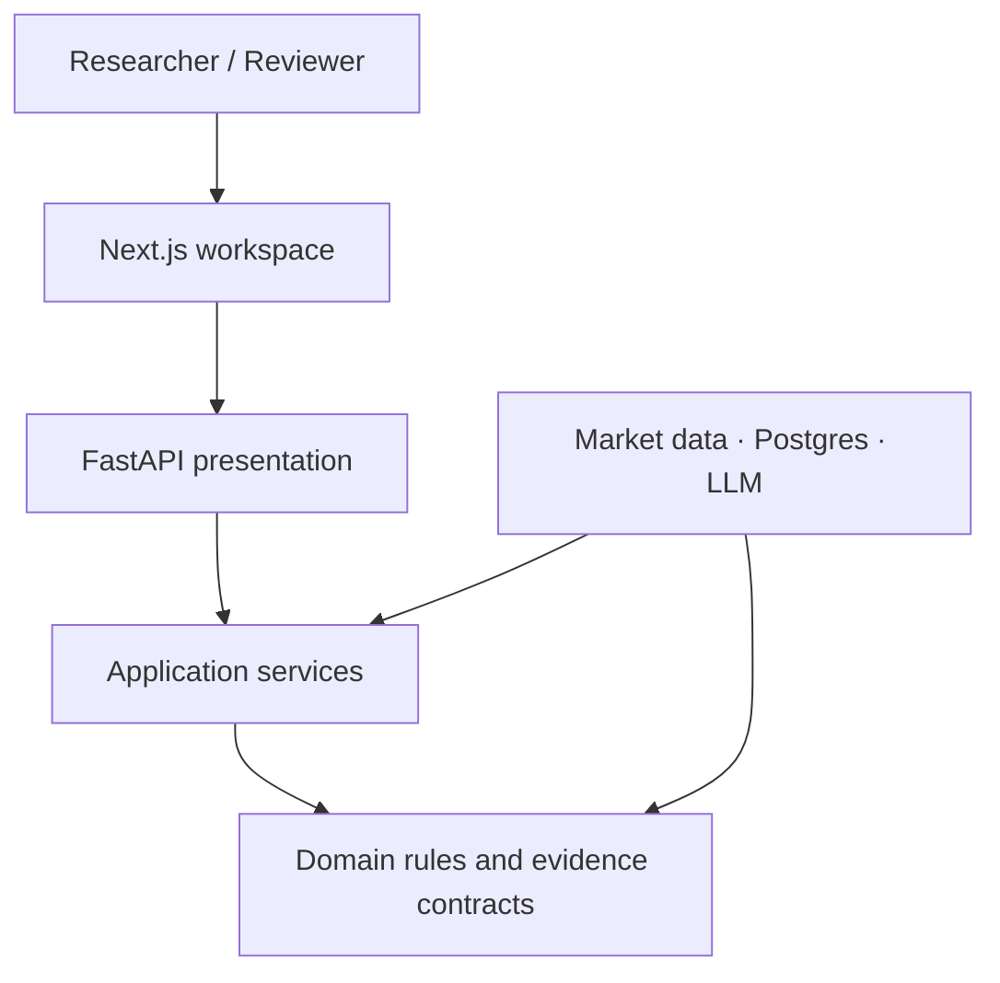
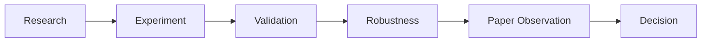
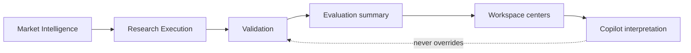

# Architecture

> Portfolio-facing overview of the demonstrable runtime.  
> Frozen product/domain authority: [`PROJECT_BIBLE.md`](PROJECT_BIBLE.md) and the [Architecture Bible](Architecture-Bible/).  
> Historical snapshot: [`legacy/ARCHITECTURE-SNAPSHOT.md`](legacy/ARCHITECTURE-SNAPSHOT.md).

## Overall shape

The product is a **modular monolith** with Clean Architecture boundaries:

- **Presentation** — Next.js research workspace (`frontend/`)
- **Application** — use-case orchestration (backend services and hooks)
- **Domain** — research lifecycle meaning, validation outcomes, governance rules
- **Infrastructure** — market-data providers, Postgres, LLM adapters

Cross-context communication is intended through stable contracts and domain events. The deployed path today is `frontend/` + `backend/`. `apps/api/` is an early target-shaped reference, not the live runtime.

## Frontend

| Area | Responsibility |
| --- | --- |
| Research Library (`/`) | Entry list of research projects |
| Research Workspace (`/research/[id]`) | Lifecycle tabs: Research → Experiment → Validation → Robustness → Paper Observation → Decision |
| Supporting tools | Strategy Lab, Compare, Markets, Data, Saved Runs (secondary navigation) |

Key conventions:

- Calculated metrics render only from backend responses or honest empty states
- Research definitions may live in browser-local storage; they are not fabricated performance
- Workspace tabs map to the product lifecycle spine; Evaluation is folded into Validation for navigation

## Backend

| Area | Path | Responsibility |
| --- | --- | --- |
| Research execution | `backend/app/research_execution/` | Historical MA crossover backtest + benchmark |
| Validation | `backend/app/research_validation/` | OOS, parameter/cost sensitivity, data quality |
| Evaluation | `backend/app/research_evaluation/` | Summarize validation evidence (no new metrics) |
| Copilot | `backend/app/research_copilot/` | Evidence-grounded explanation via configured LLM |
| Market data | `backend/app/data_providers/` + router | Yahoo (global) / AkShare (mainland A-shares) |
| Legacy demos | `backend/app/main.py` routes | Market watch, backtest lab, paper trading APIs |

## Research workflow (product spine)

Backend slices calculate evidence for **execution**, **validation**, and **evaluation**. Robustness projects those implemented checks; Paper Observation and Decision persist human-authored browser-local records. Archive is a repository action. None invent fills, scores, or approvals.

See [`RESEARCH_WORKFLOW.md`](RESEARCH_WORKFLOW.md).

## Module relationships

Bounded contexts (Architecture Bible): Research, Validation, Governance, Portfolio, Market Intelligence. Strategy remains the cross-context identity.

## Authority order

1. Architecture Bible chapters  
2. Project Bible  
3. Accepted ADRs (`docs/adr/`)  
4. Slice notes (`docs/slices/`)  
5. Implementation  
