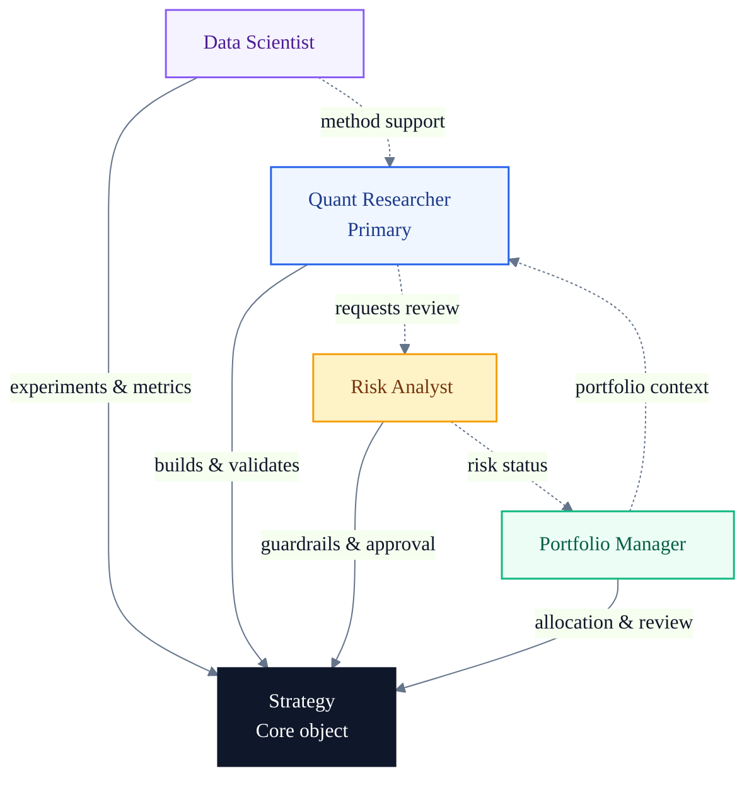
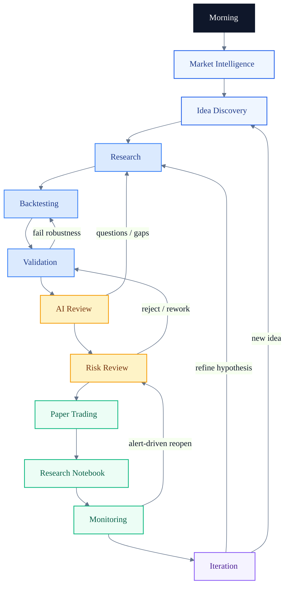
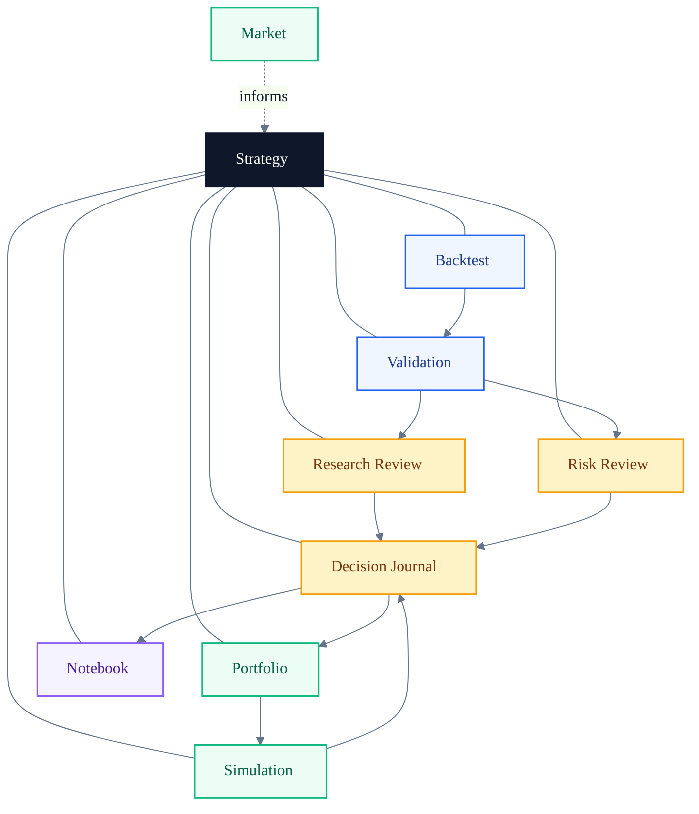
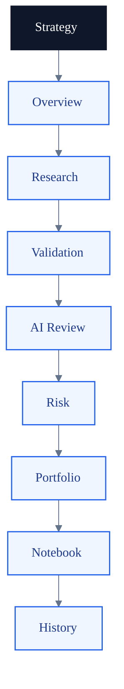
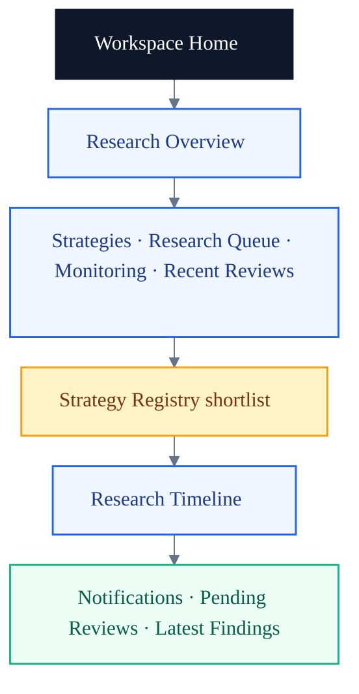
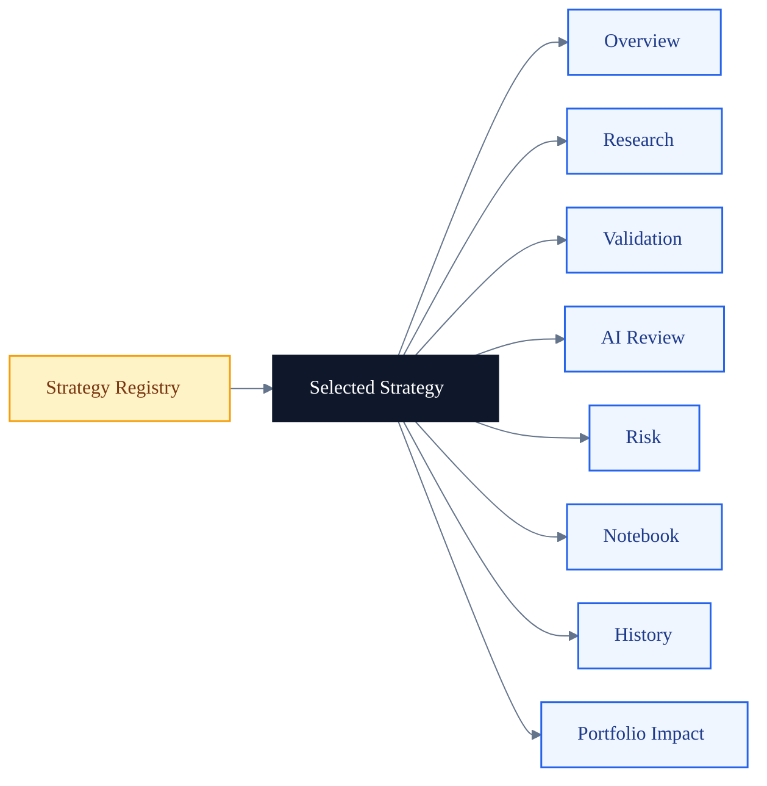
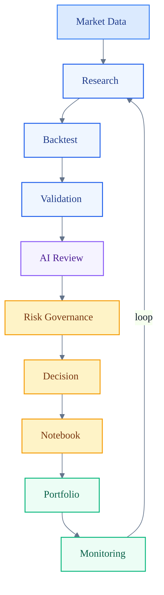

# AI Quant Research Workspace v2

> **Status: Appendix A (not Chapter 2)**  
> **Authoritative Chapter 2 is the [Domain Model](Chapter-02-Domain-Model.md).**  
> This document was previously mistitled “Chapter 2: Information Architecture.” It remains accepted product-IA guidance under the Architecture Bible, but it is no longer numbered as Chapter 2. Content decisions are unchanged.

## Architecture Bible — Appendix A: Information Architecture

> **Everything connects back to a Strategy.**

This appendix defines the information architecture (IA) of the AI Quant Research Workspace. It answers who the system serves, how research work flows day to day, which objects form the domain model, how modules connect, and how navigation should be organized.

This document is **architecture documentation only**. It does not prescribe UI components, routes, APIs, or implementation details for the current codebase.

---

# Design Philosophy

The system is **not** organized around pages, screens, or technology stacks.

The system is organized around one core object:

# Strategy

A **Research Workspace** behaves like a research operating system: discover, investigate, validate, govern, operate, and learn—always with a strategy as the unit of accountability.

| Anti-pattern | Workspace principle |
| --- | --- |
| Page-centric IA (“Market Watch page”, “Charts page”) | Object-centric IA (`Strategy`, `Backtest`, `Risk Review`, …) |
| Tool-centric IA (“yfinance module”, “LLM module”) | Workflow-centric IA (Discover → Research → Govern → Operate) |
| Dashboard of disconnected widgets | Operating system for research decisions |

---

# 1 Personas

Four personas share the workspace. They do not each own a separate product; they share the same strategy-centric objects with different responsibilities and decision rights.

## 1.1 Comparison table

| Persona | Primary job | Core questions | Heavy modules | Decision rights |
| --- | --- | --- | --- | --- |
| **Quant Researcher** (primary) | Discover ideas, research, build, validate, monitor, improve | Is the idea testable? Is the evidence robust? What should change next? | Discover, Research Lab, Backtesting, Validation, Notebook | Propose stage changes; own research hypotheses |
| **Portfolio Manager** | Portfolio health, strategy status, allocation, exposure, review | What is live in simulation? What is the exposure? What needs attention? | Strategy Registry, Portfolio Review, Monitoring | Approve allocation / stage for portfolio inclusion |
| **Risk Analyst** | Drawdown, stress, guardrails, approval | What can go wrong? Which rules bind? Can this advance? | Risk Governance, Validation, Alerts | Gate advancement; veto on risk policy |
| **Data Scientist** | Experiments, features, models, metrics | Are features valid? Is the model evaluated correctly over time? | Research Lab, Benchmark, Validation, Notebook | Own ML experiment design; not override risk gates |

## 1.2 Relationship diagram

Personas collaborate around **Strategy**. The Quant Researcher produces evidence; Risk Analyst and Portfolio Manager govern advancement; Data Scientist deepens experimental methods—all without bypassing deterministic risk rules (see Chapter 1).



[Open the SVG version](assets/personas-relationship.svg) · [Edit in draw.io](assets/drawio/personas-relationship.drawio)

---

# 2 User Journey

A typical research day is a **loop**, not a straight line. Morning preparation flows into intelligence and discovery; research and validation produce candidates for AI and risk review; paper trading and notebooks preserve decisions; monitoring feeds the next iteration.

## 2.1 End-to-end workflow



[Open the SVG version](assets/user-journey.svg) · [Edit in draw.io](assets/drawio/user-journey.drawio)

## 2.2 Feedback loops (summary)

| Loop | Trigger | Returns to |
| --- | --- | --- |
| Evidence gap | AI Review finds missing tests or unclear drivers | Research / Backtesting |
| Robustness fail | Validation fails OOS, walk-forward, or regime checks | Backtesting / parameter design |
| Risk reject | Risk Review blocks stage advance | Validation or strategy redesign |
| Alert reopen | Monitoring breach or drift | Risk Review / Notebook |
| Iteration | Scheduled review or weak live simulation | Idea Discovery or Research |

---

# 3 Core Objects

The workspace domain model is intentionally small. Every durable research artifact should attach to a **Strategy**.

## 3.1 Object catalog

| Object | Role |
| --- | --- |
| **Strategy** | Center of gravity: hypothesis, lifecycle stage, ownership, next action |
| **Backtest** | Historical simulation run and metrics for a strategy configuration |
| **Validation** | Robustness / OOS / regime / stability evidence package |
| **Risk Review** | Deterministic risk assessment and gate decision |
| **Research Review** | Human (+ optional AI-assisted) interpretation of evidence |
| **Decision Journal** | Traceable record of what was decided, by whom, on which evidence |
| **Portfolio** | Simulated or reviewed allocation context across strategies |
| **Market** | Market intelligence context (regime, universe, events) |
| **Simulation** | Paper trading / execution simulation state |
| **Notebook** | Narrative research record linked to strategy and decisions |

## 3.2 Object relationship diagram



[Open the SVG version](assets/core-objects.svg) · [Edit in draw.io](assets/drawio/core-objects.drawio)

---

# 4 Site Map

Navigation is grouped by **research operating modes**, not by technical feature names.

```text
Workspace
├── Home
│
├── Discover
│      ├── Market Intelligence
│      ├── Idea Inbox
│      └── Research Queue
│
├── Research
│      ├── Research Lab
│      ├── Backtesting
│      ├── Validation Center
│      ├── Benchmark Center
│      └── AI Review
│
├── Govern
│      ├── Strategy Registry
│      ├── Risk Governance
│      ├── Portfolio Review
│      └── Research Notebook
│
├── Operate
│      ├── Paper Trading
│      ├── Monitoring
│      └── Alerts
│
└── Settings
```



```mermaid
%%{init: {"theme":"base","themeVariables":{"fontFamily":"Inter, ui-sans-serif, system-ui, sans-serif","primaryColor":"#EFF6FF","primaryTextColor":"#0F172A","primaryBorderColor":"#2563EB","lineColor":"#64748B"},"flowchart":{"curve":"basis","nodeSpacing":24,"rankSpacing":36}}}%%
flowchart TB
    W["Workspace"]

    H["Home"]
    D["Discover"]
    R["Research"]
    G["Govern"]
    O["Operate"]
    ST["Settings"]

    W --> H
    W --> D
    W --> R
    W --> G
    W --> O
    W --> ST

    D --> D1["Market Intelligence"]
    D --> D2["Idea Inbox"]
    D --> D3["Research Queue"]

    R --> R1["Research Lab"]
    R --> R2["Backtesting"]
    R --> R3["Validation Center"]
    R --> R4["Benchmark Center"]
    R --> R5["AI Review"]

    G --> G1["Strategy Registry"]
    G --> G2["Risk Governance"]
    G --> G3["Portfolio Review"]
    G --> G4["Research Notebook"]

    O --> O1["Paper Trading"]
    O --> O2["Monitoring"]
    O --> O3["Alerts"]

    classDef root fill:#0F172A,color:#FFFFFF,stroke:#0F172A,stroke-width:2px;
    classDef section fill:#EFF6FF,color:#1E3A8A,stroke:#2563EB,stroke-width:1.5px;
    classDef leaf fill:#F8FAFC,color:#0F172A,stroke:#94A3B8,stroke-width:1px;
    class W root;
    class H,D,R,G,O,ST section;
    class D1,D2,D3,R1,R2,R3,R4,R5,G1,G2,G3,G4,O1,O2,O3 leaf;
```

[Open the SVG version](assets/site-map.svg) · [Edit in draw.io](assets/drawio/site-map.drawio)

**Strategy Registry** under Govern is the operational center of the system (see Section 8). Discover and Research *produce* candidates; Govern *owns* lifecycle truth; Operate *observes* simulation behavior.

---

# 5 Sidebar Navigation

The primary sidebar uses **four expandable sections** plus Home and Settings. Navigation stays minimal: one level of expansion, short labels, no technology jargon.


[Open the SVG version](assets/sidebar-navigation.svg) · [Edit in draw.io](assets/drawio/sidebar-navigation.drawio)

### Sidebar principles

1. **Four verbs** — Discover, Research, Govern, Operate — encode the operating model.
2. **Expand, don’t multiply** — prefer one expandable group over many top-level links.
3. **Strategy deep-link** — from Registry (or Home), open a strategy-centric shell (Section 6) rather than scattering strategy context across unrelated pages.

---

# 6 Strategy-Centric Navigation

Once a strategy is selected, local navigation is **inside the strategy**, not a jump across unrelated global pages.



[Open the SVG version](assets/strategy-centric-nav.svg) · [Edit in draw.io](assets/drawio/strategy-centric-nav.drawio)

| Tab | Purpose |
| --- | --- |
| Overview | Stage, health, risk summary, next action, owners |
| Research | Hypotheses, configs, linked backtests |
| Validation | Robustness package and pass/fail gates |
| AI Review | Evidence interpretation; never a risk override |
| Risk | Guardrails, stress, approval state |
| Portfolio | Allocation / exposure impact |
| Notebook | Narrative and decision rationale |
| History | Timeline of reviews, stage changes, alerts |

---

# 7 Workspace Home

Home is an **operating overview**, not a marketing landing page and not a dense analytics dashboard. Structure only (no visual UI specification):

```text
Workspace Home
-------------------------------------------------
Research Overview          (posture: active strategies, pending gates, overnight alerts)
-------------------------------------------------
Strategies | Research Queue | Monitoring | Recent Reviews
-------------------------------------------------
Strategy Registry          (compact table / shortlist of owned strategies)
-------------------------------------------------
Research Timeline          (recent stage changes, validations, notebook entries)
-------------------------------------------------
Notifications | Pending Reviews | Latest Findings
```



[Open the SVG version](assets/workspace-home-layout.svg) · [Edit in draw.io](assets/drawio/workspace-home-layout.drawio)

Home answers: *What needs attention today, and which strategies own that attention?*

---

# 8 Strategy Registry

The **Strategy Registry** is the center of the entire system: the authoritative list of strategies, their lifecycle stage, health, risk posture, ownership, and next action.

## 8.1 Registry columns

| Column | Meaning |
| --- | --- |
| Strategy | Name / ID of the research strategy |
| Stage | Lifecycle state (Idea → … → Archived; see Chapter 1) |
| Health | Composite research/operational health signal |
| Risk | Current risk gate level / status |
| Last Review | Most recent Research or Risk review timestamp |
| Owner | Accountable researcher (and optional PM) |
| Next Action | Explicit next step (validate, risk review, monitor, …) |

## 8.2 Click-through navigation flow

Selecting a strategy opens the strategy-centric shell (Section 6), including Portfolio Impact as an explicit destination from the registry context.



[Open the SVG version](assets/strategy-registry-flow.svg) · [Edit in draw.io](assets/drawio/strategy-registry-flow.drawio)

---

# 9 Information Flow

Information moves from market context through evidence production, governed decision, portfolio context, and monitoring—then loops back into research.



[Open the SVG version](assets/information-flow.svg) · [Edit in draw.io](assets/drawio/information-flow.drawio)

### Flow invariants

- **AI Review** interprets Validation evidence; it does not invent missing backtests.
- **Risk Governance** is deterministic relative to policy; AI may explain, never override.
- **Decision → Notebook** is mandatory for traceability.
- **Monitoring → Research** closes the operating loop.

---

# 10 Navigation Principles

1. **Everything starts from Strategy.** Global modules exist to create, find, govern, or operate strategies—not as orphan tools.
2. **Every decision has evidence.** Navigation should surface the evidence chain (Backtest → Validation → Reviews → Decision Journal).
3. **AI never overrides risk rules.** AI Review is a sibling of Risk, not a substitute for it.
4. **Every strategy has lifecycle states.** Stage is a first-class navigation and registry attribute.
5. **Everything is traceable.** History, Notebook, and Decision Journal remain reachable from the strategy shell.

---

# Architecture Summary

| Theme | Decision |
| --- | --- |
| Organizing object | **Strategy** |
| Product shape | Research **Workspace** / research OS — not a widget dashboard |
| Primary persona | Quant Researcher; PM / Risk / Data Science share objects |
| Global IA | Discover · Research · Govern · Operate (+ Home, Settings) |
| Local IA | Strategy shell: Overview → Research → Validation → AI Review → Risk → Portfolio → Notebook → History |
| System center | **Strategy Registry** |
| Home job | Attention + shortlist + timeline + pending reviews |
| Information loop | Market → Research → Backtest → Validation → AI → Risk → Decision → Notebook → Portfolio → Monitoring → Research |
| Hard boundary | Deterministic risk gates; AI assists interpretation only |

### Diagram index

| Diagram | SVG | draw.io | Mermaid |
| --- | --- | --- | --- |
| Personas relationship | [assets/personas-relationship.svg](assets/personas-relationship.svg) | [drawio](assets/drawio/personas-relationship.drawio) | Section 1 |
| User journey | [assets/user-journey.svg](assets/user-journey.svg) | [drawio](assets/drawio/user-journey.drawio) | Section 2 |
| Core objects | [assets/core-objects.svg](assets/core-objects.svg) | [drawio](assets/drawio/core-objects.drawio) | Section 3 |
| Site map | [assets/site-map.svg](assets/site-map.svg) | [drawio](assets/drawio/site-map.drawio) | Section 4 |
| Sidebar navigation | [assets/sidebar-navigation.svg](assets/sidebar-navigation.svg) | [drawio](assets/drawio/sidebar-navigation.drawio) | Section 5 |
| Strategy-centric nav | [assets/strategy-centric-nav.svg](assets/strategy-centric-nav.svg) | [drawio](assets/drawio/strategy-centric-nav.drawio) | Section 6 |
| Workspace home layout | [assets/workspace-home-layout.svg](assets/workspace-home-layout.svg) | [drawio](assets/drawio/workspace-home-layout.drawio) | Section 7 |
| Strategy registry flow | [assets/strategy-registry-flow.svg](assets/strategy-registry-flow.svg) | [drawio](assets/drawio/strategy-registry-flow.drawio) | Section 8 |
| Information flow | [assets/information-flow.svg](assets/information-flow.svg) | [drawio](assets/drawio/information-flow.drawio) | Section 9 |

---

*Appendix A defines how people, objects, and navigation organize around Strategy. Authoritative domain vocabulary lives in [Chapter 2 — Domain Model](Chapter-02-Domain-Model.md). Later chapters specify state machines and runtime architecture without changing this IA center of gravity.*
