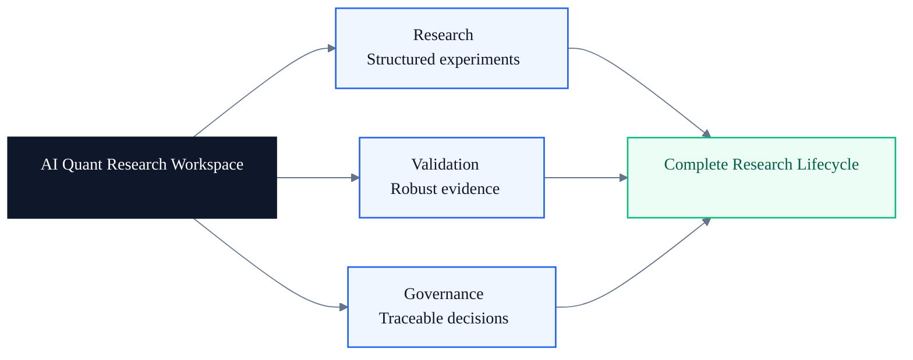
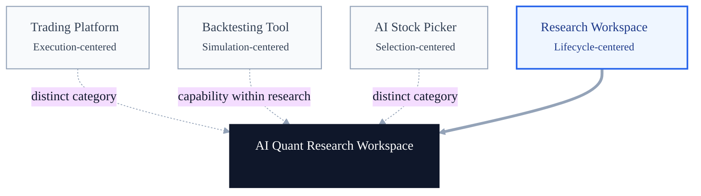
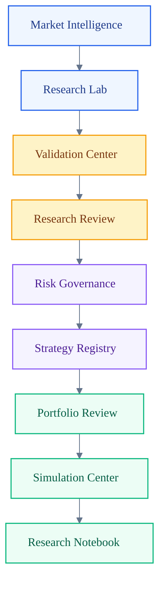

# AI Quant Research Workspace v2

## Architecture Bible — Chapter 1: Product Vision

> **Research First. AI Second. Decisions Last.**

This chapter defines the product vision for the AI Quant Research Workspace. It describes the product's purpose, principles, positioning, and research lifecycles. It intentionally makes no implementation, interface, API, or infrastructure commitments.

---

# 1 Product Vision

AI Quant Research Workspace is a governed environment for moving quantitative ideas from initial hypotheses to evidence-backed decisions. It helps quantitative researchers manage the complete research lifecycle: framing an idea, designing experiments, validating results, reviewing risk, monitoring outcomes, and preserving an auditable record of what was decided and why.

The product is **not**:

- a trading bot that autonomously places orders;
- a stock prediction model that presents forecasts as decisions; or
- an execution platform for routing and managing live orders.

It is an **AI Quant Research Workspace** organized around three responsibilities:

- **Research** — turn hypotheses into structured, reproducible experiments;
- **Validation** — test whether results are robust, explainable, and fit for purpose; and
- **Governance** — make evidence, risk controls, decisions, ownership, and lifecycle state visible.

AI assists the researcher by interpreting evidence, connecting context, and drafting explanations. Quantitative methods establish the evidence. Explicit validation and governance determine whether a strategy may advance.

[Open the SVG version](assets/vision-overview.svg)

---

# 2 Product Philosophy

The workspace follows four principles that establish the boundary between quantitative evidence, AI assistance, and accountable human decisions.

## 2.1 Quant before AI

Quantitative evidence comes first. Metrics, tests, and observed results establish what is known; AI then helps interpret that evidence. AI interpretation cannot substitute for missing evidence.

## 2.2 Deterministic before LLM

Risk limits, validation thresholds, stage gates, and policy rules are deterministic. LLMs may explain why a rule passed or failed and summarize its implications, but they never override quantitative validation or alter a risk outcome.

## 2.3 Every conclusion requires evidence

A conclusion must be traceable through metrics and evidence to its source. This chain makes the research reviewable, reproducible, and auditable.

## 2.4 Research is a lifecycle

Research does not end when a backtest is complete. A strategy moves through validation, paper trading, monitoring, periodic review, and—when its evidence or relevance no longer holds—retirement.

```mermaid
%%{init: {"theme":"base","themeVariables":{"fontFamily":"Inter, ui-sans-serif, system-ui, sans-serif","primaryColor":"#EFF6FF","primaryTextColor":"#0F172A","primaryBorderColor":"#2563EB","lineColor":"#64748B"},"flowchart":{"curve":"basis","nodeSpacing":34,"rankSpacing":42}}}%%
flowchart TB
    subgraph P1["1 · Quant before AI"]
        direction LR
        E["Evidence"] --> AI["AI Interpretation"]
    end

    subgraph P2["2 · Deterministic before LLM"]
        direction LR
        RR["Deterministic Risk Rules"] --> EX["LLM Explanation"]
        EX -. "never overrides" .-> RR
    end

    subgraph P3["3 · Every conclusion requires evidence"]
        direction LR
        C["Conclusion"] --> M["Metrics"] --> EV["Evidence"] --> S["Source"]
    end

    subgraph P4["4 · Research is a lifecycle"]
        direction LR
        I["Idea"] --> RE["Research"] --> VA["Validation"] --> PT["Paper Trading"] --> MO["Monitoring"] --> RV["Review"] --> RT["Retirement"]
    end

    classDef primary fill:#EFF6FF,color:#0F172A,stroke:#2563EB,stroke-width:1.5px;
    classDef guard fill:#FEF3C7,color:#78350F,stroke:#F59E0B,stroke-width:1.5px;
    classDef source fill:#ECFDF5,color:#065F46,stroke:#10B981,stroke-width:1.5px;
    class E,AI,C,M,EV,I,RE,VA,PT,MO,RV,RT primary;
    class RR,EX guard;
    class S source;
```

[Open the SVG version](assets/product-philosophy.svg)

---

# 3 Product Positioning

The defining category is **Research Workspace**. The product coordinates the work around quantitative research rather than specializing in trade execution, backtest computation alone, or AI-generated stock selections.

| Category | Primary job | Product relationship |
| --- | --- | --- |
| Trading Platform | Execute and manage market orders | Outside the product's purpose |
| Backtesting Tool | Simulate a defined strategy on historical data | A research capability, not the whole product |
| AI Stock Picker | Generate or rank security ideas | Not the product category |
| Research Workspace | Manage evidence, validation, review, and lifecycle | **The product's category** |

[Open the SVG version](assets/product-positioning.svg)

---

# 4 Workspace Overview

The workspace connects nine product areas into one continuous research path. The flow begins with market context, moves through research and validation, applies review and governance, registers strategies as governed assets, and continues through portfolio evaluation, simulation, and durable research notes.

[Open the SVG version](assets/workspace-overview.svg)

The sequence expresses a product-level information flow, not a required implementation order. Researchers may revisit earlier areas whenever new evidence changes the hypothesis, validation result, or decision.

---

# 5 Strategy Lifecycle

Every strategy has an explicit lifecycle state. Advancement represents increasing evidence and governance; regression to **Needs Review** is expected when monitoring identifies drift, degradation, a policy breach, or a material change in assumptions.

```mermaid
%%{init: {"theme":"base","themeVariables":{"fontFamily":"Inter, ui-sans-serif, system-ui, sans-serif","primaryColor":"#EFF6FF","primaryTextColor":"#0F172A","primaryBorderColor":"#2563EB","lineColor":"#64748B"},"flowchart":{"curve":"basis","nodeSpacing":30,"rankSpacing":36}}}%%
flowchart LR
    I["Idea"] --> R["Research"] --> V["Validated"] --> P["Paper Trading"] --> M["Monitoring"] --> N["Needs Review"] --> D["Deprecated"] --> A["Archived"]
    N -. "new evidence" .-> R

    classDef early fill:#EFF6FF,color:#1E3A8A,stroke:#2563EB,stroke-width:1.5px;
    classDef active fill:#ECFDF5,color:#065F46,stroke:#10B981,stroke-width:1.5px;
    classDef review fill:#FEF3C7,color:#78350F,stroke:#F59E0B,stroke-width:1.5px;
    classDef retired fill:#F1F5F9,color:#475569,stroke:#94A3B8,stroke-width:1.5px;
    class I,R early;
    class V,P,M active;
    class N review;
    class D,A retired;
```

[Open the SVG version](assets/strategy-lifecycle.svg)

Lifecycle states are governance labels, not performance claims. A **Validated** strategy has passed defined evidence gates; it is not guaranteed to perform in the future. **Archived** preserves the record and rationale rather than erasing unsuccessful or obsolete research.

---

# 6 Research Lifecycle

The research lifecycle is the evidence-producing loop inside the broader strategy lifecycle. Each stage adds a different kind of confidence, context, or control before a decision is made.

```mermaid
%%{init: {"theme":"base","themeVariables":{"fontFamily":"Inter, ui-sans-serif, system-ui, sans-serif","primaryColor":"#EFF6FF","primaryTextColor":"#0F172A","primaryBorderColor":"#2563EB","lineColor":"#64748B"},"flowchart":{"curve":"basis","nodeSpacing":30,"rankSpacing":36}}}%%
flowchart LR
    H["Hypothesis"] --> E["Experiment"] --> B["Backtest"] --> R["Robustness"] --> A["AI Review"] --> K["Risk Review"] --> D["Decision"] --> M["Monitoring"] --> I["Iteration"]
    I -. "refine" .-> H

    classDef quant fill:#EFF6FF,color:#1E3A8A,stroke:#2563EB,stroke-width:1.5px;
    classDef assist fill:#F5F3FF,color:#4C1D95,stroke:#8B5CF6,stroke-width:1.5px;
    classDef govern fill:#FEF3C7,color:#78350F,stroke:#F59E0B,stroke-width:1.5px;
    classDef learn fill:#ECFDF5,color:#065F46,stroke:#10B981,stroke-width:1.5px;
    class H,E,B,R quant;
    class A assist;
    class K,D govern;
    class M,I learn;
```

[Open the SVG version](assets/research-lifecycle.svg)

The **AI Review** stage interprets the quantitative record and highlights questions or inconsistencies. It does not replace robustness testing, risk review, or accountable decision-making. Monitoring feeds iteration so that conclusions can change when the evidence changes.

---

# 7 Product Slogan

> # Research First.  
> # AI Second.  
> # Decisions Last.

This is the operating order of the workspace: conduct the research, use AI to interpret the established evidence, and make decisions only after validation and review.

> **From Ideas to Evidence.**  
> **From Evidence to Decisions.**

This is the value journey: convert an investable idea into a traceable body of evidence, then convert that evidence into a governed decision.

---

## Product Vision in the Broader Landscape

TradingAgents, AI Berkshire, FinRobot, and FinRL-X each represent useful directions in AI-assisted finance and quantitative research. The AI Quant Research Workspace has a different center of gravity:

| Product / direction | Characteristic emphasis | How this vision differs |
| --- | --- | --- |
| [TradingAgents](https://tradingagents-ai.github.io/) | Specialized LLM agents collaborate in roles modeled on a trading firm | Centers the managed research lifecycle, deterministic validation, and governance record |
| [AI Berkshire](https://github.com/xbtlin/ai-berkshire) | AI skills and multi-agent analysis structure value-investing research | Centers quantitative experimentation, evidence lineage, and explicit strategy lifecycle state |
| [FinRobot](https://github.com/AI4Finance-Foundation/FinRobot) | A platform for financially specialized AI agents and financial-analysis workflows | Defines AI as an interpretation layer inside a quant-first research and review process |
| [FinRL-X](https://github.com/AI4Finance-Foundation/FinRL-Trading) | Modular, AI-native infrastructure connects quantitative research with trading deployment | Deliberately stops before execution and organizes the governed path from hypothesis through monitoring and retirement |

The distinction is one of product scope and operating model, not a judgment of quality. This vision treats models, agents, backtests, and simulations as capabilities within a larger workspace whose primary deliverable is a traceable, evidence-backed research decision.
