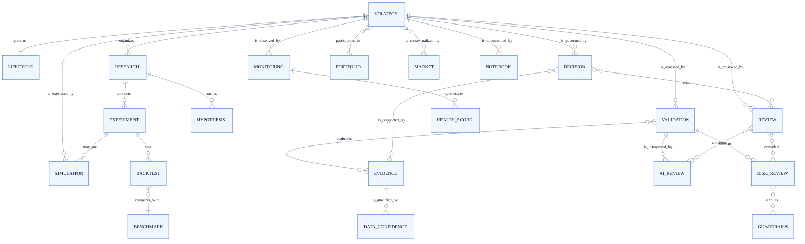
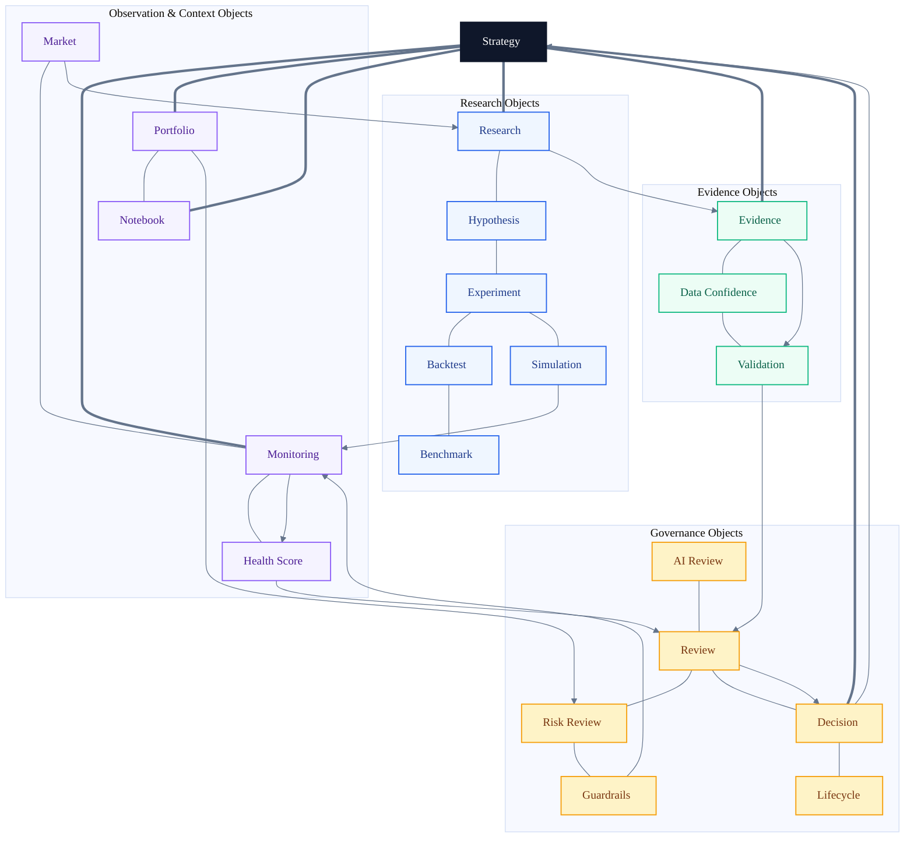
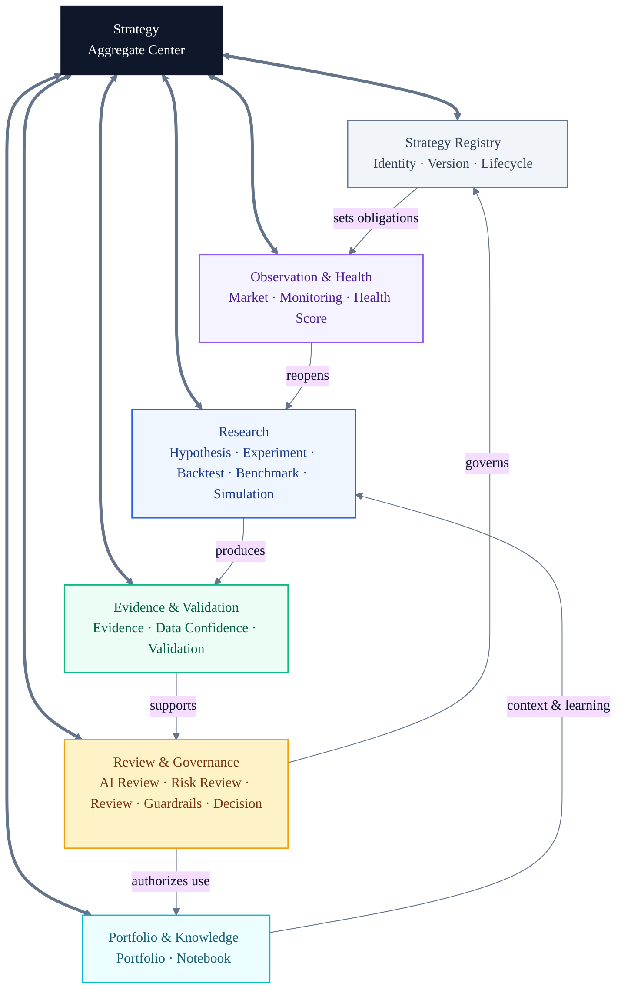
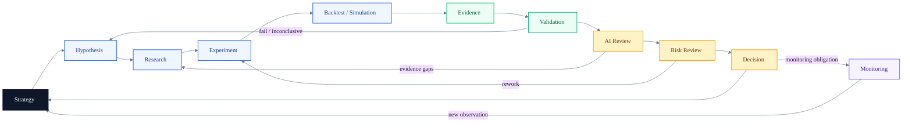
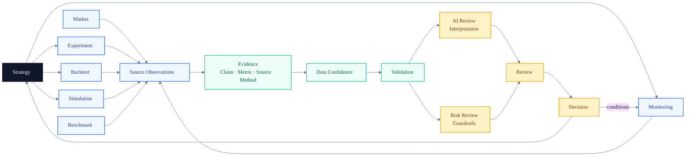
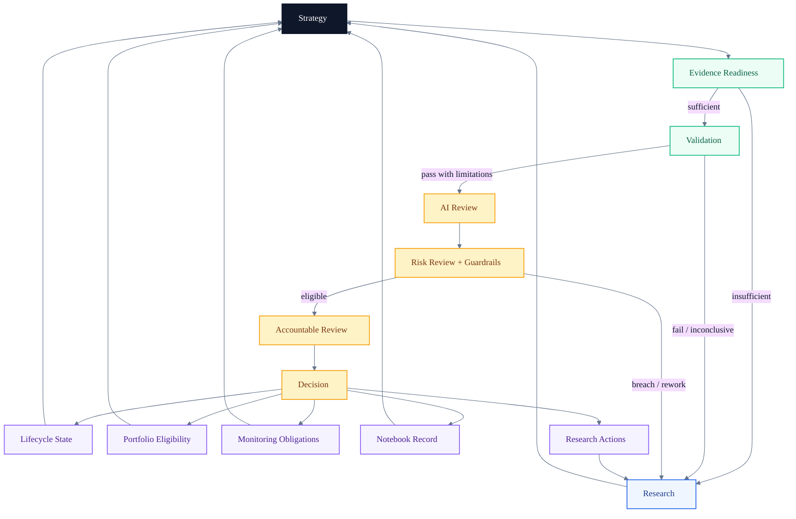
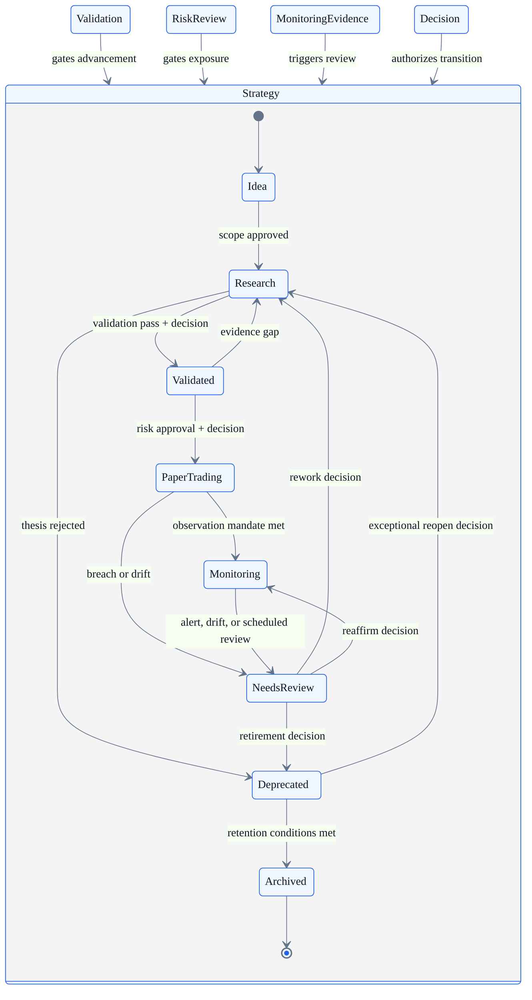

# AI Quant Research Workspace v2

## Architecture Bible — Chapter 2: Domain Model

> **Strategy is the unit of identity, evidence, governance, and learning.**

This chapter defines the product domain of the AI Quant Research Workspace. It is intentionally independent of pages, user-interface composition, services, storage technologies, APIs, and deployment topology. Its purpose is to establish the vocabulary, object boundaries, relationships, ownership rules, and invariants on which later architecture decisions must depend.

The workspace is not page-centric or feature-centric. It is **Strategy-centric**. Research exists to investigate a Strategy. Evidence exists to support or challenge it. Validation and Reviews assess it. Decisions change its governed status. Monitoring measures its continuing health. Even when an object has an independent lifecycle, it remains traceable to the Strategy whose claim, behavior, or use it affects.

---

# 1 Domain Thesis

## 1.1 The Strategy is the aggregate center

A **Strategy** is a durable, versioned research proposition for transforming market observations into portfolio intent under explicit constraints. It is not merely a formula, signal, model, backtest configuration, or trade list. It is the stable domain identity around which hypotheses, experiments, evidence, reviews, decisions, lifecycle state, and operational learning accumulate.

This leads to three architectural consequences:

1. A research artifact without a Strategy relationship is provisional context, not governed strategy research.
2. A Strategy cannot advance because one artifact looks favorable; advancement is a governed conclusion over a coherent body of evidence.
3. Strategy identity survives iteration. A changed thesis or materially changed behavior creates a new Strategy version or a new Strategy rather than silently rewriting history.

## 1.2 Domain laws

The following invariants define the product more strongly than any feature list:

| Invariant | Meaning |
| --- | --- |
| Strategy traceability | Every governed conclusion, review, decision, and observation identifies the affected Strategy and Strategy version. |
| Evidence before conclusion | A Decision cannot be justified by narrative alone; it references an explicit evidence set. |
| Quant before AI | AI Review interprets evidence but cannot create missing quantitative proof or replace Validation. |
| Deterministic governance | Guardrails and their results are deterministic. AI may explain them but cannot override them. |
| Immutable provenance | Published Evidence is append-only, source-linked, and reproducible or explicitly marked non-reproducible. |
| Explicit transitions | Strategy lifecycle changes occur only through recorded Decisions that satisfy transition requirements. |
| Version coherence | Evidence, Reviews, Decisions, Health Scores, and Monitoring observations identify the Strategy version they assess. |
| No hidden execution | Simulation models behavior in a controlled environment; it does not imply authority to execute live orders. |
| Confidence is not performance | Data Confidence measures trust in inputs and lineage. Health Score measures current Strategy condition. Neither proves future return. |
| History is retained | Superseded conclusions and retired Strategies remain reviewable; correction adds history rather than deleting it. |

## 1.3 Domain boundaries

The domain is divided into six conceptual bounded contexts. These are language and ownership boundaries, not implementation services.

| Bounded context | Core objects | Governing question |
| --- | --- | --- |
| Strategy Registry | Strategy, Lifecycle | What is this Strategy, which version is authoritative, and what state is it in? |
| Research | Research, Hypothesis, Experiment, Backtest, Benchmark, Simulation | What claim is being tested, and what observations were produced? |
| Evidence & Validation | Evidence, Data Confidence, Validation | Is the evidence sufficient, reliable, and robust? |
| Review & Governance | AI Review, Risk Review, Review, Guardrails, Decision | What does the evidence mean, what constraints apply, and what is authorized? |
| Observation & Health | Monitoring, Health Score, Market | Is the Strategy behaving as expected in its current context? |
| Portfolio & Knowledge | Portfolio, Notebook | How is the Strategy used with others, and how is its rationale preserved? |

The boundaries protect meaning. For example, a Backtest produces observations but does not declare a Strategy valid; Validation evaluates evidence but does not authorize a lifecycle transition; a Decision authorizes an outcome but does not alter the historical evidence on which it was based.

---

# 2 Aggregate and Ownership Model

## 2.1 Aggregate roots

Four objects act as durable aggregate roots:

- **Strategy** owns identity, version lineage, governed lifecycle state, current thesis reference, and the index of associated domain records.
- **Portfolio** owns allocation intent and portfolio-level constraints while referencing Strategies; it never owns or mutates Strategy identity.
- **Market** owns contextual observations, regimes, universes, and events that may inform many Strategies.
- **Notebook** owns authored knowledge entries and links them to Strategies and evidence without becoming the system of record for either.

Research, Validation, Reviews, Decisions, Monitoring programs, and Simulations may have independent lifecycles and ownership, but they are subordinate to the Strategy-centered governance model. Their records must not silently mutate the Strategy; they propose evidence or outcomes that the Strategy aggregate acknowledges through an explicit Decision.

## 2.2 Ownership roles

Ownership describes accountability, not interface permissions.

| Role | Domain accountability |
| --- | --- |
| Strategy Owner | Maintains Strategy purpose, version integrity, lifecycle intent, and next action. |
| Research Owner | Owns hypotheses, research plans, experiment design, and methodological reproducibility. |
| Evidence Custodian | Owns source lineage, evidence publication, correction, and Data Confidence assessment. |
| Validation Owner | Owns validation criteria and the integrity of pass, fail, or inconclusive findings. |
| Risk Owner | Owns Guardrails, deterministic Risk Review, exceptions policy, and risk sign-off. |
| Decision Authority | Owns the final recorded Decision within an explicit mandate. |
| Portfolio Owner | Owns portfolio-level suitability, allocation intent, and cross-Strategy constraints. |
| Monitoring Owner | Owns observation coverage, alerts, Health Score interpretation, and review escalation. |
| Notebook Author | Owns interpretation and narrative; cannot rewrite governed records through prose. |

One person may hold several roles, but the responsibilities remain distinct. Separation of meaning is required even when separation of personnel is not.

---

# 3 Domain Object Catalog

The catalog below defines the minimum complete language of the workspace. Each object has a reason to exist, a boundary that prevents it from absorbing another object's responsibilities, and a lifecycle appropriate to its meaning.

## 3.1 Strategy

**Purpose.** The durable identity and aggregate center for a testable market approach, its governed evolution, and its accumulated learning.

- **Responsibilities:** define intent, scope, assumptions, ownership, version lineage, active lifecycle state, linked evidence, and current governed disposition.
- **Inputs:** Hypotheses, Research findings, Validation outcomes, Reviews, Decisions, Guardrail results, Portfolio context, Monitoring observations, and Market context.
- **Outputs:** Strategy versions, lifecycle-transition requests, research priorities, eligibility status, monitoring scope, and a traceable strategy record.
- **Relationships:** owns or indexes every Strategy-specific artifact; may participate in many Portfolios; is contextualized by Markets and Benchmarks.
- **Lifecycle:** Idea → Research → Validated → Paper Trading → Monitoring → Needs Review → Deprecated → Archived, with governed return paths.
- **Ownership:** Strategy Owner; transitions require the relevant Decision Authority and, where applicable, Risk Owner.
- **Why it exists:** the platform needs a stable unit of accountability that survives individual experiments and changing conclusions.
- **Why it is not another object:** a Strategy is not a Hypothesis because it can contain many hypotheses; not Research because research is work performed about it; not a Decision because decisions govern its state; not a Portfolio because it is independently testable.
- **Dependents:** all Strategy-linked objects; Lifecycle, Monitoring, Portfolio, Notebook, and governance records are meaningless without a Strategy identity or version.

## 3.2 Research

**Purpose.** A bounded program of inquiry that organizes how a Strategy or Strategy question will be investigated.

- **Responsibilities:** frame questions, manage Hypotheses, define scope and methods, coordinate Experiments, and synthesize findings without authorizing outcomes.
- **Inputs:** Strategy intent, Market context, prior Evidence, Notebook knowledge, open questions, and Decision conditions.
- **Outputs:** research plan, Hypotheses, Experiments, research findings, evidence gaps, and recommendations for further testing.
- **Relationships:** belongs to a Strategy version; contains Hypotheses and Experiments; consumes Market context and Evidence; feeds Validation and Review.
- **Lifecycle:** Proposed → Scoped → Active → Synthesized → Reviewed → Closed or Reopened.
- **Ownership:** Research Owner.
- **Why it exists:** inquiry has goals, scope, assumptions, and completion criteria that must persist across individual tests.
- **Why it is not another object:** Research is not an Experiment because it coordinates multiple tests; not Evidence because it interprets and organizes work; not a Notebook because its lifecycle is governed rather than purely narrative.
- **Dependents:** Hypothesis, Experiment, Validation, AI Review, Review, Decision, and Notebook summaries.

## 3.3 Hypothesis

**Purpose.** A falsifiable claim about why, when, or under what conditions a Strategy should exhibit specified behavior.

- **Responsibilities:** state the claim, expected mechanism, observable prediction, falsification condition, scope, and assumptions.
- **Inputs:** Strategy thesis, Market observations, prior Evidence, theory, and Notebook insights.
- **Outputs:** test criteria, Experiment requirements, predicted outcomes, and explicit invalidation conditions.
- **Relationships:** belongs to Research and a Strategy version; is tested by Experiments and challenged by Evidence.
- **Lifecycle:** Draft → Testable → Under Test → Supported, Rejected, Inconclusive, or Superseded.
- **Ownership:** Research Owner, with named author.
- **Why it exists:** a Strategy needs testable claims; otherwise favorable observations can be rationalized after the fact.
- **Why it is not another object:** a Hypothesis is not a Strategy because it is one claim within the Strategy thesis; not a Decision because it has no authority; not Validation because it defines what to test rather than judging results.
- **Dependents:** Experiment, Backtest, Validation, Review, and Decision rationale.

## 3.4 Experiment

**Purpose.** A controlled test protocol that evaluates one or more Hypotheses about a Strategy.

- **Responsibilities:** define method, population, variables, controls, time boundaries, success criteria, reproducibility requirements, and deviations.
- **Inputs:** Hypothesis, Strategy version, datasets or Market observations, Benchmark, assumptions, and Guardrails relevant to experimental conduct.
- **Outputs:** observations, metrics, run records, Evidence candidates, deviations, and reproducibility metadata.
- **Relationships:** belongs to Research and Strategy; may produce Backtests or Simulations; generates Evidence for Validation.
- **Lifecycle:** Designed → Approved → Running → Completed, Failed, Cancelled, or Superseded.
- **Ownership:** Research Owner or designated experiment owner.
- **Why it exists:** a repeatable protocol must be separable from both the claim being tested and a single run of that protocol.
- **Why it is not another object:** an Experiment is not a Backtest because a Backtest is one historical simulation form; not Simulation because forward-time observation has different semantics; not Validation because the Experiment produces observations rather than judging sufficiency.
- **Dependents:** Backtest, Simulation, Evidence, Data Confidence, Validation, and Notebook.

## 3.5 Backtest

**Purpose.** A historical simulation run that evaluates Strategy behavior over a defined historical sample under explicit assumptions.

- **Responsibilities:** preserve Strategy version, sample window, Benchmark, assumptions, costs, configuration, results, diagnostics, and reproducibility identity.
- **Inputs:** Experiment protocol, Strategy version, historical Market data, Benchmark, cost assumptions, and evaluation metrics.
- **Outputs:** performance path, trades or positions as simulated observations, metrics, diagnostics, and Evidence candidates.
- **Relationships:** is a type of experimental run; belongs to an Experiment and Strategy version; compares with a Benchmark; feeds Evidence and Validation.
- **Lifecycle:** Configured → Running → Completed, Failed, Invalidated, or Superseded.
- **Ownership:** Experiment owner; Validation Owner may invalidate its admissibility but does not rewrite the run.
- **Why it exists:** historical simulation has special biases, assumptions, and reproducibility requirements that require explicit identity.
- **Why it is not another object:** a Backtest is not an Experiment because it is a run within a protocol; not Validation because strong performance is not proof of robustness; not Simulation because it evaluates historical rather than forward-time behavior.
- **Dependents:** Evidence, Validation, AI Review, Risk Review, Benchmark comparison, and Health Score baselines.

## 3.6 Benchmark

**Purpose.** A declared reference against which a Strategy, Backtest, Simulation, Portfolio, or metric is interpreted.

- **Responsibilities:** define comparison logic, composition, time alignment, currency or unit basis, availability, and fitness for purpose.
- **Inputs:** Market context, research objective, Strategy scope, and comparison policy.
- **Outputs:** reference series, baseline metrics, relative results, and suitability notes.
- **Relationships:** referenced by Strategy, Experiment, Backtest, Simulation, Validation, Portfolio, and Monitoring.
- **Lifecycle:** Proposed → Approved → Active → Revised → Retired, with version history.
- **Ownership:** Research Owner for research suitability; Portfolio Owner for portfolio-relative use.
- **Why it exists:** an unqualified result has no declared counterfactual or basis of comparison.
- **Why it is not another object:** a Benchmark is not Market because it is a selected comparison construct; not Evidence because it does not itself prove a claim; not a Strategy even when it is investable.
- **Dependents:** Experiment design, Backtest interpretation, Validation, Portfolio Review, Monitoring, and Health Score.

## 3.7 Simulation

**Purpose.** A controlled forward-time or scenario-based environment for observing Strategy behavior without granting live execution authority.

- **Responsibilities:** model time progression, scenario conditions, fills or portfolio effects, constraints, state, and observed outcomes.
- **Inputs:** Strategy version, Market feed or scenario, Portfolio context, Guardrails, cost and execution assumptions, and Benchmark.
- **Outputs:** simulated positions, events, outcomes, exceptions, Evidence candidates, and Monitoring observations.
- **Relationships:** belongs to Strategy and may belong to Experiment; may operate in Portfolio context; feeds Evidence, Monitoring, and Review.
- **Lifecycle:** Planned → Initialized → Running → Paused → Completed, Terminated, or Invalidated.
- **Ownership:** Research Owner during experiments; Portfolio or Monitoring Owner during paper observation.
- **Why it exists:** forward-time and scenario behavior reveal path-dependent and operational characteristics that historical Backtests cannot fully represent.
- **Why it is not another object:** Simulation is not Backtest because time and information arrive differently; not Monitoring because it creates the controlled environment that Monitoring observes; not execution because it has no live trading mandate.
- **Dependents:** Evidence, Monitoring, Health Score, Risk Review, Review, Decision, and Portfolio.

## 3.8 Market

**Purpose.** The shared external context in which Strategy claims, tests, and observations have meaning.

- **Responsibilities:** describe universes, instruments, calendars, regimes, events, liquidity context, and observable conditions with provenance.
- **Inputs:** identified source observations and classification policies.
- **Outputs:** contextual observations, regime labels, event context, eligible universes, and Evidence candidates.
- **Relationships:** informs Strategy and Research; supplies context to Experiment, Backtest, Benchmark, Simulation, Monitoring, and Portfolio.
- **Lifecycle:** observations are time-bound and append-only; classifications are Proposed → Confirmed → Revised or Expired.
- **Ownership:** Market data or intelligence custodian; no Strategy owner may silently redefine shared Market facts.
- **Why it exists:** Strategy performance and risk are conditional on external context that must not be embedded as untraceable assumptions.
- **Why it is not another object:** Market is not a Benchmark because it is broader than a chosen comparator; not Evidence until a specific observation is published with lineage; not Monitoring because it describes the environment, not Strategy condition.
- **Dependents:** Strategy, Research, Experiment, Backtest, Benchmark, Simulation, Portfolio, Monitoring, and Data Confidence.

## 3.9 Evidence

**Purpose.** An immutable, source-linked statement or artifact offered in support of, or opposition to, a domain claim.

- **Responsibilities:** preserve proposition, observation, metrics, source, method, time, scope, Strategy version, provenance, and admissibility status.
- **Inputs:** Experiment results, Backtests, Simulations, Market observations, Benchmark comparisons, Monitoring observations, and documented external sources.
- **Outputs:** evidence items, evidence sets, lineage chains, contradiction links, and inputs to Data Confidence and Validation.
- **Relationships:** supports or challenges Hypotheses, Validation findings, Reviews, Decisions, Health Scores, and Strategy claims.
- **Lifecycle:** Draft → Published → Accepted, Contested, Corrected, Superseded, or Withdrawn. Published content is not mutated; corrections are linked.
- **Ownership:** Evidence Custodian; originator remains attributable.
- **Why it exists:** metrics and narratives require a common traceability contract connecting a claim to its source and method.
- **Why it is not another object:** Evidence is not data generally; it is data or analysis used for a stated proposition. It is not Validation because it does not judge the whole body of proof; not a Decision because it has no authority.
- **Dependents:** Data Confidence, Validation, AI Review, Risk Review, Review, Decision, Notebook, Monitoring, and Health Score.

## 3.10 Data Confidence

**Purpose.** A structured assessment of whether data and Evidence are trustworthy enough for a specified use.

- **Responsibilities:** assess provenance, completeness, freshness, consistency, coverage, bias risk, and reproducibility; expose uncertainty and use limitations.
- **Inputs:** Evidence lineage, source metadata, quality checks, corrections, sampling context, and intended use.
- **Outputs:** confidence assessment, dimensions, limitations, failed checks, and admissibility recommendation.
- **Relationships:** qualifies Evidence; constrains Validation, AI Review, Risk Review, Decision, Monitoring, and Health Score.
- **Lifecycle:** Unassessed → Assessed → Degraded, Reassessed, Superseded, or Expired.
- **Ownership:** Evidence Custodian or independent data-quality owner.
- **Why it exists:** a numerically precise result can still be unreliable because of stale, incomplete, biased, or weakly sourced inputs.
- **Why it is not another object:** Data Confidence is not Validation because it evaluates input trustworthiness, not Strategy robustness; not Health Score because it says nothing about current Strategy performance.
- **Dependents:** Validation, all Reviews, Decision, Monitoring, Health Score, and Notebook caveats.

## 3.11 Validation

**Purpose.** A governed assessment of whether the evidence supporting a Strategy claim meets declared robustness and sufficiency criteria.

- **Responsibilities:** define validation scope, apply criteria, test out-of-sample behavior, stability, sensitivity, regimes, leakage, assumptions, and evidence sufficiency.
- **Inputs:** Strategy version, Hypotheses, Experiments, Backtests, Simulations, Benchmarks, Evidence, Data Confidence, and applicable Guardrails.
- **Outputs:** findings, passed and failed criteria, limitations, residual uncertainty, and status: Pass, Fail, or Inconclusive.
- **Relationships:** evaluates Strategy evidence; precedes authoritative Decision; informs AI Review, Risk Review, and Review.
- **Lifecycle:** Planned → In Progress → Findings Drafted → Final → Reopened or Superseded.
- **Ownership:** Validation Owner independent enough to challenge Research assumptions.
- **Why it exists:** experimental results need an explicit judgment against robustness criteria before they may influence lifecycle status.
- **Why it is not another object:** Validation is not Backtest because it evaluates many evidence items; not Review because it applies declared quantitative criteria; not Decision because it reports findings without authorization.
- **Dependents:** AI Review, Risk Review, Review, Decision, Lifecycle, Portfolio eligibility, and Notebook.

## 3.12 AI Review

**Purpose.** A non-authoritative, evidence-bounded interpretation that helps people understand findings, contradictions, gaps, and possible next questions.

- **Responsibilities:** summarize admissible Evidence, explain quantitative findings, surface inconsistencies, identify missing tests, distinguish observation from inference, and disclose uncertainty.
- **Inputs:** Strategy version, Validation findings, Evidence, Data Confidence, Guardrail results, Research context, and Notebook history.
- **Outputs:** interpretation, questions, contradiction map, evidence-gap list, and suggested next Research actions.
- **Relationships:** specializes Review semantics but has an explicitly non-authoritative role; informs human Review and Decision without controlling either.
- **Lifecycle:** Requested → Generated → Evidence-checked → Accepted for consideration, Rejected, or Superseded.
- **Ownership:** Strategy or Research Owner requests it; accountable human reviewer owns its use. The model is never the Decision Authority.
- **Why it exists:** complex quantitative records benefit from structured interpretation and challenge, provided the boundary between explanation and authority remains explicit.
- **Why it is not another object:** AI Review is not Validation because it does not establish quantitative sufficiency; not Risk Review because it cannot apply binding gates; not generic Review because its machine authorship and evidence constraints require distinct provenance.
- **Dependents:** Review, Research iteration, Decision rationale, and Notebook; no lifecycle transition may depend on AI Review alone.

## 3.13 Guardrails

**Purpose.** Versioned, deterministic policies that define unacceptable conditions, required limits, and transition gates.

- **Responsibilities:** state rules, scope, thresholds, evaluation basis, severity, breach consequences, applicability, exceptions policy, and effective period.
- **Inputs:** risk policy, Strategy classification, Portfolio mandate, Market context, regulatory or organizational constraints, and lifecycle requirements.
- **Outputs:** applicable rule set, deterministic results, breaches, required actions, and gate status.
- **Relationships:** constrain Strategy, Experiment, Simulation, Portfolio, Risk Review, Monitoring, Decision, and Lifecycle transitions.
- **Lifecycle:** Draft → Approved → Effective → Revised → Retired; evaluations reference the exact effective version.
- **Ownership:** Risk Owner or policy authority.
- **Why it exists:** critical boundaries must be explicit, repeatable, inspectable, and independent of persuasive narrative.
- **Why it is not another object:** Guardrails are not Risk Review because they are the rules, while Risk Review applies and interprets results; not Decision because they constrain authority rather than exercise it.
- **Dependents:** Risk Review, Decision, Lifecycle, Simulation, Monitoring, Health Score, and Portfolio.

## 3.14 Risk Review

**Purpose.** A governed assessment of Strategy risk using deterministic Guardrails, evidence, and explicit residual-risk judgment.

- **Responsibilities:** evaluate exposures, drawdown, concentration, liquidity, scenario behavior, operational assumptions, Guardrail results, exceptions, and unresolved risks.
- **Inputs:** Strategy version, Validation, Evidence, Data Confidence, Portfolio context, Simulation, Monitoring, Market context, and applicable Guardrails.
- **Outputs:** risk findings, breaches, residual risks, conditions, required mitigations, and gate recommendation: Approve, Approve with Conditions, Reject, or Rework.
- **Relationships:** specializes Review with binding governance semantics; informs Decision and lifecycle eligibility; may reopen Research or Validation.
- **Lifecycle:** Requested → Scoped → Assessed → Final → Conditions Monitored → Closed, Reopened, or Superseded.
- **Ownership:** Risk Owner; exception approval belongs to an explicitly named authority.
- **Why it exists:** quantitative validity does not establish acceptable risk or portfolio suitability.
- **Why it is not another object:** Risk Review is not Validation because robustness and acceptability are different judgments; not Guardrails because it applies rules and assesses residual risk; not Decision because it recommends or gates but does not necessarily authorize the final outcome.
- **Dependents:** Decision, Lifecycle, Portfolio, Monitoring, Health Score, and Notebook.

## 3.15 Review

**Purpose.** A time-bound, attributable human assessment of a Strategy and its evidence for a stated review purpose.

- **Responsibilities:** define scope, reviewer, evidence set, findings, disagreements, conditions, recommendation, and expiry or revisit criteria.
- **Inputs:** Strategy version, Research synthesis, Validation, Evidence, Data Confidence, AI Review, Risk Review, Portfolio and Market context.
- **Outputs:** findings, recommendation, dissent, conditions, action requests, and review record.
- **Relationships:** general human governance checkpoint; may consume specialized AI and Risk Reviews; directly informs Decision.
- **Lifecycle:** Requested → Assigned → In Review → Final → Acknowledged → Reopened or Superseded.
- **Ownership:** named reviewer or review body, separate from the artifact authors where independence is required.
- **Why it exists:** accountable interpretation and challenge cannot be reduced to automated tests or final authorization.
- **Why it is not another object:** Review is not AI Review because authorship and accountability differ; not Risk Review because scope may include thesis, method, evidence, or portfolio use; not Decision because it advises rather than authorizes.
- **Dependents:** Decision, Research iteration, Notebook, and Lifecycle transition conditions.

## 3.16 Decision

**Purpose.** The authoritative, immutable record of what outcome was chosen for a Strategy, by whom, on what evidence, under which conditions.

- **Responsibilities:** record proposition, authority, evidence set, Validation and Review references, Guardrail status, outcome, rationale, conditions, effective time, and supersession link.
- **Inputs:** Strategy version, Validation, Evidence, Data Confidence, AI Review as interpretation, Risk Review, Review, Guardrails, Portfolio context, and mandate.
- **Outputs:** authorized outcome, lifecycle-transition instruction, conditions, research actions, portfolio eligibility, monitoring obligations, and audit record.
- **Relationships:** governs Strategy and Lifecycle; may affect Portfolio, Monitoring, Research, and Notebook; is supported by but distinct from Evidence and Reviews.
- **Lifecycle:** Proposed → Under Deliberation → Made → Effective → Fulfilled, Expired, Revoked, or Superseded. A made Decision is never rewritten.
- **Ownership:** named Decision Authority operating within a declared mandate.
- **Why it exists:** recommendations, test results, and reviews do not themselves establish what the organization chose to do.
- **Why it is not another object:** Decision is not Review because it carries authority; not Lifecycle because it causes a state transition but also records broader outcomes; not Evidence because authority is not truth.
- **Dependents:** Strategy state, Lifecycle, Portfolio eligibility, Monitoring obligations, Research backlog, and Notebook narrative.

## 3.17 Lifecycle

**Purpose.** The governed state model and transition history that make Strategy maturity and disposition explicit.

- **Responsibilities:** define states, allowed transitions, entry and exit criteria, required Decisions, effective dates, transition history, and terminal disposition.
- **Inputs:** Strategy identity, Decision, Validation status, Risk Review, Guardrail results, Monitoring events, Health Score, and ownership.
- **Outputs:** current state, transition eligibility, blocked reasons, next permitted actions, and state history.
- **Relationships:** belongs one-to-one to Strategy identity while tracking version-aware transitions; constrained by Guardrails and changed only by Decision.
- **Lifecycle:** begins with Strategy creation and ends only when the Strategy is Archived; the Lifecycle record itself remains permanent.
- **Ownership:** Strategy Owner maintains intent; Decision Authority authorizes transitions; Risk Owner gates governed transitions.
- **Why it exists:** state semantics and transition history require their own policy model rather than an informal label on Strategy.
- **Why it is not another object:** Lifecycle is not Strategy because it models governance of state, not thesis identity; not Decision because many Decisions and events form one lifecycle history; not Monitoring because it does not observe behavior.
- **Dependents:** Strategy Registry, Research prioritization, Portfolio eligibility, Monitoring scope, Review cadence, and Notebook summaries.

## 3.18 Monitoring

**Purpose.** A continuing observation program that compares Strategy behavior, assumptions, risks, and context with expected ranges.

- **Responsibilities:** define monitored measures, cadence, baselines, thresholds, Strategy version, coverage, observations, breaches, drift, and escalation rules.
- **Inputs:** Strategy version, Decision conditions, Guardrails, Simulation or paper observations, Market context, Benchmark, Validation baselines, and Portfolio context.
- **Outputs:** observations, alerts, drift findings, Guardrail events, Evidence, Health Score inputs, and review triggers.
- **Relationships:** observes Strategy without owning it; consumes Simulation and Market; feeds Evidence, Health Score, Risk Review, Review, Decision, and Lifecycle.
- **Lifecycle:** Planned → Active → Degraded or Breached → Escalated → Restored, Reconfigured, or Closed.
- **Ownership:** Monitoring Owner; alert response has named accountable owners.
- **Why it exists:** a validated Strategy can decay, drift, encounter a new regime, or violate assumptions after its original Decision.
- **Why it is not another object:** Monitoring is not Simulation because it observes rather than creates an environment; not Health Score because it produces many observations rather than one synthesis; not Review because it detects conditions rather than adjudicating them.
- **Dependents:** Evidence, Health Score, Risk Review, Review, Decision, Lifecycle, Portfolio, and Notebook.

## 3.19 Health Score

**Purpose.** A versioned, explainable synthesis of current Strategy condition across evidence, performance, risk, stability, and monitoring dimensions.

- **Responsibilities:** combine declared dimensions, expose component values, preserve weighting and thresholds, show trend, and identify the drivers of change.
- **Inputs:** Monitoring observations, Benchmark-relative behavior, Guardrail status, Validation baselines, Data Confidence, Market context, Simulation, and Decision conditions.
- **Outputs:** score or categorical condition, component breakdown, trend, uncertainty, and review recommendation.
- **Relationships:** summarizes current Strategy condition; informs Monitoring prioritization, Review, Risk Review, Decision, Portfolio, and Lifecycle.
- **Lifecycle:** Calculated → Published → Updated on cadence or event → Superseded; each result is immutable and time-stamped.
- **Ownership:** Monitoring Owner owns calculation integrity; Strategy and Risk Owners own interpretation and response.
- **Why it exists:** stakeholders need a compact but decomposable signal of current condition across many observations.
- **Why it is not another object:** Health Score is not Validation because it is time-varying operational synthesis; not Data Confidence because it measures Strategy condition rather than input trust; not Decision because it cannot authorize action.
- **Dependents:** Review, Risk Review, Decision, Portfolio, Lifecycle, and Notebook.

## 3.20 Portfolio

**Purpose.** A governed allocation context in which multiple Strategies interact through exposures, constraints, diversification, and shared capital intent.

- **Responsibilities:** define mandate, membership, allocation intent, portfolio Guardrails, aggregate exposures, dependencies, scenarios, Benchmark, and suitability decisions.
- **Inputs:** eligible Strategies, Strategy Decisions and states, Health Scores, Risk Reviews, Monitoring, Market context, Simulations, Benchmarks, and portfolio Guardrails.
- **Outputs:** membership, target allocation intent, portfolio-level evidence, constraint results, review findings, and Strategy-specific conditions.
- **Relationships:** references many Strategies; a Strategy may be considered by many Portfolios; Portfolio never owns Strategy identity or research truth.
- **Lifecycle:** Proposed → Constructed → Reviewed → Active in simulation → Rebalanced → Suspended, Closed, or Archived.
- **Ownership:** Portfolio Owner with Risk Owner oversight.
- **Why it exists:** a Strategy acceptable alone may be unsuitable when combined with correlated exposures, shared risks, or a particular mandate.
- **Why it is not another object:** Portfolio is not Strategy because it composes independent Strategies; not Simulation because it defines allocation intent; not Decision because it is a durable context governed by many decisions.
- **Dependents:** Simulation, Monitoring, Risk Review, Decision, Health Score interpretation, and Notebook.

## 3.21 Notebook

**Purpose.** The durable narrative memory of questions, interpretations, decisions, dissent, lessons, and evolving context around a Strategy.

- **Responsibilities:** preserve authored entries, citations, links, chronology, unresolved questions, decision commentary, and retrospectives.
- **Inputs:** Strategy context, Research notes, Evidence links, Reviews, Decisions, Monitoring events, Health Scores, Market context, and author interpretation.
- **Outputs:** narrative record, research synthesis, review preparation, decision explanation, and learning history.
- **Relationships:** references Strategy and any domain artifact; cannot replace Evidence, Validation, Review, or Decision records.
- **Lifecycle:** Entry Draft → Published → Amended by linked revision → Superseded or Archived. Original authorship is retained.
- **Ownership:** Notebook Author; Strategy Owner curates relevance but cannot erase attributable history.
- **Why it exists:** structured objects cannot fully capture rationale, uncertainty, debate, and learning over time.
- **Why it is not another object:** Notebook is not Evidence because prose may contain interpretation; not Decision because it does not authorize outcomes; not Research because it records knowledge beyond a bounded inquiry.
- **Dependents:** Research, AI Review context, Review preparation, Decision explanation, Monitoring retrospectives, and future Strategy versions.

## 3.22 Monitoring Review Loop: the role of Review as a recurring object

The domain object **Review** is intentionally reusable after initial validation. A Review may be a research review, validation review, monitoring review, lifecycle review, or retirement review. Its stable contract is an attributable assessment of a declared scope; its subtype or purpose supplies the context. AI Review and Risk Review remain distinct because machine authorship and deterministic risk authority require stronger boundaries than a generic review-purpose label can provide.

---

# 4 Dependency Model

## 4.1 Upstream and downstream dependencies

| Object | Primary upstream dependencies | Primary downstream dependents |
| --- | --- | --- |
| Strategy | Hypothesis, Decision, Lifecycle | Every Strategy-specific object |
| Research | Strategy, Market, Notebook | Hypothesis, Experiment, Validation, Review |
| Hypothesis | Strategy, Research, Market | Experiment, Validation, Decision rationale |
| Experiment | Strategy, Hypothesis, Benchmark | Backtest, Simulation, Evidence |
| Backtest | Experiment, Market, Benchmark | Evidence, Validation, Reviews |
| Benchmark | Market, comparison policy | Backtest, Validation, Portfolio, Monitoring |
| Simulation | Strategy, Experiment or Portfolio, Market | Evidence, Monitoring, Risk Review |
| Market | External observations and classifications | Research, tests, Monitoring, Portfolio |
| Evidence | Tests, observations, sources | Data Confidence, Validation, Reviews, Decision |
| Data Confidence | Evidence lineage and quality checks | Validation, Reviews, Decision, Health Score |
| Validation | Evidence, Data Confidence, Benchmarks | Reviews, Decision, Lifecycle eligibility |
| AI Review | Evidence, Validation, Data Confidence | Review, Research iteration, Decision context |
| Guardrails | Policy and mandate | Risk Review, Monitoring, Decision, Lifecycle |
| Risk Review | Guardrails, Validation, Portfolio context | Decision, Lifecycle, Monitoring conditions |
| Review | Validation, AI Review, Risk Review | Decision, Research actions |
| Decision | Evidence, Validation, Reviews, authority | Strategy, Lifecycle, Portfolio, Monitoring |
| Lifecycle | Strategy, Decision, Guardrails | Eligibility, cadence, ownership obligations |
| Monitoring | Strategy, Decisions, Simulation, Market | Evidence, Health Score, Reviews |
| Health Score | Monitoring, risk, confidence, baselines | Reviews, Decision, Portfolio, Lifecycle |
| Portfolio | Strategies, Decisions, risk context | Simulation, Monitoring, Strategy conditions |
| Notebook | Authored interpretation and domain links | Research context, Reviews, future learning |

## 4.2 Distinctions that must remain explicit

- **Hypothesis → Experiment → Evidence → Validation → Review → Decision** is a chain of different responsibilities, not interchangeable names for “analysis.”
- **Backtest** and **Simulation** are observation-producing run types with different time semantics.
- **Data Confidence**, **Validation**, and **Health Score** answer different questions: “Can we trust the input?”, “Is the claim robust?”, and “How is the Strategy doing now?”
- **Guardrails**, **Risk Review**, and **Decision** separate policy, assessment, and authority.
- **Notebook** preserves interpretation; **Evidence** preserves proof; **Decision** preserves authority.
- **Portfolio** supplies combination context but cannot redefine a Strategy's research history.

---

# 5 Diagrams

Every diagram uses Strategy as its organizing center. Mermaid is the canonical text representation. SVG is the portable rendering, and draw.io is the editable visual representation.

## 5.1 Entity Relationship Diagram

This diagram expresses domain cardinality and aggregate references. A relationship does not imply a database foreign key or storage design.

[Mermaid source](assets/domain-model/entity-relationship.mmd) · [SVG](assets/domain-model/entity-relationship.svg) · [Edit in draw.io](assets/domain-model/entity-relationship.drawio)

## 5.2 Object Relationship Diagram

The object map shows the complete ubiquitous language grouped by responsibility. Strategy is the only object to which every group ultimately returns.

[Mermaid source](assets/domain-model/object-relationship.mmd) · [SVG](assets/domain-model/object-relationship.svg) · [Edit in draw.io](assets/domain-model/object-relationship.drawio)

## 5.3 Strategy Domain Diagram

This diagram defines Strategy as the aggregate center and shows the bounded contexts that collaborate around it. Contexts contribute records and judgments; none may bypass Strategy governance.

[Mermaid source](assets/domain-model/strategy-domain.mmd) · [SVG](assets/domain-model/strategy-domain.svg) · [Edit in draw.io](assets/domain-model/strategy-domain.drawio)

## 5.4 Research Lifecycle Diagram

Research is a learning loop around a stable Strategy identity. Negative or inconclusive findings are valid outcomes; they refine or reject a Hypothesis rather than disappearing.

[Mermaid source](assets/domain-model/research-lifecycle.mmd) · [SVG](assets/domain-model/research-lifecycle.svg) · [Edit in draw.io](assets/domain-model/research-lifecycle.drawio)

## 5.5 Evidence Flow Diagram

Evidence flow separates observation, qualification, assessment, interpretation, and authority. Each stage adds meaning without rewriting its inputs.

[Mermaid source](assets/domain-model/evidence-flow.mmd) · [SVG](assets/domain-model/evidence-flow.svg) · [Edit in draw.io](assets/domain-model/evidence-flow.drawio)

## 5.6 Decision Flow Diagram

A Decision is last in the reasoning chain and first in the obligation chain. It closes deliberation for a stated scope, then creates lifecycle, portfolio, monitoring, research, and knowledge consequences.

[Mermaid source](assets/domain-model/decision-flow.mmd) · [SVG](assets/domain-model/decision-flow.svg) · [Edit in draw.io](assets/domain-model/decision-flow.drawio)

## 5.7 Strategy State Machine

The state machine belongs to Strategy. States communicate governed disposition, not a forecast of future performance. All transitions require a recorded Decision; selected transitions additionally require Validation, Risk Review, or Monitoring evidence.

[Mermaid source](assets/domain-model/strategy-state-machine.mmd) · [SVG](assets/domain-model/strategy-state-machine.svg) · [Edit in draw.io](assets/domain-model/strategy-state-machine.drawio)

---

# 6 Architectural Consequences

This domain model constrains future architecture without prescribing its implementation:

1. Future capabilities must identify which domain object they create, assess, or govern. A capability that cannot name its object boundary is not yet architecturally defined.
2. Strategy identity and version coherence must survive changes in storage, interface, models, and analytical methods.
3. Evidence lineage, Data Confidence, Validation, Review, and Decision must remain separately inspectable; collapsing them would erase accountability.
4. AI may contribute an AI Review or assist Notebook authorship. It may not silently become Evidence, Validation, Risk Review, or Decision Authority.
5. Strategy lifecycle state must be derived from explicit governed transitions, never inferred from navigation location, task completion, or an isolated metric.
6. Portfolio analysis must reference Strategy truth; it cannot create a private, contradictory version of the Strategy.
7. Monitoring must remain version-aware and capable of reopening Research or Review when assumptions change.

The result is a platform organized around durable research truth: a Strategy with a testable thesis, a traceable body of evidence, explicit validation, accountable governance, and a preserved learning history.

