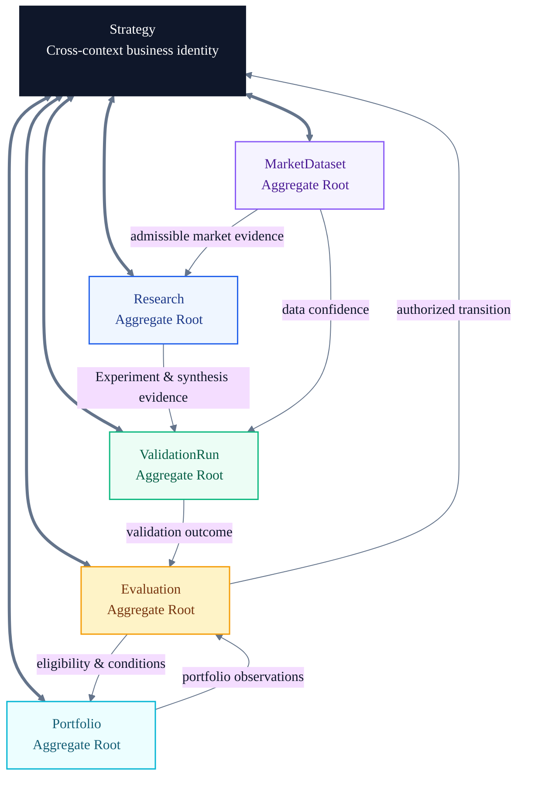
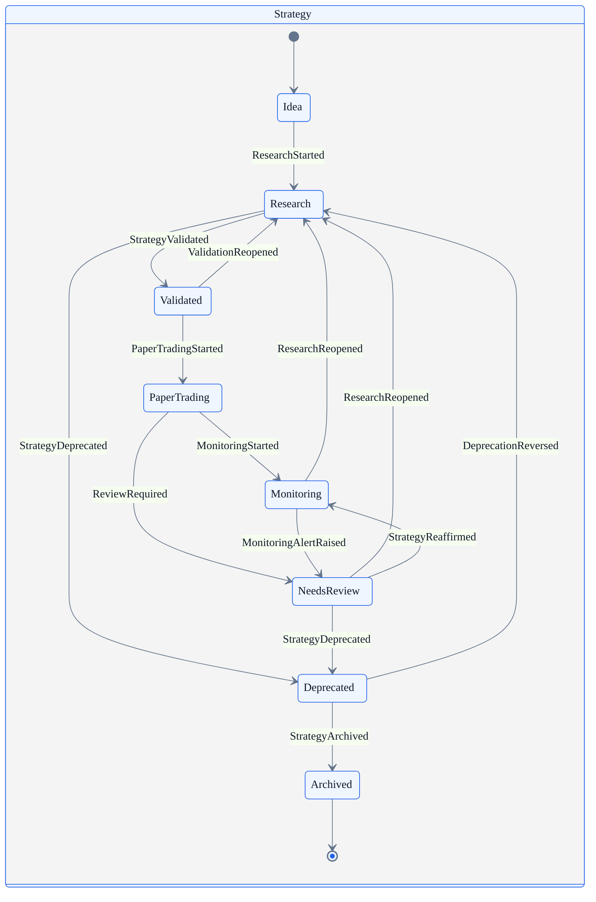
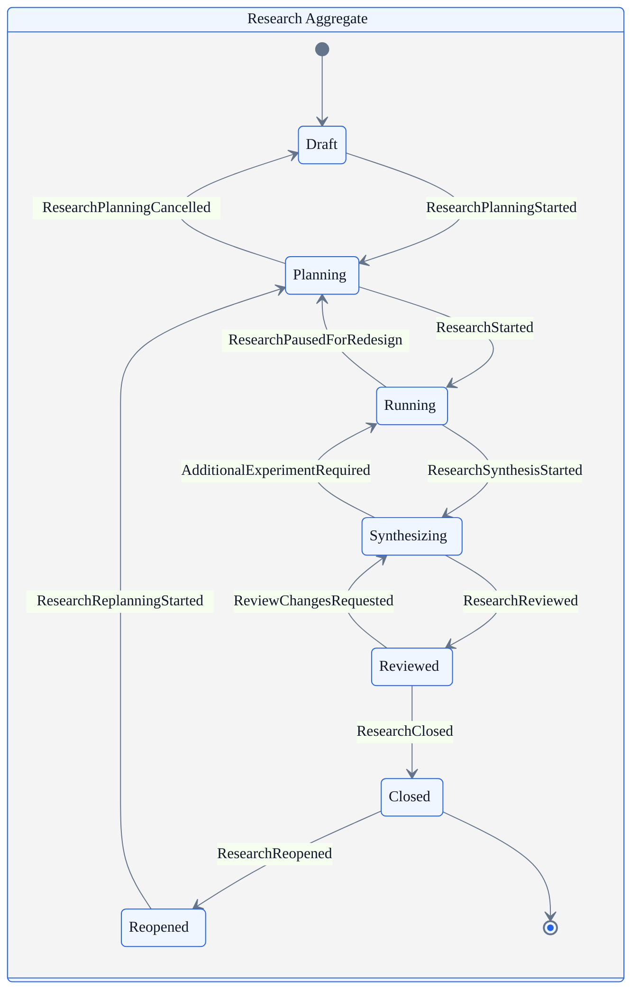
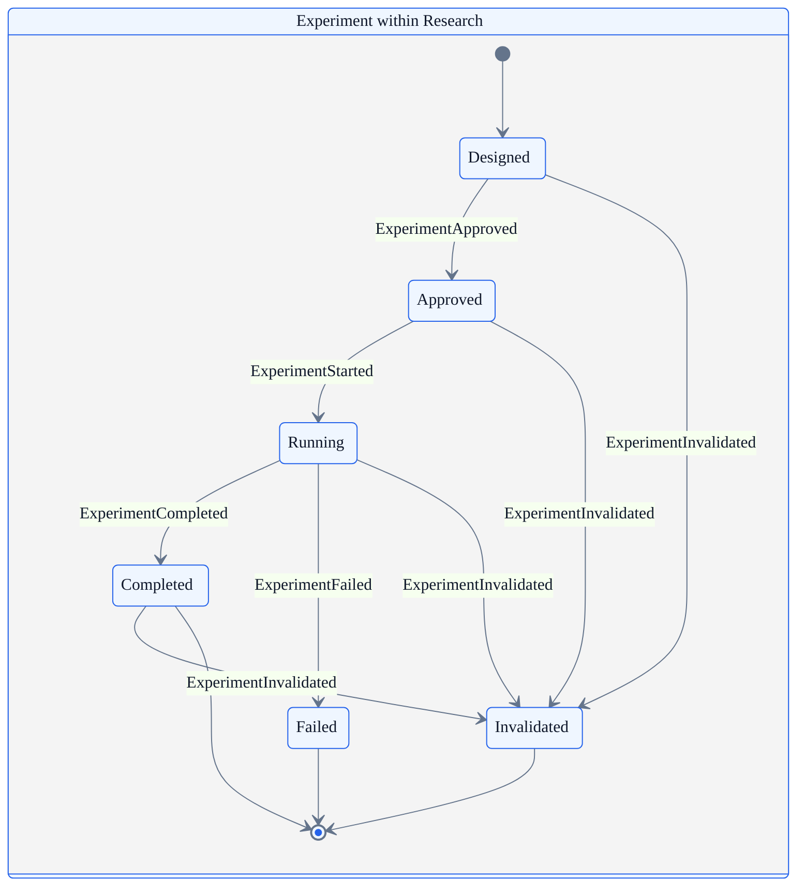
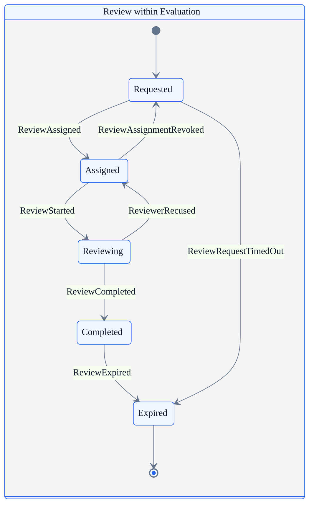
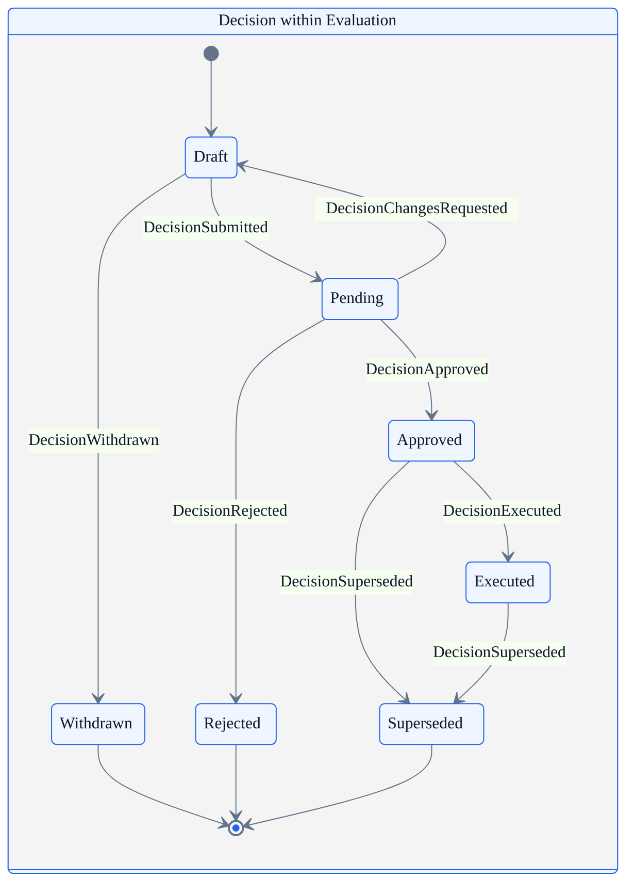
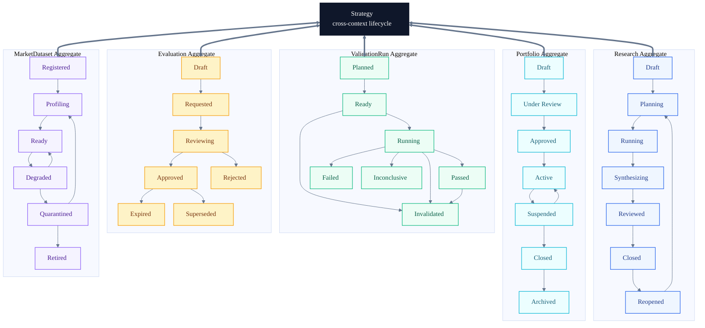

# AI Quant Research Workspace

## Architecture Bible — Chapter 03: State Machine

> **Business state records what the domain is allowed to mean next.**

This chapter defines the business state machines of the AI Quant Research Workspace. It contains no page, interface, service, API, storage, or implementation design. The models describe business authority: which states exist, which transitions are legal, what evidence must be present, who may trigger change, and which conditions block it.

The architecture in this chapter is frozen around five bounded contexts and five aggregate roots:

| Bounded context | Aggregate root | State authority |
| --- | --- | --- |
| Research | **Research** | Research plan, Hypotheses, Experiments, synthesis, and closure |
| Validation | **ValidationRun** | One versioned validation assessment and its outcome |
| Governance | **Evaluation** | Reviews, Decision, conditions, expiry, and supersession |
| Portfolio | **Portfolio** | Strategy membership, eligibility, allocation intent, and portfolio status |
| Market Intelligence | **MarketDataset** | Dataset fitness, confidence, quarantine, and retirement |

**Strategy remains the cross-context business identity and the center of the platform.** Under the frozen aggregate model, Strategy lifecycle is a governed cross-context process rather than a sixth aggregate root. Its state changes only when the authoritative aggregate events required for a transition agree. No context may advance Strategy unilaterally.

---

# 1 Purpose

## 1.1 Why state machines exist

A state machine makes business meaning explicit. It defines:

- the finite states an object may occupy;
- the transitions that are legal from each state;
- the event that requests or records a transition;
- the actor with authority to trigger it;
- the evidence and dependencies that must exist;
- the conditions that block it; and
- the obligations created after it succeeds.

Without these rules, labels such as “validated,” “approved,” or “closed” become informal descriptions. Different parts of the platform can then assign the same word different meanings, accept impossible sequences, or infer authority from the mere presence of data.

State machines turn those labels into contracts. A Strategy in **Validated** means that the required ValidationRun reached a passing terminal state, its Evidence was admissible, and an Evaluation authorized the transition. It does not mean that a backtest happened to look favorable.

## 1.2 Why CRUD is insufficient

CRUD describes persistence operations—create, read, update, and delete. It does not describe business legality.

| CRUD question | State-machine question |
| --- | --- |
| Can the record be updated? | Is this specific transition legal from the current business state? |
| Does a field contain `approved`? | Who approved it, against what Evidence, and under which Guardrails? |
| Can a status value be written? | Which domain event authorizes the change? |
| Can a record be deleted? | Must its history remain because a later Decision depends on it? |
| Did storage succeed? | Were the business preconditions and invariants satisfied? |

CRUD permits syntactically valid but semantically impossible operations: closing Research with no Experiment, executing a rejected Decision, placing a Deprecated Strategy in a Portfolio, or approving an Evaluation whose ValidationRun was invalidated. A state machine rejects these even if a persistence layer could store them.

## 1.3 Business state versus persistence state

**Business state** expresses domain meaning and authority. **Persistence state** expresses the condition of a stored representation.

Examples of persistence state include “new row,” “dirty,” “saved,” “soft-deleted,” “replicated,” or “archived in cold storage.” None of these authorizes a business transition. Conversely, the business state **Archived** does not imply that a record is physically moved or deleted.

The separation is governed by four rules:

1. Persistence success never proves business validity.
2. Business transitions are identified by domain events, not inferred from field mutation.
3. Historical terminal records remain addressable when Evidence, Evaluation, or Decision depends on them.
4. A failed persistence attempt does not create a domain event; a committed domain event does not lose its meaning when storage topology changes.

## 1.4 Cross-context state authority

[Mermaid source](assets/state-machine/platform-state-authority.mmd) · [SVG](assets/state-machine/platform-state-authority.svg) · [Edit in draw.io](assets/state-machine/platform-state-authority.drawio)

---

# 2 Strategy State Machine

Strategy lifecycle is the platform-level process that coordinates the five aggregate roots. A Strategy state is a governed disposition, not a progress indicator and not a performance forecast.

## 2.1 States

| State | Business meaning |
| --- | --- |
| **Idea** | A Strategy identity and initial thesis exist, but Research has not begun. |
| **Research** | An active Research aggregate is testing the thesis through one or more Experiments. |
| **Validated** | Required ValidationRuns passed and an Evaluation authorized validation status for the current Strategy version. |
| **Paper Trading** | Forward observation is authorized under Portfolio and risk conditions without live execution authority. |
| **Monitoring** | The Strategy is under an active, version-aware observation mandate. |
| **Needs Review** | A breach, drift, expiry, contradiction, or scheduled checkpoint requires a new Evaluation. |
| **Deprecated** | New use is prohibited; current use must cease or follow an approved exit condition. |
| **Archived** | The lifecycle is terminal and retained for history, evidence lineage, and learning. |

## 2.2 State diagram

[Mermaid source](assets/state-machine/strategy-state-machine.mmd) · [SVG](assets/state-machine/strategy-state-machine.svg) · [Edit in draw.io](assets/state-machine/strategy-state-machine.drawio)

## 2.3 Allowed transitions

| From → To | Trigger event | Required evidence and business rule | Resulting obligation |
| --- | --- | --- | --- |
| Idea → Research | `ResearchStarted` | Testable Hypothesis, Research Owner, scope, and usable MarketDataset exist. | Research aggregate enters Planning or Running. |
| Research → Validated | `StrategyValidated` | Research is Reviewed or Closed; required ValidationRun is Passed; Evaluation Decision is Approved; no blocking Guardrail breach exists. | Validation basis and Strategy version are frozen for this state. |
| Research → Deprecated | `StrategyDeprecated` | Evaluation approves rejection, abandonment, duplication, or loss of relevance. | New Experiments stop unless needed for closure; rationale is retained. |
| Validated → Paper Trading | `PaperTradingStarted` | Risk Review approved, Portfolio permits admission, monitoring plan and limits exist, and Evaluation Decision is Executed. | Paper observations and Guardrail monitoring begin. |
| Validated → Research | `ValidationReopened` | Evidence is corrected, expired, contradicted, or no longer sufficient. | Previous validation remains historical; a new Research cycle opens. |
| Paper Trading → Monitoring | `MonitoringStarted` | Minimum observation window completed, paper conditions satisfied, and Evaluation authorizes continued monitoring. | Ongoing monitoring cadence and review date become binding. |
| Paper Trading → Needs Review | `ReviewRequired` | Paper breach, material deviation, invalid data, or evaluation expiry occurs. | New portfolio admission is blocked pending Evaluation. |
| Monitoring → Needs Review | `MonitoringAlertRaised` | Guardrail breach, Health Score deterioration, drift, incident, expiry, or scheduled review threshold is met. | Evaluation must be requested; affected Portfolio use follows policy. |
| Monitoring → Research | `ResearchReopened` | New evidence or regime change invalidates an assumption strongly enough to require direct re-research. | Research opens immediately; the transition does not erase monitoring history. |
| Needs Review → Research | `ResearchReopened` | Evaluation identifies an evidence gap, failed assumption, or required redesign. | Research scope records the review findings it must resolve. |
| Needs Review → Monitoring | `StrategyReaffirmed` | Evaluation approves continued use, risks are accepted, and monitoring conditions are renewed. | New conditions and expiry replace prior ones prospectively. |
| Needs Review → Deprecated | `StrategyDeprecated` | Evaluation rejects continued use or a mandatory Guardrail requires retirement. | Portfolio references must be removed or placed under controlled exit. |
| Deprecated → Research | `DeprecationReversed` | Exceptional Decision Authority approves reopening on materially new evidence; no prohibition makes reopening illegal. | A new Research version is created; Deprecated history remains immutable. |
| Deprecated → Archived | `StrategyArchived` | No active Portfolio dependency remains, retention requirements are met, and final Evaluation is complete. | Strategy becomes terminal and read-only in business terms. |

## 2.4 Invalid transitions

The following are always invalid:

- Idea → Validated: Research and Validation cannot be skipped.
- Idea → Paper Trading or Monitoring: no governed evidence basis exists.
- Research → Paper Trading: a passing ValidationRun and approved Evaluation are mandatory.
- Validated → Archived: retirement rationale and Deprecated state cannot be skipped.
- Paper Trading → Validated: a later state cannot pretend forward observation never began; it must enter Needs Review or Research.
- Monitoring → Paper Trading: returning to paper observation requires a new Decision and is modeled through Needs Review or Research, not backward mutation.
- Archived → any active state: Archived is terminal. Reuse requires a new Strategy identity or explicitly related successor.
- Any transition caused only by an AI Review: AI interpretation has no transition authority.
- Any transition based on a superseded Strategy version, expired Evaluation, invalidated ValidationRun, quarantined MarketDataset, or rejected Decision.

## 2.5 Strategy transition rules

- Only a Strategy Owner may request ordinary advancement; Risk or Monitoring Owners may request review or restriction.
- Only an authorized Evaluation Decision may advance, reaffirm, deprecate, reopen after deprecation, or archive a Strategy.
- Validation evidence must refer to the exact Strategy version being transitioned.
- Risk conditions and Portfolio eligibility are evaluated at transition time, not inherited indefinitely from an earlier state.
- Failed transition requests leave the Strategy in its prior state and record blocking reasons; they do not create an intermediate implied state.
- A successful transition emits one authoritative event and records its evidence set, Evaluation, Decision, actor, time, and conditions.

---

# 3 Research State Machine

Research is an aggregate root in the Research bounded context. It owns planning, Hypotheses, Experiments, synthesis, review status, and closure for a defined Strategy question.

## 3.1 State diagram

[Mermaid source](assets/state-machine/research-state-machine.mmd) · [SVG](assets/state-machine/research-state-machine.svg) · [Edit in draw.io](assets/state-machine/research-state-machine.drawio)

## 3.2 Entry and exit criteria

| State | Entry criteria | Exit criteria |
| --- | --- | --- |
| Draft | Strategy identity, author, initial question, and provisional Hypothesis exist. | Scope is coherent enough to plan, or the draft is abandoned without becoming governed Research. |
| Planning | Research Owner, Strategy version, intended Evidence, candidate Experiments, MarketDataset needs, and completion criteria are identified. | At least one approved Experiment can run; required datasets are Ready and ownership is accepted. |
| Running | Plan is active, Experiment ownership exists, and no blocking data or governance condition remains. | Required Experiments reach terminal states or an explicit redesign is required. |
| Synthesizing | Sufficient Experiment outcomes and Evidence exist to compare with Hypotheses. | Findings, contradictions, limitations, and evidence gaps are documented for review. |
| Reviewed | Accountable Review completed against the synthesis and Evidence set. | Review conditions are resolved and closure criteria are satisfied, or changes return it to Synthesizing. |
| Closed | At least one Experiment exists; all required Experiments are terminal; findings and Evidence lineage are published; unresolved items are explicitly carried forward. | Terminal unless an authorized event supplies a reason and owner for reopening. |
| Reopened | A Monitoring alert, Evaluation condition, corrected Evidence, or new material Market context requires further inquiry. | New scope, Hypothesis impact, and planned Experiments are accepted. |

## 3.3 Allowed transitions

| From → To | Event | Conditions |
| --- | --- | --- |
| Draft → Planning | `ResearchPlanningStarted` | Initial Hypothesis is testable and Research Owner accepts accountability. |
| Planning → Running | `ResearchStarted` | At least one Experiment is Approved; required MarketDatasets are Ready; plan is not blocked. |
| Planning → Draft | `ResearchPlanningCancelled` | No Experiment is Running; cancellation reason is recorded. |
| Running → Planning | `ResearchPausedForRedesign` | Active Experiments are paused, failed, or invalidated; redesign does not falsify history. |
| Running → Synthesizing | `ResearchSynthesisStarted` | Required Experiments are terminal and Evidence candidates are available. |
| Synthesizing → Running | `AdditionalExperimentRequired` | Synthesis identifies a material gap with an approved Experiment plan. |
| Synthesizing → Reviewed | `ResearchReviewed` | Findings and Evidence lineage are complete enough for accountable review. |
| Reviewed → Synthesizing | `ReviewChangesRequested` | Reviewer identifies resolvable deficiencies without requiring a new plan. |
| Reviewed → Closed | `ResearchClosed` | Review conditions resolved; at least one Experiment exists; findings and limitations are published. |
| Closed → Reopened | `ResearchReopened` | Authorized trigger identifies new Evidence, correction, alert, or Decision obligation. |
| Reopened → Planning | `ResearchReplanningStarted` | Reopening scope, ownership, impacted Hypotheses, and completion criteria are accepted. |

## 3.4 Invalid transitions

- Draft → Running: planning and Experiment approval cannot be skipped.
- Planning → Synthesizing: no executed research exists to synthesize.
- Running → Reviewed or Closed: synthesis is mandatory.
- Synthesizing → Closed: accountable Review is mandatory.
- Closed → Running: a closed aggregate must first become Reopened and be replanned.
- Reopened → Closed: reopening creates unresolved work by definition.
- Any transition that changes the Strategy version in place. Material Strategy change requires a new Research scope or successor aggregate.
- Closure while an Experiment remains Designed, Approved, or Running.

---

# 4 Experiment State Machine

Experiment is an entity owned by Research. Its state machine prevents test design, authorization, execution, and result interpretation from collapsing into one mutable record.

## 4.1 State diagram

[Mermaid source](assets/state-machine/experiment-state-machine.mmd) · [SVG](assets/state-machine/experiment-state-machine.svg) · [Edit in draw.io](assets/state-machine/experiment-state-machine.drawio)

## 4.2 Transition conditions

| Transition | Conditions | Blocking conditions |
| --- | --- | --- |
| Designed → Approved | Testable Hypothesis, method, inputs, Benchmark, success and falsification criteria, owner, and reproducibility plan are declared. | Missing Strategy version; non-Ready MarketDataset; unresolved leakage or prohibited method; author self-approval where independent approval is required. |
| Approved → Running | Approval remains effective; required resources and datasets match approved versions; Research is Running. | Approval expired; Research not Running; Dataset quarantined; concurrent run would violate plan or Guardrails. |
| Running → Completed | Protocol reached its planned end; outputs, deviations, metrics, and provenance were captured. | Missing required output; unrecorded protocol deviation; corrupted run; cancelled process represented as success. |
| Running → Failed | Run could not complete for an operational or methodological reason that does not itself prove the Hypothesis false. | Failure reason missing; partial results incorrectly presented as completed Evidence. |
| Designed / Approved / Running / Completed → Invalidated | Leakage, provenance defect, wrong Strategy version, invalid data, calculation defect, or material protocol violation makes the result inadmissible. | None; confirmed invalidity must not be suppressed. |

## 4.3 Terminal-state meaning

- **Completed** means the approved protocol completed and produced assessable outputs. It does not mean the Hypothesis is supported or the Strategy is valid.
- **Failed** means execution failed. The failure may inform future Research but its intended result is not admissible as completed Evidence.
- **Invalidated** means prior or current outputs cannot be relied upon for the intended claim. Invalidation is permanent for that Experiment identity; a corrected rerun is a new Experiment or run identity.

Invalid transitions include Designed → Running, Approved → Completed, Failed → Running, Invalidated → any active state, and Completed → Running. Rework creates a new Experiment version or a separately identified rerun; it does not rewrite terminal history.

---

# 5 Review State Machine

Review is an entity owned by Evaluation. It records an attributable assessment for a declared scope. AI Review may inform it but cannot occupy the accountable reviewer role; Risk Review may be a required specialized input with separate authority.

## 5.1 State diagram

[Mermaid source](assets/state-machine/review-state-machine.mmd) · [SVG](assets/state-machine/review-state-machine.svg) · [Edit in draw.io](assets/state-machine/review-state-machine.drawio)

## 5.2 Transition rules

| From → To | Event | Conditions |
| --- | --- | --- |
| Requested → Assigned | `ReviewAssigned` | Scope, due time, required Evidence set, reviewer competence, and independence requirements are satisfied. |
| Assigned → Reviewing | `ReviewStarted` | Reviewer accepts assignment; Evaluation and referenced Evidence remain current. |
| Reviewing → Completed | `ReviewCompleted` | Findings, recommendation, dissent, conditions, Evidence references, and reviewer attestation are complete. |
| Requested → Expired | `ReviewRequestTimedOut` | Assignment deadline passes without an eligible reviewer. |
| Assigned → Requested | `ReviewAssignmentRevoked` | Reviewer becomes unavailable, conflicted, or ineligible before substantive review. |
| Reviewing → Assigned | `ReviewerRecused` | Reviewer declares conflict or inability to finish; partial notes remain attributable and are not final findings. |
| Completed → Expired | `ReviewExpired` | Validity period ends, Strategy version changes, Evidence is invalidated, or a required dependency expires. |

## 5.3 Timeout and expiry rules

Timeouts are business deadlines, not background-job behavior.

- Every Requested Review has an assignment deadline and completion deadline derived from review type and severity.
- A critical Monitoring breach may require immediate assignment; ordinary scheduled Reviews may use a longer policy-defined window.
- Missing the assignment deadline emits `ReviewRequestTimedOut` and moves the Review to Expired. It does not imply rejection or approval.
- Missing the completion deadline while Assigned or Reviewing emits `ReviewOverdue`; the Evaluation becomes blocked. Policy may revoke assignment or escalate ownership, but cannot manufacture a Completed state.
- A Completed Review has an explicit validity period or a defined invalidating condition. Expiry prevents future Decisions from relying on it but does not erase its historical role.
- Material Evidence correction, Strategy version change, ValidationRun invalidation, or changed Guardrails expires a Review immediately when its conclusion could be affected.
- An Expired Review cannot be reopened. A new Review is requested with links to the expired predecessor.

Invalid transitions include Requested → Reviewing, Assigned → Completed, Reviewing → Expired as a substitute for overdue handling, Completed → Reviewing, and Expired → any active state.

---

# 6 Decision State Machine

Decision is an entity owned by Evaluation. It is the authoritative record of what outcome was chosen for a Strategy within a stated mandate. Approval and execution are separate: approval authorizes an outcome; execution confirms that the authorized business change took effect.

## 6.1 State diagram

[Mermaid source](assets/state-machine/decision-state-machine.mmd) · [SVG](assets/state-machine/decision-state-machine.svg) · [Edit in draw.io](assets/state-machine/decision-state-machine.drawio)

## 6.2 Transition rules

| From → To | Event | Conditions and effects |
| --- | --- | --- |
| Draft → Pending | `DecisionSubmitted` | Proposition, affected Strategy version, Evidence set, ValidationRun, required Reviews, Guardrail status, authority, rationale, and proposed conditions are complete. The decision basis becomes fixed for deliberation. |
| Draft → Withdrawn | `DecisionWithdrawn` | Proposer withdraws before submission; reason is retained. No lifecycle authority is created. |
| Pending → Draft | `DecisionChangesRequested` | Decision Authority requires a correctable change that does not require a new Evaluation. Prior submission remains in history. |
| Pending → Approved | `DecisionApproved` | Decision Authority is authorized; required Reviews are Completed and current; ValidationRun outcome is acceptable; no blocking Guardrail breach exists; conditions are explicit. |
| Pending → Rejected | `DecisionRejected` | Authority declines the proposition because evidence, risk, mandate, or business conditions are unacceptable. Rejection rationale and next permitted action are mandatory. |
| Approved → Executed | `DecisionExecuted` | Authorized transition or obligation is applied to the intended Strategy version and dependent aggregates acknowledge it. |
| Approved → Superseded | `DecisionSuperseded` | A later approved Decision replaces it before execution, or changed facts make execution inappropriate. |
| Executed → Superseded | `DecisionSuperseded` | A later executed Decision changes the governed outcome prospectively. Historical execution remains true. |

## 6.3 Rejection semantics

Rejected is a terminal outcome for one Decision identity. It is not the same as Validation **Failed**, Review **Expired**, or an execution error.

- Rejection may require Research rework, a new ValidationRun, a different proposition, or Strategy deprecation.
- A rejected Decision cannot be edited back to Pending or Approved.
- Resubmission creates a new Decision linked to the rejected predecessor and explicitly identifies what changed.
- Rejection never deletes supporting Evidence or dissenting Reviews.
- AI Review cannot approve or reject a Decision.

Invalid transitions include Draft → Approved, Pending → Executed, Rejected → Approved, Withdrawn → Pending, Executed → Approved, and Superseded → any active state.

---

# 7 Transition Rules by Aggregate

## 7.1 Aggregate lifecycle overview

The following supporting lifecycles complete the frozen aggregate model. They do not replace the detailed Research, Review, Decision, or Strategy machines.

[Mermaid source](assets/state-machine/aggregate-lifecycle-overview.mmd) · [SVG](assets/state-machine/aggregate-lifecycle-overview.svg) · [Edit in draw.io](assets/state-machine/aggregate-lifecycle-overview.drawio)

## 7.2 Research aggregate

| Transition authority | Required evidence | Blocking conditions | Dependencies |
| --- | --- | --- | --- |
| Research Owner triggers planning, running, synthesis, and replanning. Accountable reviewer completes Reviewed. Research Owner requests closure; governance policy may require Evaluation acknowledgment. | Strategy version, Hypotheses, plan, Experiment terminal records, published Evidence, synthesis, and Review. | No approved Experiment; non-Ready or Quarantined MarketDataset; active Experiment at closure; missing provenance; unresolved required Review changes. | MarketDataset supplies admissible inputs; ValidationRun consumes completed Research Evidence; Evaluation may reopen Research. |

## 7.3 ValidationRun aggregate

### States and transitions

| From → To | Trigger event | Meaning |
| --- | --- | --- |
| Planned → Ready | `ValidationRunPrepared` | Scope, criteria, Strategy version, Evidence set, Benchmark, and Data Confidence requirements are fixed. |
| Ready → Running | `ValidationRunStarted` | Validation Owner starts assessment against unchanged inputs. |
| Running → Passed | `ValidationPassed` | Every mandatory criterion passed and residual limitations are within policy. |
| Running → Failed | `ValidationFailed` | One or more mandatory criteria failed. |
| Running → Inconclusive | `ValidationInconclusive` | Assessment completed but Evidence is insufficient, contradictory, or too uncertain for Pass or Fail. |
| Planned / Ready / Running / Passed / Failed / Inconclusive → Invalidated | `ValidationInvalidated` | Input, method, provenance, Strategy version, or calculation defect makes the outcome inadmissible. |

| Who may trigger | Required evidence | Blocking conditions | Dependencies |
| --- | --- | --- | --- |
| Validation Owner prepares and starts. The validation method determines terminal outcome; a human cannot manually declare Pass against failed criteria. Evidence Custodian or Validation Owner may request invalidation; authorized Validation Owner confirms it. | Closed or sufficiently synthesized Research, terminal Experiments, admissible Evidence, Data Confidence, Benchmark, criteria, and exact Strategy version. | Active required Experiment; Quarantined MarketDataset; missing lineage; stale Strategy version; undeclared criteria change; unresolved validation defect. | Research provides Evidence; MarketDataset provides confidence status; Evaluation consumes terminal outcome. |

Passed, Failed, Inconclusive, and Invalidated are terminal for one ValidationRun identity. Reassessment creates a new ValidationRun linked to its predecessor.

## 7.4 Evaluation aggregate

### States and transitions

| From → To | Trigger event | Meaning |
| --- | --- | --- |
| Draft → Requested | `EvaluationRequested` | Scope, Strategy version, proposition, required Reviews, Decision Authority, and validity policy are declared. |
| Requested → Reviewing | `EvaluationReviewStarted` | Required Reviews are assigned and at least one begins. |
| Reviewing → Approved | `EvaluationApproved` | Required Reviews completed, Decision approved, and no blocking condition remains. |
| Reviewing → Rejected | `EvaluationRejected` | Decision rejected or a mandatory governance condition failed. |
| Approved → Expired | `EvaluationExpired` | Validity period ends or a dependency changes materially. |
| Approved / Rejected / Expired → Superseded | `EvaluationSuperseded` | A newer Evaluation becomes authoritative for the same scope. |

| Who may trigger | Required evidence | Blocking conditions | Dependencies |
| --- | --- | --- | --- |
| Strategy Owner or Monitoring Owner requests. Governance Coordinator starts review. Decision Authority determines Approved or Rejected through the Decision entity. Policy clock or dependency event causes expiry. | Terminal ValidationRun where required, Completed current Reviews, Guardrail results, Evidence set, Data Confidence, Portfolio context, and explicit proposition. | Review overdue or Expired; ValidationRun Invalidated or still Running; Decision not Approved; authority conflict; unresolved mandatory Guardrail breach; Strategy version mismatch. | ValidationRun provides findings; Portfolio provides suitability; MarketDataset and Research affect evidence validity; Evaluation emits Strategy transition authority. |

## 7.5 Portfolio aggregate

### States and transitions

| From → To | Trigger event | Meaning |
| --- | --- | --- |
| Draft → Under Review | `PortfolioReviewRequested` | Mandate, proposed Strategy membership, Benchmark, constraints, and allocation intent are complete. |
| Under Review → Approved | `PortfolioApproved` | Every Strategy is eligible; aggregate Guardrails pass; Portfolio Decision is approved. |
| Approved → Active | `PortfolioActivated` | Monitoring, ownership, and paper-observation dependencies are active. |
| Active → Suspended | `PortfolioSuspended` | Breach, data loss, Strategy deprecation, mandate change, or governance instruction blocks normal use. |
| Suspended → Active | `PortfolioReactivated` | All blocking conditions resolve and a new Evaluation authorizes resumption. |
| Active / Suspended → Closed | `PortfolioClosed` | Membership and obligations are wound down under approved conditions. |
| Closed → Archived | `PortfolioArchived` | No active Strategy or monitoring dependency remains and retention conditions are met. |

| Who may trigger | Required evidence | Blocking conditions | Dependencies |
| --- | --- | --- | --- |
| Portfolio Owner requests review, activation, suspension, closure, and archiving. Risk Owner may require suspension. Decision Authority approves or reactivates. | Strategy Evaluations, Decisions, lifecycle states, Health Scores, risk Evidence, correlation and exposure Evidence, Benchmark, Guardrail results, and monitoring plan. | Deprecated or Archived Strategy proposed for membership; Needs Review Strategy without explicit hold policy; expired Evaluation; unresolved portfolio Guardrail breach; unavailable monitoring. | Evaluation governs eligibility; Strategy lifecycle constrains membership; MarketDataset and Monitoring support continuing operation. |

## 7.6 MarketDataset aggregate

### States and transitions

| From → To | Trigger event | Meaning |
| --- | --- | --- |
| Registered → Profiling | `MarketDatasetProfilingStarted` | Source identity, ownership, coverage intent, and terms are recorded. |
| Profiling → Ready | `MarketDatasetReady` | Quality, schema, provenance, freshness, coverage, and use constraints meet policy. |
| Ready → Degraded | `MarketDatasetDegraded` | Confidence falls but explicitly limited use remains permissible. |
| Degraded → Ready | `MarketDatasetRestored` | Reassessment confirms all required confidence dimensions recovered. |
| Ready / Degraded → Quarantined | `MarketDatasetQuarantined` | Material integrity, provenance, compliance, or contamination risk prohibits use. |
| Quarantined → Profiling | `MarketDatasetReassessmentStarted` | Corrective action completed and a full reassessment begins. |
| Registered / Profiling / Ready / Degraded / Quarantined → Retired | `MarketDatasetRetired` | Source is obsolete, prohibited, unsupported, or replaced; historical lineage remains. |

| Who may trigger | Required evidence | Blocking conditions | Dependencies |
| --- | --- | --- | --- |
| Dataset Custodian registers, profiles, degrades, restores, and retires. Evidence Custodian or Risk Owner may require quarantine. Policy criteria determine Ready. | Source provenance, quality profile, coverage, freshness, corrections, licensing or use constraints, and Data Confidence assessment. | Unknown source; failed mandatory quality rule; prohibited use; unresolved contamination; missing ownership; attempted retirement while active work lacks a governed replacement or exception. | Research and ValidationRun consume Ready datasets; Degraded use must be explicit; quarantine may invalidate Experiments, Evidence, Reviews, and Evaluations. |

---

# 8 Business Invariants

The following invariants are mandatory across every transition. They are grouped for readability; numbering provides a stable reference for future chapters.

## 8.1 Global state invariants

1. **G-01 — Event authority.** No business state changes without one named trigger event and an authorized actor or deterministic policy outcome.
2. **G-02 — Legal source state.** A transition is valid only from the exact state declared by the state machine.
3. **G-03 — Version coherence.** Strategy, Research, Experiment, Evidence, ValidationRun, Review, Evaluation, Decision, Portfolio, and Monitoring references must resolve to compatible versions.
4. **G-04 — Immutable history.** Completed, terminal, rejected, invalidated, expired, superseded, deprecated, and archived history is not rewritten.
5. **G-05 — No inferred authority.** Record existence, field mutation, task completion, AI output, or persistence success cannot imply approval or transition authority.
6. **G-06 — Evidence traceability.** Every evidentiary transition records the Evidence set, provenance, intended claim, and Data Confidence status used at transition time.
7. **G-07 — Failure atomicity.** A blocked or failed transition leaves the source business state unchanged and records blocking reasons.
8. **G-08 — Terminal identity.** A terminal object cannot return to an active state; rework creates a new identity or an explicitly modeled reopen state where allowed.
9. **G-09 — Prospective supersession.** Supersession changes authority prospectively and never makes the superseded record historically false.
10. **G-10 — Explicit expiry.** Time-limited authority has an expiry rule; expired authority cannot support a new transition.
11. **G-11 — Human accountability.** AI Review may inform but may not approve Validation, Risk Review, Evaluation, Decision, or Strategy transition.
12. **G-12 — Deterministic Guardrails.** A mandatory Guardrail result cannot be overridden by narrative interpretation; exceptions require a separately authorized policy path.

## 8.2 Strategy invariants

13. **S-01 — Research before validation.** Strategy cannot enter Validated without governed Research and at least one terminal Experiment.
14. **S-02 — Passing validation.** Strategy cannot enter Validated without a Passed, current ValidationRun for the exact Strategy version.
15. **S-03 — Evaluation authority.** Strategy cannot advance, reaffirm, deprecate, reverse deprecation, or archive without an Approved and Executed Decision in Evaluation.
16. **S-04 — Paper Trading gate.** Strategy cannot enter Paper Trading before Validation passes, Risk Review approves, applicable Guardrails pass, and Portfolio eligibility exists.
17. **S-05 — No execution implication.** Paper Trading never grants live order-execution authority.
18. **S-06 — Monitoring obligation.** Strategy cannot enter Monitoring without an active monitoring plan, owner, thresholds, Benchmark, and review date.
19. **S-07 — Alert consequence.** A mandatory-severity Monitoring alert forces Needs Review unless policy requires direct deprecation or suspension.
20. **S-08 — Direct research return.** Monitoring may enter Research only through `ResearchReopened` with explicit evidence or assumption impact.
21. **S-09 — Deprecation restriction.** Deprecated Strategy cannot accept new Portfolio membership, new Paper Trading admission, or ordinary advancement.
22. **S-10 — Archive dependency.** Strategy cannot be Archived while any active Portfolio, Monitoring, unresolved Decision condition, or retention prerequisite depends on active status.
23. **S-11 — Archive terminality.** Archived Strategy cannot be reopened; continued work requires a successor Strategy identity.
24. **S-12 — State meaning.** Validated means criteria passed; it never means future performance is guaranteed.

## 8.3 Research and Experiment invariants

25. **R-01 — Strategy attachment.** Research cannot exist without a Strategy identity and version.
26. **R-02 — Testable plan.** Research cannot enter Running without a testable Hypothesis and at least one Approved Experiment.
27. **R-03 — Dataset fitness.** Experiment cannot start with a Quarantined or Retired MarketDataset; Degraded use requires an explicit approved limitation.
28. **R-04 — Protocol approval.** Experiment cannot enter Running before Approved.
29. **R-05 — Terminal distinction.** Completed, Failed, and Invalidated are distinct terminal meanings and cannot substitute for one another.
30. **R-06 — Completion honesty.** Experiment cannot be Completed if required outputs or provenance are missing or a material deviation is undisclosed.
31. **R-07 — Invalidation propagation.** Invalidated Experiment outputs cannot support new Evidence, ValidationRun, Review, Evaluation, or Decision.
32. **R-08 — Synthesis before review.** Research cannot enter Reviewed before Synthesizing completes.
33. **R-09 — Review before closure.** Research cannot close without an accountable Completed Review.
34. **R-10 — Experiment before closure.** Research cannot close without at least one Experiment, and all required Experiments must be terminal.
35. **R-11 — Reopen discipline.** Closed Research cannot run work directly; it must enter Reopened and then Planning.
36. **R-12 — Negative-result retention.** Failed Experiments and rejected Hypotheses remain part of the Research record.

## 8.4 Validation and Governance invariants

37. **V-01 — Evaluation dependency.** Evaluation cannot exist without a referenced ValidationRun when the proposition requires quantitative validation.
38. **V-02 — Fixed criteria.** Validation criteria cannot change after ValidationRun starts; changed criteria require a new run.
39. **V-03 — Terminal algorithmic outcome.** A human cannot manually convert Failed or Inconclusive ValidationRun to Passed.
40. **V-04 — Validation finality.** Passed, Failed, Inconclusive, and Invalidated are terminal for a ValidationRun identity.
41. **V-05 — Invalidation reach.** ValidationRun invalidation blocks or expires dependent Reviews, Evaluations, and unexecuted Decisions.
42. **E-01 — Review completeness.** Evaluation cannot become Approved until every mandatory Review is Completed and current.
43. **E-02 — Review timeout block.** Overdue, Requested, Assigned, Reviewing, or Expired mandatory Review blocks Evaluation approval.
44. **E-03 — Risk rejection.** A rejected mandatory Risk Review blocks approval and Strategy advancement.
45. **E-04 — Decision presence.** Evaluation cannot become Approved without an Approved Decision.
46. **E-05 — Decision execution.** Strategy state does not change until its Approved Decision reaches Executed.
47. **E-06 — Rejection terminality.** Rejected Decision cannot later become Approved; resubmission creates a new Decision.
48. **E-07 — Authority scope.** Decision Authority must have mandate for the proposition, Strategy, Portfolio, and risk level affected.
49. **E-08 — Expired basis.** Expired Review or Evaluation cannot authorize a transition.
50. **E-09 — AI boundary.** AI Review cannot satisfy the accountable Review or Risk Review requirement by itself.
51. **E-10 — Supersession link.** Superseded Evaluation and Decision identify their successor and retain their original evidence basis.

## 8.5 Portfolio invariants

52. **P-01 — Eligibility.** Portfolio cannot reference Deprecated or Archived Strategy as an eligible active member.
53. **P-02 — Review hold.** Needs Review Strategy cannot be newly admitted and must follow portfolio hold, reduction, or suspension policy.
54. **P-03 — Validation currency.** Strategy admission requires current ValidationRun and Evaluation appropriate to the intended Portfolio use.
55. **P-04 — Aggregate Guardrails.** Portfolio cannot become Approved or Active while a mandatory portfolio Guardrail fails.
56. **P-05 — Monitoring coverage.** Portfolio cannot become Active without monitoring for every active Strategy and portfolio-level exposure.
57. **P-06 — Suspension propagation.** Mandatory Strategy restriction or critical data quarantine may require Portfolio suspension according to policy.
58. **P-07 — Reactivation authority.** Suspended Portfolio cannot return to Active without a new approved Evaluation of the blocking conditions.
59. **P-08 — Closure before archive.** Portfolio cannot be Archived before Closed or while active membership or monitoring obligations remain.

## 8.6 MarketDataset invariants

60. **M-01 — Provenance.** MarketDataset cannot become Ready without known source, ownership, temporal coverage, quality profile, and permitted use.
61. **M-02 — Confidence.** MarketDataset readiness requires Data Confidence to meet the intended-use threshold.
62. **M-03 — Quarantine exclusion.** Quarantined MarketDataset cannot feed a new Experiment, ValidationRun, Evaluation, Portfolio activation, or Decision.
63. **M-04 — Degraded disclosure.** Degraded MarketDataset use must be explicit in Experiment, Evidence, ValidationRun, and Review limitations.
64. **M-05 — Correction propagation.** Material data correction triggers impact assessment for dependent Experiments, Evidence, ValidationRuns, Reviews, Evaluations, Decisions, and Strategy states.
65. **M-06 — Retirement lineage.** Retired MarketDataset remains resolvable for historical provenance and cannot be silently replaced in an existing evidence chain.

---

# 9 Trigger Events

Events are stated in past tense because they record accepted business facts. An attempted transition that fails its guards emits no success event.

## 9.1 Strategy events

| Event | From → To | Primary initiator | Key guard |
| --- | --- | --- | --- |
| `ResearchStarted` | Idea → Research | Strategy Owner / Research Owner | Research plan and usable MarketDataset exist. |
| `StrategyValidated` | Research → Validated | Decision Authority through Evaluation | Validation Passed; Evaluation and Decision approved. |
| `StrategyDeprecated` | Research or Needs Review → Deprecated | Decision Authority | Retirement or rejection rationale approved. |
| `PaperTradingStarted` | Validated → Paper Trading | Portfolio Owner, authorized by Decision | Risk approval, Guardrails, Portfolio eligibility, monitoring plan. |
| `ValidationReopened` | Validated → Research | Validation or Strategy Owner, authorized by Evaluation | Evidence invalidation, expiry, or material contradiction. |
| `MonitoringStarted` | Paper Trading → Monitoring | Monitoring Owner, authorized by Decision | Observation mandate and entry criteria met. |
| `ReviewRequired` | Paper Trading → Needs Review | Risk or Monitoring Owner | Material deviation, invalid data, breach, or expiry. |
| `MonitoringAlertRaised` | Monitoring → Needs Review | Monitoring policy | Alert meets mandatory review threshold. |
| `ResearchReopened` | Monitoring or Needs Review → Research | Strategy, Monitoring, or Evaluation Owner | New evidence or unresolved assumption requires Research. |
| `StrategyReaffirmed` | Needs Review → Monitoring | Decision Authority | Evaluation approves continuation and conditions. |
| `DeprecationReversed` | Deprecated → Research | Exceptional Decision Authority | Materially new evidence and policy permission. |
| `StrategyArchived` | Deprecated → Archived | Strategy Owner, authorized by Decision | No active dependencies; retention requirements met. |

## 9.2 Research and Experiment events

| Event | From → To | Owner |
| --- | --- | --- |
| `ResearchPlanningStarted` | Research Draft → Planning | Research Owner |
| `ResearchStarted` | Research Planning → Running | Research Owner |
| `ResearchPlanningCancelled` | Research Planning → Draft | Research Owner |
| `ResearchPausedForRedesign` | Research Running → Planning | Research Owner |
| `ResearchSynthesisStarted` | Research Running → Synthesizing | Research Owner |
| `AdditionalExperimentRequired` | Research Synthesizing → Running | Research Owner after review of gap |
| `ResearchReviewed` | Research Synthesizing → Reviewed | Accountable Reviewer |
| `ReviewChangesRequested` | Research Reviewed → Synthesizing | Accountable Reviewer |
| `ResearchClosed` | Research Reviewed → Closed | Research Owner after conditions resolve |
| `ResearchReopened` | Research Closed → Reopened | Evaluation, Monitoring, or Research Owner under policy |
| `ResearchReplanningStarted` | Research Reopened → Planning | Research Owner |
| `ExperimentApproved` | Experiment Designed → Approved | Experiment Approver |
| `ExperimentStarted` | Experiment Approved → Running | Experiment Owner |
| `ExperimentCompleted` | Experiment Running → Completed | Experiment Owner under protocol checks |
| `ExperimentFailed` | Experiment Running → Failed | Experiment Owner or deterministic run outcome |
| `ExperimentInvalidated` | Experiment nonterminal or Completed → Invalidated | Research or Evidence authority |

## 9.3 Review and Decision events

| Event | From → To | Owner or policy |
| --- | --- | --- |
| `ReviewAssigned` | Review Requested → Assigned | Governance Coordinator |
| `ReviewStarted` | Review Assigned → Reviewing | Assigned Reviewer |
| `ReviewCompleted` | Review Reviewing → Completed | Assigned Reviewer |
| `ReviewRequestTimedOut` | Review Requested → Expired | Review timeout policy |
| `ReviewAssignmentRevoked` | Review Assigned → Requested | Governance Coordinator |
| `ReviewerRecused` | Review Reviewing → Assigned | Assigned Reviewer / Governance Coordinator |
| `ReviewExpired` | Review Completed → Expired | Validity policy or dependency event |
| `ReviewOverdue` | Review Assigned or Reviewing → same state, Evaluation blocked | Completion timeout policy |
| `DecisionSubmitted` | Decision Draft → Pending | Decision Proposer |
| `DecisionWithdrawn` | Decision Draft → Withdrawn | Decision Proposer |
| `DecisionChangesRequested` | Decision Pending → Draft | Decision Authority |
| `DecisionApproved` | Decision Pending → Approved | Decision Authority |
| `DecisionRejected` | Decision Pending → Rejected | Decision Authority |
| `DecisionExecuted` | Decision Approved → Executed | Authorized business owner |
| `DecisionSuperseded` | Decision Approved or Executed → Superseded | Later Decision Authority |

## 9.4 ValidationRun and Evaluation events

| Event | From → To | Owner or policy |
| --- | --- | --- |
| `ValidationRunPrepared` | ValidationRun Planned → Ready | Validation Owner |
| `ValidationRunStarted` | ValidationRun Ready → Running | Validation Owner |
| `ValidationPassed` | ValidationRun Running → Passed | Validation criteria outcome |
| `ValidationFailed` | ValidationRun Running → Failed | Validation criteria outcome |
| `ValidationInconclusive` | ValidationRun Running → Inconclusive | Validation criteria outcome |
| `ValidationInvalidated` | ValidationRun any admissible state → Invalidated | Validation Owner after defect confirmation |
| `EvaluationRequested` | Evaluation Draft → Requested | Strategy or Monitoring Owner |
| `EvaluationReviewStarted` | Evaluation Requested → Reviewing | Governance Coordinator |
| `EvaluationApproved` | Evaluation Reviewing → Approved | Decision Authority through approved Decision |
| `EvaluationRejected` | Evaluation Reviewing → Rejected | Decision Authority or mandatory gate failure |
| `EvaluationExpired` | Evaluation Approved → Expired | Validity policy or dependency change |
| `EvaluationSuperseded` | Evaluation terminal/current → Superseded | Later authoritative Evaluation |

## 9.5 Portfolio and MarketDataset events

| Event | From → To | Owner or policy |
| --- | --- | --- |
| `PortfolioReviewRequested` | Portfolio Draft → Under Review | Portfolio Owner |
| `PortfolioApproved` | Portfolio Under Review → Approved | Decision Authority with Risk approval |
| `PortfolioActivated` | Portfolio Approved → Active | Portfolio Owner |
| `PortfolioSuspended` | Portfolio Active → Suspended | Portfolio or Risk Owner; mandatory policy where applicable |
| `PortfolioReactivated` | Portfolio Suspended → Active | Decision Authority |
| `PortfolioClosed` | Portfolio Active or Suspended → Closed | Portfolio Owner with approved wind-down |
| `PortfolioArchived` | Portfolio Closed → Archived | Portfolio Owner |
| `MarketDatasetProfilingStarted` | MarketDataset Registered → Profiling | Dataset Custodian |
| `MarketDatasetReady` | MarketDataset Profiling → Ready | Quality policy / Dataset Custodian |
| `MarketDatasetDegraded` | MarketDataset Ready → Degraded | Dataset Custodian or confidence policy |
| `MarketDatasetRestored` | MarketDataset Degraded → Ready | Dataset Custodian after reassessment |
| `MarketDatasetQuarantined` | MarketDataset Ready or Degraded → Quarantined | Dataset Custodian, Evidence Custodian, or Risk Owner |
| `MarketDatasetReassessmentStarted` | MarketDataset Quarantined → Profiling | Dataset Custodian |
| `MarketDatasetRetired` | MarketDataset nonterminal → Retired | Dataset Custodian / policy authority |

## 9.6 Event causality

Events may trigger evaluation in another bounded context, but they do not directly mutate another aggregate. A representative causal chain is:

`ResearchStarted` → `ExperimentCompleted` → `ResearchClosed` → `ValidationPassed` → `StrategyValidated` → `PortfolioEligibilityGranted` → `PaperTradingStarted` → `MonitoringAlertRaised` → `ResearchReopened`.

This chain illustrates business causality, not an API or integration specification. Each receiving aggregate independently validates its own transition rules.

---

# 10 Artifacts

## 10.1 Diagram index

| Diagram | Purpose | Mermaid | SVG | draw.io |
| --- | --- | --- | --- | --- |
| Platform State Authority | Shows the frozen bounded contexts and aggregate roots around Strategy | [Source](assets/state-machine/platform-state-authority.mmd) | [SVG](assets/state-machine/platform-state-authority.svg) | [Edit](assets/state-machine/platform-state-authority.drawio) |
| Strategy State Machine | Defines the complete platform-level Strategy lifecycle | [Source](assets/state-machine/strategy-state-machine.mmd) | [SVG](assets/state-machine/strategy-state-machine.svg) | [Edit](assets/state-machine/strategy-state-machine.drawio) |
| Research State Machine | Defines Research aggregate planning, execution, synthesis, review, closure, and reopening | [Source](assets/state-machine/research-state-machine.mmd) | [SVG](assets/state-machine/research-state-machine.svg) | [Edit](assets/state-machine/research-state-machine.drawio) |
| Experiment State Machine | Defines Experiment approval, execution, completion, failure, and invalidation | [Source](assets/state-machine/experiment-state-machine.mmd) | [SVG](assets/state-machine/experiment-state-machine.svg) | [Edit](assets/state-machine/experiment-state-machine.drawio) |
| Review State Machine | Defines accountable Review assignment, completion, timeout, and expiry | [Source](assets/state-machine/review-state-machine.mmd) | [SVG](assets/state-machine/review-state-machine.svg) | [Edit](assets/state-machine/review-state-machine.drawio) |
| Decision State Machine | Defines approval, rejection, execution, and supersession | [Source](assets/state-machine/decision-state-machine.mmd) | [SVG](assets/state-machine/decision-state-machine.svg) | [Edit](assets/state-machine/decision-state-machine.drawio) |
| Aggregate Lifecycle Overview | Completes the frozen aggregate-root lifecycle model | [Source](assets/state-machine/aggregate-lifecycle-overview.mmd) | [SVG](assets/state-machine/aggregate-lifecycle-overview.svg) | [Edit](assets/state-machine/aggregate-lifecycle-overview.drawio) |

## 10.2 Reading rules

- Mermaid files are the canonical text diagrams.
- SVG files are publication and embedding artifacts.
- draw.io files are editable visual artifacts and must preserve the same business semantics.
- Diagram layout may change; state names, transition events, guards, and invariants may change only through an explicit architecture revision.
- No diagram in this chapter grants implementation authority. It defines product-domain behavior only.

---

# Architecture Summary

The AI Quant Research Workspace is governed by business transitions, not status-field CRUD. Strategy remains the platform's cross-context identity, while Research, ValidationRun, Evaluation, Portfolio, and MarketDataset each protect their own transactional truth. Experiments produce observations; ValidationRuns judge admissibility and robustness; Reviews create accountable assessments; Decisions create authority; Portfolios govern combined use; MarketDatasets govern input fitness.

The state machines make one principle enforceable throughout the architecture:

> **No Strategy advances because work exists. It advances only when evidence, authority, and business rules agree.**
