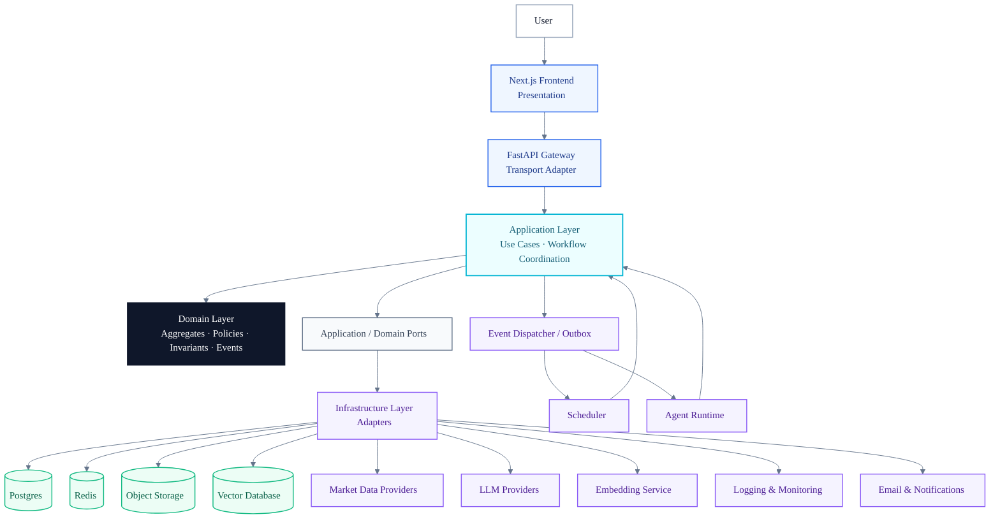
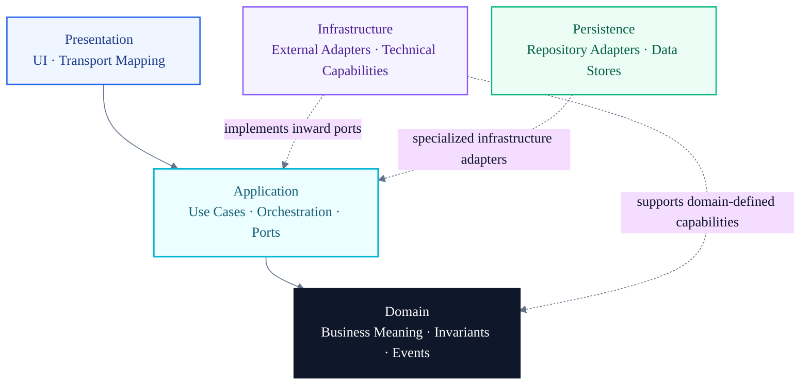
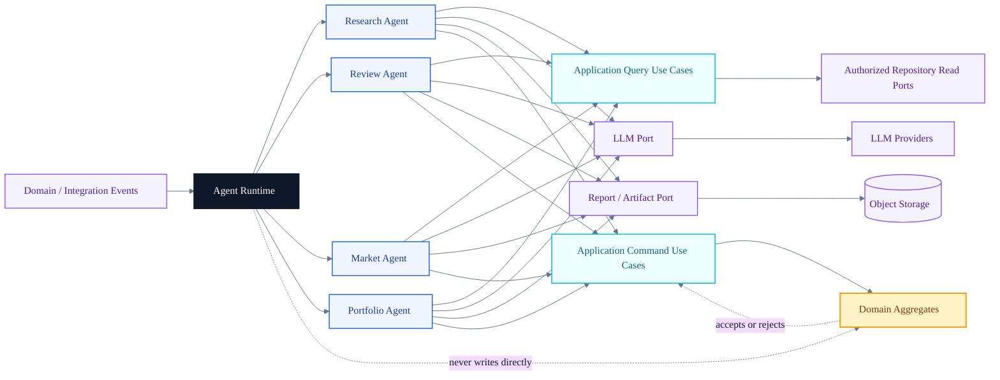
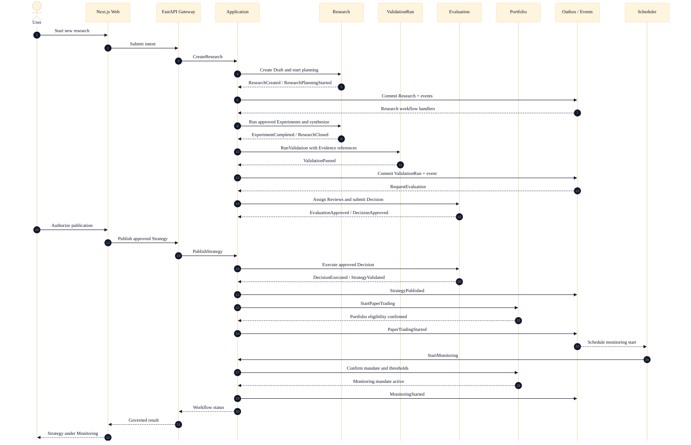
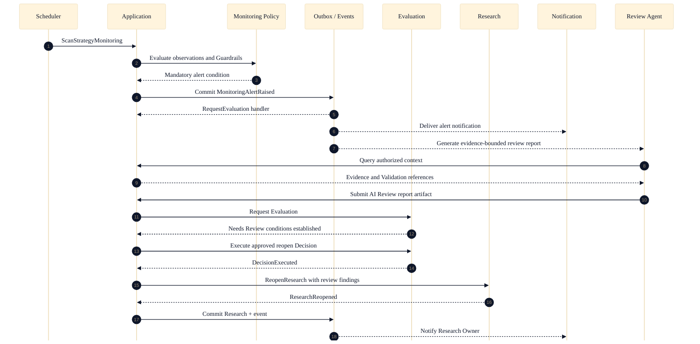

# AI Quant Research Workspace

## Architecture Bible — Chapter 04: Runtime Architecture

**Version 1.0**

> **The Domain decides. The Application coordinates. Infrastructure connects. Presentation communicates.**

This chapter defines how the AI Quant Research Workspace runs. It converts the frozen Business Architecture into a Software Architecture without redesigning Product Vision, Product DNA, the Research Evaluation Engine, bounded contexts, aggregate design, or state machines.

It is architecture documentation only. It defines runtime boundaries, responsibilities, dependency direction, orchestration, event flow, agent isolation, background work, and target repository organization. It defines no API contract, database schema, application component, or deployment script.

The frozen business model remains authoritative:

- bounded contexts: **Research**, **Validation**, **Governance**, **Portfolio**, and **Market Intelligence**;
- aggregate roots: **Research**, **ValidationRun**, **Evaluation**, **Portfolio**, and **MarketDataset**; and
- **Strategy** as the cross-context business identity whose lifecycle changes only when authoritative aggregate events agree.

---

# 1 Runtime Overview

## 1.1 Runtime topology

The platform uses a Clean Architecture core inside a small set of independently operable runtimes:

| Runtime | Primary responsibility | May initiate Application use cases? | May modify Domain directly? |
| --- | --- | --- | --- |
| Next.js Web Runtime | Human interaction and presentation | Through the FastAPI Gateway | No |
| FastAPI API Runtime | Transport boundary, authentication context, input mapping, response mapping | Yes | No |
| Worker Runtime | Event handlers, scheduled jobs, durable background workflows | Yes | No |
| Agent Runtime | Evidence-bounded AI analysis and report production | Yes | No |
| Infrastructure Adapters | External I/O and technology integration | Invoked through ports | No |

The **Application and Domain layers form the system core**. They may run inside the API, Worker, or controlled process boundary, but their dependency rules do not change with deployment topology.

## 1.2 High-level runtime diagram



[Mermaid source](assets/runtime-architecture/runtime-overview.mmd) · [SVG](assets/runtime-architecture/runtime-overview.svg) · [Edit in draw.io](assets/runtime-architecture/runtime-overview.drawio)

## 1.3 Runtime flow versus dependency direction

The runtime path and the source dependency direction must not be confused.

- At runtime, a use case may call a repository port and an Infrastructure adapter may query Postgres.
- At design time, Infrastructure depends on the port defined inward; Domain never imports the adapter.
- Domain returns decisions and Domain Events. It does not “flow down” into Infrastructure or know where it is persisted.
- The high-level diagram therefore shows **call flow outward through ports**, while Clean Architecture dependency arrows always point inward.

## 1.4 Event-driven transaction boundary

A business command follows one consistency pattern:

1. Presentation, Scheduler, or Agent Runtime invokes an Application use case.
2. Application loads the authoritative aggregate through a port.
3. Domain evaluates invariants and either rejects the command or records state change and Domain Events.
4. A unit of work persists aggregate changes and an outbox record in one atomic boundary.
5. After commit, an event dispatcher publishes integration events.
6. Event handlers initiate new Application use cases; they never mutate another aggregate directly.

This preserves local aggregate consistency while allowing cross-context workflows to proceed asynchronously and recoverably.

---

# 2 Layer Responsibilities

## 2.1 Layer model



[Mermaid source](assets/runtime-architecture/layer-dependencies.mmd) · [SVG](assets/runtime-architecture/layer-dependencies.svg) · [Edit in draw.io](assets/runtime-architecture/layer-dependencies.drawio)

## 2.2 Responsibility matrix

| Layer | Purpose | Owns | Cannot own | Allowed dependencies |
| --- | --- | --- | --- | --- |
| **Presentation** | Translate human or transport interaction into Application requests and present results. | UI state, view formatting, transport validation, authentication context extraction, correlation identifiers, error presentation. | Business transitions, aggregate rules, repository calls, SQL, provider selection, LLM prompts that produce governed conclusions. | Application contracts and presentation-local libraries only. |
| **Application** | Coordinate one use case or long-running workflow across Domain objects and ports. | Use-case boundaries, commands and queries, transaction intent, authorization orchestration, idempotency scope, port interfaces, workflow checkpoints, event handling policy. | Core business invariants, provider-specific I/O, SQL, HTTP presentation, LLM-generated authority. | Domain and inward contracts. Infrastructure is supplied through interfaces, never imported as a business dependency. |
| **Domain** | Express the frozen business model and decide whether a business action is legal. | Aggregates, entities, value objects, Domain Events, invariants, domain policies, specifications, state machines, domain errors. | Database concerns, HTTP, FastAPI, Next.js, SQLAlchemy, Redis, queues, LLMs, schedulers, provider SDKs, observability vendors. | Domain language only; ideally the language runtime and minimal deterministic utilities. |
| **Infrastructure** | Connect inward-defined capabilities to technologies and external systems. | Adapter implementations, provider clients, event transport, cache mechanics, file/object transport, telemetry exporters, email/notification delivery, scheduler engine integration. | Business policy, state authority, use-case sequencing, aggregate invariants. | Application and Domain interfaces plus external libraries. |
| **Persistence** | Preserve and retrieve aggregate state, evidence metadata, read models, and transactional event records. | Repository adapters, unit-of-work implementation, mapping, migrations as a separate future concern, connection behavior, concurrency checks, outbox/inbox storage mechanics. | Aggregate behavior, transition decisions, review policy, provider-independent domain identity. | Application repository ports, Domain types for mapping, and storage technology. |

Persistence is shown separately because it has important operational responsibilities, but architecturally it remains an **Infrastructure adapter family**, not a layer that Domain depends upon.

---

# 3 Application Layer

## 3.1 Why the Application Layer exists

Domain objects decide local business legality; they should not coordinate HTTP requests, transactions, multiple aggregate roots, external providers, scheduled timing, or report delivery. The Application Layer supplies that coordination boundary.

An Application use case:

1. accepts an intention expressed as a command or query;
2. establishes actor, mandate, correlation, and idempotency context;
3. loads required aggregates and read models through ports;
4. invokes Domain behavior;
5. coordinates multiple aggregate transactions without merging aggregate boundaries;
6. persists results through a unit of work;
7. publishes resulting events after commit; and
8. returns a technology-neutral outcome.

It does not decide whether Strategy may advance, whether Validation passed, or whether a Guardrail can be ignored. Those decisions remain in Domain.

## 3.2 Use-case catalog

| Use case | Orchestration responsibility | Domain authority invoked | Typical outputs |
| --- | --- | --- | --- |
| **CreateResearch** | Resolve Strategy identity, create Research draft, associate owner and initial Hypothesis, persist atomically. | Research aggregate creation rules. | Research identifier, Draft state, `ResearchCreated`. |
| **RunValidation** | Load closed Research Evidence, create ValidationRun, obtain dataset confidence, execute deterministic validation policy, persist outcome. | ValidationRun criteria and state machine. | Passed, Failed, Inconclusive, or Invalidated outcome and event. |
| **PublishStrategy** | Confirm approved Evaluation and executed Decision, make the governed Strategy version discoverable, record publication metadata. | Evaluation and Strategy lifecycle authorization already established by frozen rules. | Published representation and `StrategyPublished`; no new lifecycle state is invented. |
| **StartMonitoring** | Confirm Strategy state, Evaluation conditions, Portfolio eligibility, Benchmark, owner, and thresholds; establish monitoring mandate. | Strategy transition and monitoring policy. | Monitoring mandate and `MonitoringStarted`. |
| **GenerateDailyReport** | Gather authorized read models, invoke report producer or Agent Runtime, store report artifact, distribute through notification ports. | Domain controls which facts and interpretations are admissible. | Versioned report reference and delivery outcome. |

Other vertical slices follow the same form: `ApproveExperiment`, `CloseResearch`, `RequestEvaluation`, `ApproveDecision`, `StartPaperTrading`, `SuspendPortfolio`, `QuarantineMarketDataset`, and `ReopenResearch`.

## 3.3 Orchestration diagram

```mermaid
%%{init: {"theme":"base","themeVariables":{"fontFamily":"Inter, ui-sans-serif, system-ui, sans-serif","primaryTextColor":"#0F172A","lineColor":"#64748B"},"flowchart":{"curve":"basis","nodeSpacing":28,"rankSpacing":42}}}%%
flowchart LR
    IN["Driving Adapter<br/>API · Scheduler · Agent"] --> UC["Application Use Case"]
    UC --> AUTH["Actor & Mandate Check"]
    AUTH --> LOAD["Load through Repository Ports"]
    LOAD --> DOM["Invoke Domain Behavior"]
    DOM --> UOW["Unit of Work"]
    UOW --> OUT["Persist Aggregate + Outbox"]
    OUT --> EVT["Publish after Commit"]
    EVT --> HANDLER["Application Event Handler"]
    HANDLER --> UC2["Next Use Case"]

    DOM -. "rule violation" .-> REJECT["Business Rejection<br/>No state change"]
    OUT -. "technical failure" .-> RETRY["Retry / Recovery<br/>No false event"]

    classDef driving fill:#EFF6FF,color:#1E3A8A,stroke:#2563EB,stroke-width:1.5px;
    classDef app fill:#ECFEFF,color:#155E75,stroke:#06B6D4,stroke-width:1.5px;
    classDef domain fill:#0F172A,color:#FFFFFF,stroke:#0F172A,stroke-width:2.5px;
    classDef infra fill:#F5F3FF,color:#4C1D95,stroke:#8B5CF6,stroke-width:1.5px;
    classDef failure fill:#FEF2F2,color:#991B1B,stroke:#EF4444,stroke-width:1.5px;
    class IN driving;
    class UC,AUTH,LOAD,UOW,HANDLER,UC2 app;
    class DOM domain;
    class OUT,EVT infra;
    class REJECT,RETRY failure;
```



[Mermaid source](assets/runtime-architecture/application-orchestration.mmd) · [SVG](assets/runtime-architecture/application-orchestration.svg) · [Edit in draw.io](assets/runtime-architecture/application-orchestration.drawio)

## 3.4 Vertical slices

Vertical Slice Architecture is used **inside the Application and Presentation layers** where it improves cohesion. Each slice groups one business intention, its input/output contracts, handler, authorization policy, and tests. Slices share the frozen Domain model and ports; they do not create private domain rules or bypass bounded contexts.

A slice may coordinate one aggregate strongly or several aggregates through a workflow. Cross-aggregate atomicity is not assumed. When a workflow crosses aggregate or bounded-context boundaries, events and explicit workflow state carry progress.

---

# 4 Domain Layer

## 4.1 Domain contents

| Building block | Runtime role |
| --- | --- |
| **Aggregates** | Protect consistency boundaries and authorize state changes for Research, ValidationRun, Evaluation, Portfolio, and MarketDataset. |
| **Entities** | Preserve identity and lifecycle inside an aggregate, including Experiment, Review, and Decision. |
| **Value Objects** | Express immutable concepts such as StrategyVersion, EvidenceReference, DatasetConfidence, GuardrailResult, BenchmarkReference, EvaluationScope, and MonitoringThreshold. |
| **Domain Events** | Record accepted business facts such as `ResearchStarted`, `ValidationPassed`, `DecisionApproved`, `PaperTradingStarted`, and `MonitoringAlertRaised`. |
| **Business Invariants** | Reject impossible or unauthorized transitions defined in Chapter 03. |
| **Policies** | Apply deterministic rules spanning domain concepts without becoming provider or workflow code. |

## 4.2 Domain purity

Domain never depends on:

- a database, table, query language, ORM, or migration;
- HTTP, FastAPI, request objects, response codes, or serialization frameworks;
- Next.js, React, browser state, or UI formatting;
- LLM providers, prompts, model SDKs, embeddings, or vector stores;
- scheduler libraries, cron syntax, queues, worker frameworks, or wall-clock polling;
- market-data vendor SDKs, email services, telemetry vendors, or cloud APIs.

When Domain needs a fact such as current time, policy configuration, or an external classification, Application supplies a value obtained through an inward-defined port. Domain behavior remains deterministic for the supplied inputs.

## 4.3 Events and policies

Domain Events are created by aggregates after invariants pass. They describe facts inside a bounded context. Application maps selected Domain Events to integration events only after persistence succeeds.

Domain policies are deterministic. An LLM cannot implement a passing Validation result, a Guardrail override, a risk approval, or a lifecycle transition. AI output may become a report or an AI Review candidate, which an Application use case submits to the governed Evaluation workflow.

---

# 5 Infrastructure Layer

## 5.1 Ports and adapters

Infrastructure implements interfaces owned inward by Application or, where the capability is genuinely domain-defined, by Domain. Adapter replacement must not change business meaning.

```mermaid
%%{init: {"theme":"base","themeVariables":{"fontFamily":"Inter, ui-sans-serif, system-ui, sans-serif","primaryTextColor":"#0F172A","lineColor":"#64748B"},"flowchart":{"curve":"basis","nodeSpacing":26,"rankSpacing":42}}}%%
flowchart TB
    CORE["Application + Domain Core"]
    RP["Repository Ports"]
    EP["Event Ports"]
    DP["Document / Artifact Ports"]
    MP["Market Data Port"]
    LP["LLM Port"]
    XP["Embedding / Search Ports"]
    NP["Notification Ports"]
    OP["Observability Ports"]
    TP["Clock / Scheduling Ports"]

    CORE --> RP & EP & DP & MP & LP & XP & NP & OP & TP
    RP --> PG[("Postgres")]
    RP --> REDIS[("Redis")]
    EP --> OUT["Outbox + Event Transport"]
    DP --> OBJ[("Object Storage")]
    MP --> MKT["Market Data Providers"]
    LP --> LLM["LLM Providers"]
    XP --> EMB["Embedding Service"]
    XP --> VDB[("Vector Database")]
    NP --> EMAIL["Email"]
    NP --> NOTIFY["Notifications"]
    OP --> LOG["Logging"]
    OP --> MON["Runtime Monitoring"]
    TP --> SCHED["Scheduler Engine"]

    classDef core fill:#0F172A,color:#FFFFFF,stroke:#0F172A,stroke-width:3px;
    classDef port fill:#ECFEFF,color:#155E75,stroke:#06B6D4,stroke-width:1.5px;
    classDef adapter fill:#F5F3FF,color:#4C1D95,stroke:#8B5CF6,stroke-width:1.5px;
    classDef data fill:#ECFDF5,color:#065F46,stroke:#10B981,stroke-width:1.5px;
    class CORE core;
    class RP,EP,DP,MP,LP,XP,NP,OP,TP port;
    class OUT,MKT,LLM,EMB,EMAIL,NOTIFY,LOG,MON,SCHED adapter;
    class PG,REDIS,OBJ,VDB data;
```



[Mermaid source](assets/runtime-architecture/infrastructure-adapters.mmd) · [SVG](assets/runtime-architecture/infrastructure-adapters.svg) · [Edit in draw.io](assets/runtime-architecture/infrastructure-adapters.drawio)

## 5.2 Infrastructure capability catalog

| Capability | Runtime responsibility | Explicit boundary |
| --- | --- | --- |
| Repository | Rehydrate and persist aggregates and read models through inward ports. | Does not decide transitions or expose storage objects to Domain. |
| Postgres | Durable system of record, transactional aggregate persistence, outbox/inbox records, and durable workflow state. | Technology choice does not define Domain shape. No schema is specified here. |
| Redis | Ephemeral cache, distributed coordination, rate-limit state, and short-lived job support where justified. | Never the sole system of record for governed state or Evidence. |
| Object Storage | Large report, dataset snapshot, notebook export, and artifact content storage. | Domain stores stable references and provenance, not provider-specific URLs as business meaning. |
| Market Data Provider | Acquire external market observations and source metadata. | Cannot declare MarketDataset Ready or Evidence admissible; Domain policies decide. |
| LLM Provider | Produce model completions for bounded AI tasks. | Cannot approve, validate, execute, or mutate an aggregate. |
| Embedding Service | Produce vector representations from authorized content. | Embeddings are derived artifacts, never original Evidence. |
| Vector Database | Retrieve semantically related authorized material. | Not the system of record and not a source of truth without original citations. |
| Logging | Capture structured technical events with correlation and redaction. | Logs are not Domain Events or business audit records. |
| Monitoring | Observe runtime health, latency, failures, saturation, and delivery. | Runtime monitoring is distinct from Strategy Monitoring in the Domain. |
| Scheduler | Trigger time-based Application commands and expiry checks. | Cannot apply business state transitions directly. |
| Email | Deliver formatted communications. | Delivery does not create approval or acknowledgment unless a governed use case records it. |
| Notification | Deliver alerts through configured channels. | Notification failure does not erase the underlying Domain Event. |

## 5.3 Event delivery guarantees

- Aggregate persistence and outbox append share one atomic transaction.
- Publishing is **at least once**; handlers must be idempotent.
- Event identity, aggregate identity, aggregate version, causation, correlation, and occurred time are preserved.
- Ordering is required per aggregate stream, not globally.
- Consumers record inbox or equivalent deduplication state where repeated effects matter.
- Poison events are isolated for investigation; they are not silently discarded.
- Event payloads contain stable facts and references, not ORM objects or provider responses.

---

# 6 Agent Runtime

## 6.1 Boundary and purpose

Agent Runtime is a separate driving runtime for non-authoritative AI work. It reacts to domain or integration events, gathers authorized context, calls an LLM through Infrastructure, and produces traceable report artifacts or proposed follow-up commands.

Agents do not run inside aggregates and do not receive repository implementations. “Reads repositories” means they invoke **Application query use cases or read ports** that enforce authorization, provenance, and data minimization. Every write or state-change request returns through an Application command.

## 6.2 Agent roles

| Agent | Consumes | Reads through Application | Produces | Forbidden authority |
| --- | --- | --- | --- | --- |
| **Research Agent** | `ResearchCreated`, `ExperimentCompleted`, `ResearchReopened` | Strategy version, Hypotheses, Experiment outcomes, Evidence, Notebook context | Research brief, evidence-gap report, candidate questions, proposed Research actions | Cannot complete Research, validate Evidence, or approve an Experiment. |
| **Review Agent** | `ValidationPassed`, `ValidationFailed`, `EvaluationRequested` | ValidationRun, Evidence, Data Confidence, Guardrail results, prior Reviews | AI Review report, contradiction map, limitation summary | Cannot complete accountable Review, approve Evaluation, or decide. |
| **Market Agent** | `MarketDatasetReady`, `MarketDatasetDegraded`, scheduled market events | Authorized datasets, regimes, events, source confidence | Market brief, anomaly report, candidate Evidence references | Cannot mark a dataset Ready, quarantine it, or declare a Strategy state. |
| **Portfolio Agent** | `PortfolioActivated`, `MonitoringAlertRaised`, health-check trigger | Portfolio read model, eligible Strategies, exposures, Health Scores, Evaluation conditions | Portfolio commentary, concentration report, review proposal | Cannot rebalance, suspend, admit Strategy, or approve risk. |

## 6.3 Agent component diagram



[Mermaid source](assets/runtime-architecture/agent-runtime.mmd) · [SVG](assets/runtime-architecture/agent-runtime.svg) · [Edit in draw.io](assets/runtime-architecture/agent-runtime.drawio)

## 6.4 Agent safety contract

- Every run has a purpose, trigger event, actor or system sponsor, authorized scope, model identity, prompt or policy version, input references, and output reference.
- Reports distinguish sourced facts, deterministic calculations, model inference, and uncertainty.
- Original Evidence citations remain accessible; vector retrieval alone is not provenance.
- Sensitive data is minimized before provider calls and handled according to provider policy.
- Agent output is untrusted until an Application use case validates structure and submits it to the appropriate domain workflow.
- Retries are idempotent and never create duplicate Decisions, Reviews, or transition commands.
- Model failure degrades the report workflow; it cannot block deterministic risk protection or fabricate a successful business transition.

---

# 7 Scheduler

## 7.1 Scheduler boundary

Scheduler is a driving Infrastructure adapter. It determines **when to request work**, not **whether the resulting business transition is legal**. Each job invokes one Application use case with an idempotency key and scheduled effective time. Application and Domain re-check current state when the job runs.

The scheduler does not import repositories, aggregates, or provider clients directly. Provider access occurs behind Application ports; all business outputs are recorded through use cases and Domain Events.

## 7.2 Background job catalog

| Job | Trigger | Default frequency | Application use case | Output |
| --- | --- | --- | --- | --- |
| **Daily Market Sync** | Market calendar and configured universe window | Once per market day after source availability; retry by policy | `SynchronizeMarketDataset` | New dataset snapshot or refresh result; confidence assessment request; `MarketDatasetSyncCompleted` or failure record. |
| **Portfolio Health Check** | Portfolio local business calendar | Daily and after critical Strategy events | `EvaluatePortfolioHealth` | Portfolio Health Score inputs, Guardrail results, review proposal, report reference. |
| **Monitoring Scan** | Active monitoring mandate | Intraday or daily according to mandate severity | `ScanStrategyMonitoring` | Monitoring observations, `MonitoringAlertRaised` where Domain thresholds are met. |
| **News Collection** | Source-specific publication window | Periodic, typically hourly during relevant market windows | `CollectMarketIntelligence` | Source-linked news artifacts, deduplication result, MarketDataset candidate update. |
| **Research Reminder** | Research plan due dates and inactivity policy | Daily | `EvaluateResearchReminders` | Reminder notification or escalation request; no Research state transition by itself. |
| **Evaluation Expiration** | Evaluation validity deadline | At deadline plus periodic reconciliation | `ExpireEvaluations` | `EvaluationExpired`, dependent review/eligibility checks, notification. |
| **Review Timeout Scan** | Review assignment and completion deadlines | Frequent policy interval | `EvaluateReviewDeadlines` | `ReviewRequestTimedOut` or `ReviewOverdue`, Evaluation block, escalation notification. |
| **Daily Report Generation** | Reporting calendar after data and monitoring cutoffs | Daily | `GenerateDailyReport` | Versioned report artifact and delivery requests. |

Frequencies are policy defaults, not fixed cron expressions. Market calendars, Strategy mandates, Portfolio severity, provider availability, and organizational policy determine effective schedules.

## 7.3 Scheduler runtime diagram

```mermaid
%%{init: {"theme":"base","themeVariables":{"fontFamily":"Inter, ui-sans-serif, system-ui, sans-serif","primaryTextColor":"#0F172A","lineColor":"#64748B"},"flowchart":{"curve":"basis","nodeSpacing":24,"rankSpacing":40}}}%%
flowchart LR
    CLOCK["Clock / Calendar"] --> ENGINE["Scheduler Engine"]
    EVENTS["Domain Events"] --> ENGINE
    ENGINE --> JOBS["Job Definitions<br/>Trigger · Frequency · Idempotency"]
    JOBS --> APP["Application Use Cases"]
    APP --> DOM["Domain Rules"]
    DOM --> OUT["Domain Events + Business Results"]
    OUT --> BUS["Outbox / Event Dispatcher"]
    BUS --> ENGINE
    BUS --> NOTIFY["Notification Adapter"]
    BUS --> AGENT["Agent Runtime"]

    JOBS -. "never" .-> DIRECT["Direct Repository / Aggregate Mutation"]

    classDef trigger fill:#F8FAFC,color:#334155,stroke:#64748B,stroke-width:1.5px;
    classDef infra fill:#F5F3FF,color:#4C1D95,stroke:#8B5CF6,stroke-width:1.5px;
    classDef app fill:#ECFEFF,color:#155E75,stroke:#06B6D4,stroke-width:1.5px;
    classDef domain fill:#0F172A,color:#FFFFFF,stroke:#0F172A,stroke-width:2.5px;
    classDef invalid fill:#FEF2F2,color:#991B1B,stroke:#EF4444,stroke-width:1.5px;
    class CLOCK,EVENTS trigger;
    class ENGINE,JOBS,BUS,NOTIFY,AGENT infra;
    class APP app;
    class DOM domain;
    class OUT trigger;
    class DIRECT invalid;
```



[Mermaid source](assets/runtime-architecture/scheduler-runtime.mmd) · [SVG](assets/runtime-architecture/scheduler-runtime.svg) · [Edit in draw.io](assets/runtime-architecture/scheduler-runtime.drawio)

## 7.4 Job guarantees

- Every job execution has a stable job identity, scheduled time, attempt, correlation identifier, and idempotency key.
- Late execution uses current Domain state; it never assumes the state that existed when scheduled.
- Overlapping executions for the same business scope are prevented or safely deduplicated.
- Technical retries preserve the original causation context.
- A job may finish successfully with a business no-op when current state makes the requested action unnecessary.
- Missed schedules are reconciled according to business importance; they are not silently ignored.
- Time zone and market calendar are explicit value inputs, never host-local assumptions.

---

# 8 Runtime Sequence

## 8.1 New Research to Monitoring

This sequence spans bounded contexts without merging their transaction boundaries. Publication makes the approved Strategy version available to authorized consumers; it does not invent a new frozen lifecycle state.



[Mermaid source](assets/runtime-architecture/research-to-monitoring-sequence.mmd) · [SVG](assets/runtime-architecture/research-to-monitoring-sequence.svg) · [Edit in draw.io](assets/runtime-architecture/research-to-monitoring-sequence.drawio)

## 8.2 Monitoring Alert to Research Reopened



[Mermaid source](assets/runtime-architecture/alert-reopen-sequence.mmd) · [SVG](assets/runtime-architecture/alert-reopen-sequence.svg) · [Edit in draw.io](assets/runtime-architecture/alert-reopen-sequence.drawio)

## 8.3 Sequence guarantees

- Every arrow to an aggregate is mediated by an Application use case.
- A Domain Event is published only after the authoritative state commits.
- Cross-context steps are independently retryable and idempotent.
- A later step cannot retroactively change the meaning of a previously committed event.
- Agent and notification failure do not suppress the Monitoring alert or bypass Evaluation.
- Workflow status is observable without pretending the entire sequence is one database transaction.

---

# 9 Repository Structure

## 9.1 Target organization

The following is a recommended target structure. It documents ownership and dependency boundaries; it does not require this chapter to move or create application files.

```text
/
├── docs/
│   └── Architecture-Bible/
├── apps/
│   ├── api/
│   │   └── src/
│   │       ├── application/
│   │       │   ├── research/
│   │       │   ├── validation/
│   │       │   ├── governance/
│   │       │   ├── portfolio/
│   │       │   └── market_intelligence/
│   │       ├── domain/
│   │       │   ├── research/
│   │       │   ├── validation/
│   │       │   ├── governance/
│   │       │   ├── portfolio/
│   │       │   └── market_intelligence/
│   │       ├── infrastructure/
│   │       │   ├── persistence/
│   │       │   ├── events/
│   │       │   ├── market_data/
│   │       │   ├── ai/
│   │       │   ├── storage/
│   │       │   ├── notifications/
│   │       │   └── observability/
│   │       └── presentation/
│   │           └── http/
│   ├── web/
│   │   └── src/
│   │       ├── app/
│   │       ├── modules/
│   │       └── shared/
│   ├── worker/
│   │   └── src/
│   │       ├── event_handlers/
│   │       └── scheduled_jobs/
│   └── agents/
│       └── src/
│           ├── research_agent/
│           ├── review_agent/
│           ├── market_agent/
│           └── portfolio_agent/
├── packages/
│   ├── contracts/
│   ├── observability/
│   └── test_support/
├── tests/
│   ├── architecture/
│   ├── contract/
│   ├── integration/
│   └── end_to_end/
├── scripts/
└── .github/
    └── workflows/
```

## 9.2 Structural rules

- `apps/api/src/domain/` is organized by bounded context, not technical type across the whole platform.
- `application/` uses vertical slices within bounded contexts; shared workflow abstractions remain small and explicit.
- `infrastructure/` may depend inward on interfaces and Domain types; no inward layer imports it.
- `presentation/http/` contains transport mapping only. The term “Gateway” describes runtime responsibility, not business ownership.
- `apps/worker/` and `apps/agents/` are driving runtimes that depend on Application contracts; they do not duplicate Domain.
- `packages/contracts/` contains stable cross-runtime message contracts, not aggregate classes or business logic.
- `packages/` must not become a miscellaneous shared folder. A package requires a clear owner and dependency policy.
- Architecture tests verify forbidden dependencies and bounded-context boundaries.

## 9.3 Bounded context and vertical slice relationship

Bounded contexts are the primary ownership boundary. Vertical slices organize use cases inside them. Clean Architecture layers remain visible within the API core. These three structures are complementary:

- **DDD** determines language, aggregates, and context boundaries.
- **Clean Architecture** determines dependency direction.
- **Vertical slices** determine use-case cohesion.

---

# 10 Dependency Rules

The following rules are strict and testable:

1. Presentation may depend on Application contracts; it cannot call Infrastructure, repositories, provider SDKs, or Domain persistence directly.
2. Next.js never connects directly to Postgres, Redis, Object Storage, Vector Database, Market Data, or LLM providers for governed platform work.
3. FastAPI Gateway performs transport mapping and invokes Application; it contains no aggregate transition rules.
4. Application may depend on Domain and inward interfaces; it cannot depend on concrete Infrastructure adapters.
5. Domain cannot import FastAPI, Next.js, SQLAlchemy, database drivers, Redis clients, queue clients, scheduler libraries, OpenAI or other LLM SDKs, market-data SDKs, or cloud SDKs.
6. Domain Events contain business facts only and remain independent of event-bus technology.
7. Infrastructure implements interfaces defined by Application or Domain and is selected at the composition boundary.
8. Persistence maps aggregates without leaking ORM entities into Domain or Application contracts.
9. Application coordinates multiple aggregates but may not bypass an aggregate to mutate its internal entities.
10. Cross-aggregate workflows use explicit steps, events, and idempotency; they do not assume one global transaction.
11. Scheduler calls Application use cases only; it never calls Domain or repositories directly.
12. Agents call Application queries and commands only; they never mutate Domain, repository state, or lifecycle status directly.
13. LLM output cannot satisfy deterministic Validation, Guardrails, Risk Review, Decision approval, or state-transition authority.
14. Event handlers are Application entry points and must re-check current business state before acting.
15. Redis, Vector Database, and search indexes are derived or ephemeral stores; they cannot become the sole source of governed truth.
16. Object Storage content is referenced through stable artifact identity and provenance, not treated as unversioned mutable truth.
17. Logging and runtime monitoring cannot substitute for Domain Events, business audit, or Strategy Monitoring.
18. Query optimization may use read models, but commands always pass through Application and Domain rules.
19. Shared packages cannot create reverse dependencies from Domain to outer layers.
20. Composition and deployment configuration are the only places allowed to bind ports to concrete adapters.

---

# 11 Architecture Principles

## 11.1 DDD

Runtime modules preserve the five frozen bounded contexts and aggregate roots. Strategy remains the cross-context identity. Language and state authority come from Domain, not technology or navigation.

## 11.2 Clean Architecture

Dependencies point inward. Outer runtimes and adapters are replaceable. Domain remains executable and testable without HTTP, databases, cloud services, schedulers, or LLMs.

## 11.3 Dependency Inversion

Application and Domain define the capabilities they require. Infrastructure implements those interfaces. Technology choices satisfy business needs rather than shaping business objects.

## 11.4 Event Driven

Domain Events record accepted facts. Transactional outbox delivery connects bounded contexts and runtimes with idempotent, recoverable handlers. Events complement commands; they do not remove aggregate authority.

## 11.5 CQRS Ready

Commands and queries have distinct contracts and responsibilities. Read models may evolve independently for performance. CQRS readiness does not require immediate separate databases, event sourcing, or duplicated Domain models.

## 11.6 Agent Ready

Agent Runtime is isolated, event-aware, evidence-bounded, provider-agnostic, and non-authoritative. Agents extend analysis capacity without becoming a backdoor around Application or Domain.

## 11.7 Cloud Ready

Stateless API instances, durable Postgres state, externalized artifacts, idempotent workers, observable events, and replaceable adapters permit horizontal scaling and managed services without requiring Domain redesign.

## 11.8 LLM Ready

LLM providers sit behind a port. Model identity, policy version, inputs, citations, cost, latency, and output artifacts are traceable. Deterministic business rules remain available when LLM services fail or are disabled.

---

# 12 Deliverables

## 12.1 Diagram index

| Diagram | Type | Mermaid | SVG | draw.io |
| --- | --- | --- | --- | --- |
| Runtime Overview | High-level runtime / component | [Source](assets/runtime-architecture/runtime-overview.mmd) | [SVG](assets/runtime-architecture/runtime-overview.svg) | [Edit](assets/runtime-architecture/runtime-overview.drawio) |
| Layer Dependencies | Clean Architecture component | [Source](assets/runtime-architecture/layer-dependencies.mmd) | [SVG](assets/runtime-architecture/layer-dependencies.svg) | [Edit](assets/runtime-architecture/layer-dependencies.drawio) |
| Application Orchestration | Workflow component | [Source](assets/runtime-architecture/application-orchestration.mmd) | [SVG](assets/runtime-architecture/application-orchestration.svg) | [Edit](assets/runtime-architecture/application-orchestration.drawio) |
| Infrastructure Adapters | Ports-and-adapters component | [Source](assets/runtime-architecture/infrastructure-adapters.mmd) | [SVG](assets/runtime-architecture/infrastructure-adapters.svg) | [Edit](assets/runtime-architecture/infrastructure-adapters.drawio) |
| Agent Runtime | Agent component | [Source](assets/runtime-architecture/agent-runtime.mmd) | [SVG](assets/runtime-architecture/agent-runtime.svg) | [Edit](assets/runtime-architecture/agent-runtime.drawio) |
| Scheduler Runtime | Background-work component | [Source](assets/runtime-architecture/scheduler-runtime.mmd) | [SVG](assets/runtime-architecture/scheduler-runtime.svg) | [Edit](assets/runtime-architecture/scheduler-runtime.drawio) |
| Research to Monitoring | Sequence | [Source](assets/runtime-architecture/research-to-monitoring-sequence.mmd) | [SVG](assets/runtime-architecture/research-to-monitoring-sequence.svg) | [Edit](assets/runtime-architecture/research-to-monitoring-sequence.drawio) |
| Alert to Research Reopened | Sequence | [Source](assets/runtime-architecture/alert-reopen-sequence.mmd) | [SVG](assets/runtime-architecture/alert-reopen-sequence.svg) | [Edit](assets/runtime-architecture/alert-reopen-sequence.drawio) |

## 12.2 Architecture Decision Summary

| Decision | Chosen direction | Consequence |
| --- | --- | --- |
| **RAD-01 — Runtime core** | Clean Architecture core with Presentation, Application, Domain, and Infrastructure; Persistence is an adapter family. | Business logic remains independent of frameworks and stores. |
| **RAD-02 — Domain authority** | Five frozen aggregate roots retain local consistency; Strategy lifecycle is cross-context and Evaluation-authorized. | No runtime component may advance Strategy unilaterally. |
| **RAD-03 — API boundary** | Next.js uses a thin FastAPI Gateway that invokes Application use cases. | Transport concerns cannot become business policy. |
| **RAD-04 — Workflow coordination** | Application coordinates use cases and cross-aggregate workflows; Domain owns rules. | Orchestration remains visible without creating an anemic Domain. |
| **RAD-05 — Event delivery** | Domain Events plus transactional outbox; at-least-once, idempotent consumers, per-aggregate ordering. | Cross-context workflows are recoverable without a global transaction. |
| **RAD-06 — Persistence** | Postgres is the durable system of record; Redis is ephemeral; Object Storage holds large artifacts; Vector Database is derived. | Governed truth has one durable authority and derived stores remain rebuildable. |
| **RAD-07 — Agent isolation** | Agents are separate driving runtimes using Application queries and commands. | LLMs cannot bypass state machines, repositories, or decision authority. |
| **RAD-08 — Scheduling** | Scheduler triggers Application use cases with idempotent job identity. | Time-based work follows the same business rules as human requests. |
| **RAD-09 — Modularity** | Bounded contexts own Domain modules; vertical slices organize Application use cases. | DDD ownership and use-case cohesion coexist. |
| **RAD-10 — Read scaling** | Command path remains Domain-governed; query path is CQRS-ready with replaceable read models. | Read performance may evolve without weakening invariants. |
| **RAD-11 — Provider abstraction** | Market data, LLM, embeddings, notifications, telemetry, and storage sit behind inward ports. | Vendors are replaceable and provider failure cannot redefine Domain meaning. |
| **RAD-12 — Deployment evolution** | Web, API, Worker, and Agent are distinct runtime roles; the core may begin as a modular deployment and separate only when operational evidence requires it. | Avoids premature distributed complexity while preserving extraction boundaries. |

## 12.3 Publication rules

- Mermaid is the canonical text representation of diagrams.
- SVG is the publication and embedding representation.
- draw.io is the editable visual representation.
- The three formats must preserve the same component boundaries and dependency meaning.
- Repository structure is a target recommendation, not an instruction to modify the current project.
- This chapter introduces no API, database schema, or implementation contract.

---

# Runtime Architecture Summary

The platform runs as a Domain-centered system with multiple controlled entry points. Humans use Next.js through a thin FastAPI boundary. Scheduler and Agent Runtime initiate the same Application use cases as other driving adapters. Application coordinates work, Domain protects business meaning, Infrastructure implements replaceable capabilities, and Postgres preserves governed truth.

Events connect bounded contexts after local consistency is committed. Agents explain and report but never decide. Schedules request work but never force state. Read models may scale independently, while every command continues through the frozen aggregate and state-machine rules.

> **Every runtime path may begin outside the core, but every business decision must pass through it.**

