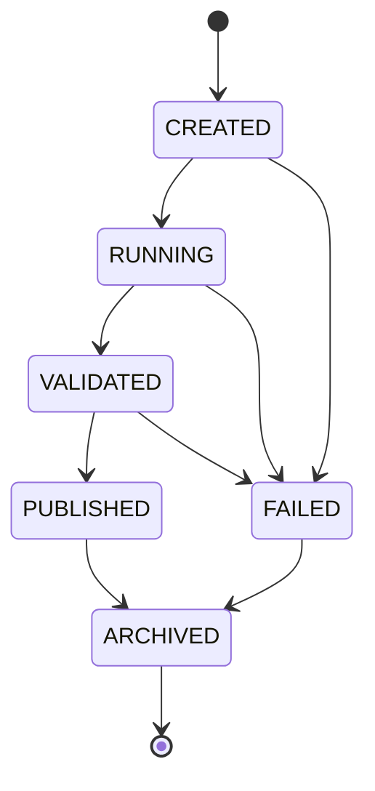

# Intelligence Publishing — Phase 4.1–4.5

Research Run Registry + Research Artifact Registry + Intelligence Snapshot
Contracts + Deterministic Artifact-to-Snapshot Builders + Read-only Intelligence
Query Layer for the AI Investment Intelligence Platform.

**Built on an Evidence-driven Quant Research Engine.**  
Every AI insight is backed by structured research evidence. Explainable. Traceable. Reviewable.

## Purpose

Phase 4.1 creates the minimum production-quality foundation for registering
completed research runs and storing **immutable** run manifests on the local
filesystem.

Phase 4.2 adds append-only, checksummed research artifact registration under
each run.

Phase 4.3 defines the first **consumer-facing snapshot contracts** and a
snapshot registry with explicit-input convenience builders.

Phase 4.3.1 hardens registry consistency: run-level write locking, idempotent
publish recovery, and failed create-run cleanup.

Phase 4.4 adds deterministic builders that **read registered artifact payloads**
and map supported evidence contracts into typed snapshots, then register via
the snapshot registry.

Phase 4.5 exposes a **read-only** HTTP query layer over published registry state
(IntelligenceService + `/api/v1/intelligence`). No write API, Publisher, or
frontend consumption is implemented in this phase.

## Three structure categories

| Category | Owner | Examples | Role |
| --- | --- | --- | --- |
| Domain research structures | Existing research / evidence modules | factor metrics, model evaluation, prediction tables, validation results, signal calculations, feature importance, reproducibility evidence | Authoritative research payloads — **not redesigned** by publishing |
| Publishing registry structures | `app.intelligence` | `ResearchRunMetadata`, `ResearchRunManifest`, `ResearchArtifactReference`, `ArtifactVerificationResult`, `ResearchSnapshotReference`, `SnapshotVerificationResult` | Storage, identity, provenance, integrity, lifecycle |
| Consumer snapshot structures | `app.intelligence` snapshot contracts | `ResearchSummarySnapshot`, `SignalSnapshot` | Stable, immutable consumer projections |

Domain metrics stay inside artifact **files**. Registry references carry only
identity, type, path, integrity, and lightweight descriptive metadata.
Snapshots may summarize domain outputs for consumers but must not become
unrestricted copies of raw research artifacts.

## Canonical relationships

```text
Domain Research Object
  → serialized artifact file
  → ResearchArtifactReference
  → ResearchRunManifest.artifacts

Research Run
  → Registered Artifacts
  → Artifact Registry read / optional verification
  → Deterministic Snapshot Builder
  → Typed in-memory Snapshot
  → Snapshot Registry
  → snapshots/*.json
  → ResearchSnapshotReference
  → ResearchRunManifest.snapshots
```

`ResearchRunManifest` is the aggregate root. Snapshot **content** and
`ResearchSnapshotReference` remain separate.

## Authority boundary

| Layer | Authority |
| --- | --- |
| Deterministic research services | Own calculations (factors, models, validation) |
| Research run / artifact registry | Receives completed outputs; records metadata and lifecycle |
| Snapshot builders (Phase 4.3) | Project registered artifacts into versioned consumer contracts from **explicit** normalized inputs or clearly available registry metadata |
| Future serving APIs | Will read published runs / snapshots — not implemented yet |

Publishing **must not** trigger training, factor calculation, or model retraining.
Builders **must not** invent findings, generate LLM prose, or invent investment
logic from arbitrary factor values.

Existing reproducibility helpers in `app.research_reproducibility` continue to
own evidence-artifact fingerprints. This registry reuses git/runtime resolution
where useful and does not replace those contracts.

## Directory structure

```text
backend/outputs/                  # or $INTELLIGENCE_OUTPUT_DIR
  latest.json                     # lightweight pointer to latest published run
  runs/
    run_<UTC>_<suffix>/
      manifest.json               # versioned aggregate root
      artifacts/
        <safe-name>__<short-id>.<ext>
      snapshots/
        <safe-name>__<short-id>.json
```

Generated manifests must not be committed. See `.gitignore`.

## Research run lifecycle



### Allowed transitions

| From | To |
| --- | --- |
| CREATED | RUNNING, FAILED |
| RUNNING | VALIDATED, FAILED |
| VALIDATED | PUBLISHED, FAILED |
| PUBLISHED | ARCHIVED |
| FAILED | ARCHIVED |
| ARCHIVED | _(terminal)_ |

Rejected examples: `PUBLISHED → RUNNING`, `FAILED → RUNNING`, `ARCHIVED → *`.

## Manifest structure

Schema version: `research-run-manifest/v1`

```json
{
  "schema_version": "research-run-manifest/v1",
  "run": {
    "schema_version": "research-run-manifest/v1",
    "run_id": "run_20260728T041530Z_a1b2c3d4",
    "run_type": "FACTOR",
    "status": "CREATED",
    "created_at": "2026-07-28T04:15:30Z",
    "updated_at": "2026-07-28T04:15:30Z",
    "published_at": null,
    "dataset_version": null,
    "feature_version": null,
    "model_version": null,
    "git_commit": null,
    "generator": "intelligence-run-registry/phase-4.1",
    "environment": "python/3.x.y",
    "random_seed": null,
    "training_window": null,
    "prediction_window": null,
    "universe": null,
    "notes": null
  },
  "artifacts": [],
  "snapshots": [],
  "checksums": {},
  "validation": {
    "ok": true,
    "checks": ["registry_manifest_created"],
    "details": {"phase": "4.1"}
  },
  "errors": []
}
```

Unknown research versions are `null` — never fabricated placeholders such as `"v1"`.

Run IDs contain no ticker names, strategy names, user input, or secrets.

## Immutability rule

Once a run reaches **PUBLISHED**:

- the manifest may only transition to **ARCHIVED**;
- corrections require a **new run**;
- artifact and snapshot bytes must not be overwritten.

Artifact and snapshot registration are append-only on `CREATED` / `RUNNING` /
`VALIDATED` only. There is no `update_*` / `delete_*` for either.

## Latest pointer behaviour

`outputs/latest.json` is updated **only after** the published `manifest.json` write succeeds.

It stores lightweight pointer metadata only:

- `schema_version`
- `run_id`
- `manifest_path` (relative to the output root)
- `published_at`

It does not duplicate the full manifest.

`get_latest_published_run()` returns `None` when the pointer is absent, and fails safely when the pointer is corrupt or points at a non-published run.

## Environment configuration

| Variable | Meaning |
| --- | --- |
| `INTELLIGENCE_OUTPUT_DIR` | Absolute or relative filesystem root. Empty / unset → `backend/outputs`. |

Documented in `backend/.env.example`.

## Package layout

```text
backend/app/intelligence/
  __init__.py
  schemas.py              # enums + registry models + id generators
  errors.py               # focused domain exceptions
  storage.py              # filesystem root, atomic writes, SHA-256, run locks
  run_lock.py             # POSIX flock run-level write lock (Phase 4.3.1)
  manifest.py             # build / transition / validate
  run_registry.py         # ResearchRunRegistry (Phase 4.1 / 4.3.1)
  artifact_registry.py    # ResearchArtifactRegistry (Phase 4.2 / 4.4 read API)
  snapshot_contracts.py   # ResearchSummarySnapshot / SignalSnapshot (Phase 4.3)
  snapshot_registry.py    # ResearchSnapshotRegistry + convenience builders
  snapshot_builders.py    # Artifact→Snapshot builders (Phase 4.4)
```

## Phase 4.2 — Research Artifact Registry

### Artifact definition

An artifact is an immutable, checksummed **file** owned by a research run. Domain
research objects remain in the Quant Research Engine / Evidence Layer. The
publishing layer treats their serialized bytes as **opaque** content.

`ResearchArtifactReference` is a child record inside one manifest — not a second
independent artifact manifest and not a carrier of IC, Sharpe, predictions, or
other business metrics.

The registry records only:

- what was produced (`name`, `artifact_type`, `media_type`)
- which run produced it (parent manifest + run directory ownership)
- where it lives (`relative_path` under `artifacts/`)
- whether bytes changed (`sha256` checksum + `size_bytes`)

`ArtifactReference` remains a compatibility alias for
`ResearchArtifactReference`. New code should use `ResearchArtifactReference`.

### Supported artifact types

| Enum | Serialized value |
| --- | --- |
| REPRODUCIBILITY_MANIFEST | `reproducibility_manifest` |
| DATA_VALIDATION_REPORT | `data_validation_report` |
| FACTOR_METRICS | `factor_metrics` |
| FACTOR_REPORT | `factor_report` |
| MODEL_EVALUATION | `model_evaluation` |
| PREDICTION_TABLE | `prediction_table` |
| FEATURE_IMPORTANCE | `feature_importance` |
| VALIDATION_REPORT | `validation_report` |
| GENERIC_JSON | `generic_json` |
| GENERIC_PARQUET | `generic_parquet` |

### Registration lifecycle

Allowed only when run status is `CREATED`, `RUNNING`, or `VALIDATED`.

| Method | Behaviour |
| --- | --- |
| `register_json_artifact` | Deterministic JSON bytes → atomic write under `artifacts/` → SHA-256 → manifest append |
| `register_file_artifact` | Copy regular file bytes into run-owned `artifacts/` (never persist absolute source path) |
| `get_artifact` / `list_artifacts` | Resolve by name or `artifact_id` |
| `verify_artifact` | Read-only integrity check (`hmac.compare_digest`) |
| `read_artifact_bytes` / `read_json_artifact` | Safe read of registered artifact content (Phase 4.4) |

Artifact IDs: `artifact_<8-hex>`.

### Checksums

- Algorithm: `sha256` only
- Source of truth: `ResearchArtifactReference.checksum`
- Top-level `manifest.checksums` is keyed by `artifact_id` and kept synchronized

### Failure rollback

Write order: validate → atomic artifact write → confirm digest → atomic manifest write.
If the manifest write fails, the newly created artifact file is removed.
Previously registered artifacts are left untouched.

## Phase 4.3 — Intelligence Snapshot Contracts

### Implemented contracts

| Contract | Schema version | Purpose |
| --- | --- | --- |
| `ResearchSummarySnapshot` | `research-summary-snapshot/v1` | Generic research summary (trend / factor / model / general) |
| `SignalSnapshot` | `signal-snapshot/v1` | Normalized consumer signals with bounded direction enum |

Only these two contracts are implemented. There is no generic reflection-based
snapshot framework.

### Snapshot reference

`ResearchSnapshotReference` (publishing layer) includes at least:

- `snapshot_id`, `name`, `snapshot_type`, `schema_version`
- `relative_path`, `media_type`
- `checksum_algorithm`, `checksum`, `size_bytes`
- `created_at`, `as_of`
- `source_artifact_ids`
- `metadata` (publication context only — **not** full snapshot content)

Snapshot IDs: `snapshot_<8-hex>`.

No preemptively invented `SnapshotReference` alias; use
`ResearchSnapshotReference` in new code.

### Source provenance

Before snapshot creation:

- every `source_artifact_id` must exist on the **same** run
- cross-run references are rejected
- missing / invalid sources are never silently omitted
- optional `require_artifact_verification=True` requires successful artifact
  integrity verification before building

Snapshot content provenance also records `source_artifact_ids` and builder id.

### Builders and registry

| Entry | Behaviour |
| --- | --- |
| `register_snapshot` | Persist an already-constructed typed snapshot (Phase 4.4 entry point) |
| `build_research_summary_snapshot` | Explicit findings / limitations + registry metadata → typed summary → `register_snapshot` path |
| `build_signal_snapshot` | Explicit normalized `SignalRecord` inputs → typed signal snapshot → register path |
| `get_snapshot` / `list_snapshots` | Resolve by name or `snapshot_id` |
| `verify_snapshot` | Read-only integrity check |

Registration steps (under the run write lock):

1. re-read the latest manifest
2. re-check writable status
3. validate source artifact IDs on the same run
4. optionally verify source artifact integrity
5. serialize deterministically under `snapshots/`
6. calculate checksum and size
7. append `ResearchSnapshotReference` to the manifest
8. atomically write the manifest; rollback the new snapshot file on failure

### Signal semantics

Direction enum (bounded):

- `strong_negative`, `negative`, `neutral`, `positive`, `strong_positive`

`score` is optional and **not** assumed to be a probability. `confidence` is
optional in `[0, 1]` when the producer supplies it. Builders do not auto-convert
arbitrary factor values into directional signals.

### Deterministic serialization

JSON snapshots use:

- UTF-8
- stable keys
- no NaN / Infinity
- timezone-aware UTC datetimes
- explicit enum serialization
- stable ordering where order has no semantic meaning

**Identity vs content:** two builds with identical explicit data may produce
different `snapshot_id` and `generated_at` values, but content fields excluding
identity/time remain stable for identical inputs.

### Checksum verification

`verify_snapshot` is read-only. It detects missing files and changed bytes via
SHA-256 and size comparison. It does not mutate the manifest.

### Lifecycle and immutability

- Append-only registration
- Unique snapshot `name` within a run
- Destination overwrite rejected
- `PUBLISHED` / `FAILED` / `ARCHIVED` reject snapshot creation
- No `update_snapshot()` / `delete_snapshot()`

### Metadata boundary

| Structure | Metadata rule |
| --- | --- |
| `ResearchArtifactReference.metadata` | Rejects domain / run payload keys |
| `ResearchSnapshotReference.metadata` | Publishing context only; must not duplicate full snapshot content |
| Snapshot **content** | May contain normalized consumer findings / signals (that is the contract) |

Do not apply the artifact domain-field blacklist blindly to snapshot content.

## Phase 4.3.1 — Registry concurrency and publish recovery

### Run-level write lock

Manifest-mutating operations serialize per run via POSIX `fcntl.flock` on:

```text
runs/<run_id>/.write.lock
```

Lock scope:

- per `run_id` (different runs do not share one global lock)
- held only around read-modify-write of the run (re-read manifest inside the lock)
- never registered as an artifact or snapshot

Operations that acquire the lock:

- `ResearchArtifactRegistry._register_bytes`
- `ResearchSnapshotRegistry` registration / convenience builders
- `ResearchRunRegistry.update_status` / `publish_run` / `archive_run` (via update)
- `ResearchRunRegistry.create_run` (after directory creation)

**Limitations:** POSIX/advisory flock on the local host filesystem. Not a
distributed lock. Network filesystems that ignore flock are unsupported.

### Idempotent publish recovery

`publish_run(run_id)`:

| Current status | Behaviour |
| --- | --- |
| `VALIDATED` | Write `PUBLISHED` manifest, then write/replace `latest.json` |
| `PUBLISHED` | Do not mutate the published manifest; rewrite `latest.json` from it; return existing manifest |
| Other | Reject with `InvalidRunTransitionError` |

If the published manifest write succeeds but `latest.json` fails, the run stays
`PUBLISHED`. Calling `publish_run` again repairs the pointer. `published_at`
remains stable; artifacts and snapshots are not rewritten.

### Failed create-run cleanup

If initial manifest writing fails after the run directory was created by that
call, the incomplete directory is removed when it has no committed
`manifest.json`. Pre-existing committed runs are never deleted. The original
exception is preserved when cleanup succeeds.

## Phase 4.4 — Deterministic Artifact-to-Snapshot Builders

### Artifact payload read API

`ResearchArtifactRegistry` adds:

| Method | Behaviour |
| --- | --- |
| `read_artifact_bytes` | Resolve registered reference → bytes (optional verify) |
| `read_json_artifact` | Same + UTF-8 JSON parse; rejects non-JSON media when required |

Builders must not call `Path.read_text()` on free paths.

### Snapshot registration API

`ResearchSnapshotRegistry.register_snapshot(...)` accepts an already constructed
`ResearchSummarySnapshot` or `SignalSnapshot`, validates type/provenance, and
persists under the run lock.

Phase 4.3 convenience methods remain and construct content then persist through
the same locked registration path.

### Builder vs registry responsibilities

| Component | Owns |
| --- | --- |
| `ResearchSummarySnapshotBuilder` / `SignalSnapshotBuilder` | Read artifacts, validate supported contracts, map to typed in-memory snapshots |
| `ResearchSnapshotRegistry` | Locking, status gates, file write, checksum, manifest append, rollback |
| Builders | Do **not** write files, update manifests, change status, or publish |

Public APIs: `build(...)` (side-effect free) and `build_and_register(...)`.

### Supported artifact-to-snapshot mappings

Domain factor/model/prediction JSON does **not** carry `SignalDirection` or typed
`SnapshotFinding` records. Auto-deriving directions from scores or RankIC would
invent investment logic and is rejected.

Support is determined **only** by the artifact payload top-level
`schema_version` (fail-closed; no field guessing):

| Evidence contract | Builder | Maps to |
| --- | --- | --- |
| `research-summary-evidence/v1` | `ResearchSummarySnapshotBuilder` (`research-summary-builder/v1`) | `ResearchSummarySnapshot` |
| `signal-evidence/v1` | `SignalSnapshotBuilder` (`signal-builder/v1`) | `SignalSnapshot` |

Upstream producers (or adapters outside this phase) must register JSON artifacts
whose payloads already contain these evidence contracts. Prediction tables and
factor metric blobs without these versions are rejected as unsupported.

### Determinism

For identical source payloads, source IDs, builder version/config, and relevant
run metadata, business content is identical. Allowed to differ: `snapshot_id`,
`generated_at`. Tests compare content excluding identity/time fields.

Duplicate source IDs are normalized (first-seen read order; sorted provenance IDs
in content and reference).

### Evidence transformation boundary

Builders transform **already normalized evidence** into consumer contracts.
They do not validate whether an investment conclusion is correct, recalculate
metrics, invent findings, or convert scores into directions.

### Strict vs permissive verification

- `require_artifact_verification=True` — source checksum/size must verify before read
- default / permissive — registered IDs must exist; tampered bytes are not blocked unless verification is requested

## Phase 4.5 — Read-only Intelligence Query Layer

```text
Published Research Run
        ↓
Run / Artifact / Snapshot Registries
        ↓
IntelligenceService
        ↓
Stable API DTOs
        ↓
FastAPI Read-only Router
        ↓
Research Library / Workspace / Future Agent
```

### Architecture

HTTP never touches storage or builders. The read path is:

`FastAPI Router → IntelligenceService → ResearchRunRegistry / ResearchArtifactRegistry / ResearchSnapshotRegistry`

Package: `backend/app/intelligence_serving/`  
Router: `backend/app/api/routes/intelligence.py` (`/api/v1/intelligence`)

### Service versus Registry

| Layer | Responsibility |
| --- | --- |
| Registries | Resolve registered resources, integrity verify, typed snapshot file read |
| `IntelligenceService` | Publication visibility, error mapping, DTO projection |
| Router | Query parsing + HTTP status mapping only |

### Snapshot content read flow

`ResearchSnapshotRegistry.read_snapshot(run_id, name_or_id, verify=?)`:

1. resolve registered `ResearchSnapshotReference`
2. optional integrity verification
3. read registered bytes within the run directory
4. JSON decode + validate Phase 4.3 contract by `snapshot_type`
5. return typed `ResearchSummarySnapshot` or `SignalSnapshot`

### Publication visibility policy

Phase 4.5 consumer endpoints serve **only** `PUBLISHED` runs.

- `ARCHIVED` is **not** consumer-readable in this phase (lifecycle documents archive as terminal; it is not defined as a public serving state).
- There is **no** `include_unpublished` bypass.
- List endpoints return only published runs.
- `status` query may only request `PUBLISHED`; other values → `INVALID_QUERY`.

### API endpoints

| Method | Path | Response |
| --- | --- | --- |
| GET | `/api/v1/intelligence/runs` | `RunListDTO` |
| GET | `/api/v1/intelligence/runs/latest` | `ResearchRunDetailDTO` |
| GET | `/api/v1/intelligence/runs/{run_id}` | `ResearchRunDetailDTO` |
| GET | `/api/v1/intelligence/runs/{run_id}/artifacts` | `ArtifactListDTO` |
| GET | `/api/v1/intelligence/runs/{run_id}/snapshots` | `SnapshotListDTO` |
| GET | `/api/v1/intelligence/runs/{run_id}/snapshots/{snapshot_name_or_id}` | `SnapshotContentDTO` |

`/runs/latest` is registered before `/runs/{run_id}`.

Optional query: `verify` on snapshot content (default `false`).

### DTO boundary

Public DTOs project registry metadata and typed snapshot **content**. They omit:

- `relative_path` / absolute paths
- raw artifact evidence payloads
- reference `metadata` bags (not guaranteed public-safe)

### Error model

Stable `error_code` values in `detail`: `INVALID_RUN_ID`, `INVALID_QUERY`, `INVALID_SNAPSHOT_TYPE`, `RUN_NOT_FOUND`, `RUN_NOT_PUBLISHED`, `LATEST_NOT_FOUND`, `LATEST_POINTER_INVALID`, `SNAPSHOT_NOT_FOUND`, `SNAPSHOT_INTEGRITY_FAILED`, `SNAPSHOT_CONTENT_INVALID`, `INTELLIGENCE_STORAGE_ERROR`, `MANIFEST_VALIDATION_ERROR`.

### Why raw artifact payloads are not exposed

Domain research bytes remain opaque evidence. Consumer intelligence is the versioned snapshot contract. Exposing raw artifacts would bypass provenance, leak metrics, and couple clients to unstable research schemas.

### Why no ResearchPublisher

Write orchestration already exists on registries + Phase 4.4 builders. Phase 4.5 is read-only serving; a Publisher would duplicate write paths and blur boundaries.

### Security / storage limitations

- No authentication / API keys / RBAC in this phase — endpoints are as open as the rest of the demo API surface.
- Filesystem registry limitations remain (local disk, POSIX flock, `INTELLIGENCE_OUTPUT_DIR`).

## Deliberate limitations (still deferred)

- Additional snapshot contracts beyond Research Summary + Signal
- Automatic mapping from raw domain modeling/factor JSON without evidence contracts
- Frontend integration / consumption (Phase 4.6+)
- Authentication / RBAC / unpublished admin endpoints
- Artifact file download / raw artifact JSON endpoints
- ResearchPublisher / one-click publish pipeline / workers
- Database / Supabase / distributed locks
- Portfolio / risk / market snapshot types
- Content fingerprints / snapshot deduplication
- Retraining or changes to factor/model calculations

## Related roadmap

See Phase 4 in [`docs/ROADMAP.md`](ROADMAP.md) and the repository [`ROADMAP.md`](../ROADMAP.md).
