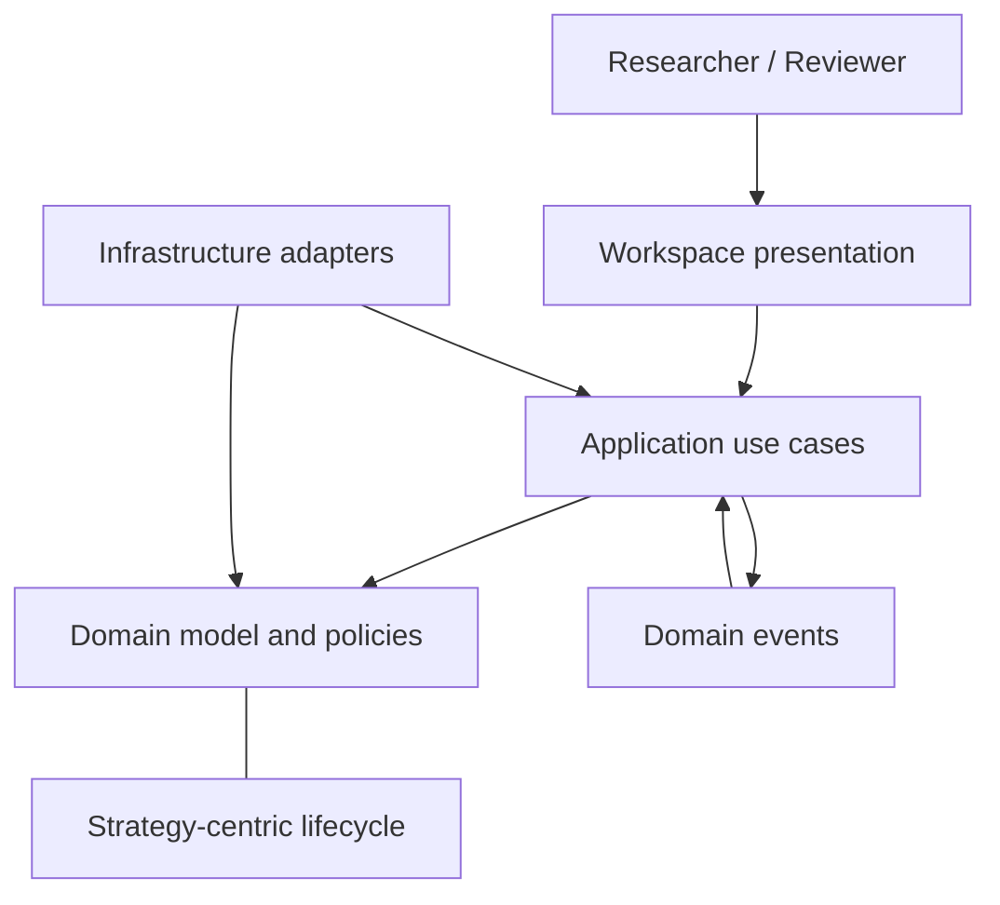
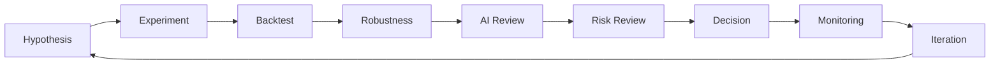

# AI Quant Research Workspace — Project Bible

> **Status:** Foundational · **Authority:** Single source of truth for product and engineering direction
> **Version:** 1.0 · **Last reviewed:** 2026-07-13

This document is the repository-level constitution. The detailed Architecture Bible defines the frozen product, domain, state, and runtime models. Accepted ADRs explain why engineering decisions were made. When documents conflict, use this order:

1. Accepted Architecture Bible chapters
2. This Project Bible
3. Accepted Architecture Decision Records
4. Slice documentation and operational guides
5. Existing implementation

Implementation that conflicts with a higher authority is migration work, not a reason to silently redefine the architecture.

## Vision

Create the operating system in which quantitative research moves from ideas to evidence and from evidence to governed decisions.

The product is an **AI Quant Research Workspace**. It is not a trading bot, stock prediction model, broker, or execution platform. Its value is the integrity of the research lifecycle: reproducible inquiry, deterministic validation, traceable evidence, explicit review, and controlled strategy evolution.

> **Research First. AI Second. Decisions Last.**

## Mission

Help quantitative researchers and reviewers:

- frame falsifiable hypotheses;
- design and reproduce experiments;
- evaluate strategies against benchmarks and robustness criteria;
- connect every conclusion to metrics, evidence, and source provenance;
- apply deterministic risk and governance policies;
- monitor live research assumptions without enabling autonomous execution; and
- preserve an auditable record of decisions, ownership, and lifecycle changes.

## Product positioning

| Category | Primary object | Primary outcome | This product |
|---|---|---|---|
| Trading platform | Order | Execution | No |
| Backtesting tool | Backtest run | Performance estimate | A capability, not the category |
| AI stock picker | Recommendation | Predicted selection | No |
| Research workspace | Strategy and evidence | Governed research decision | **Yes** |

AI Quant Research Workspace complements specialist market-data, backtesting, and portfolio systems. It provides the strategy-centric research record that connects them.

## Product DNA

### Quant before AI

Quantitative evidence is produced and validated before AI interpretation. An LLM may explain evidence; it cannot convert weak evidence into strong evidence.

### Deterministic before probabilistic

State transitions, risk limits, eligibility, validation gates, and guardrails are deterministic and testable. AI output is advisory and never overrides them.

### Evidence before conclusion

Every durable conclusion traces through metrics and evidence to a source. Data confidence and provenance are part of the conclusion, not footnotes.

### Lifecycle over snapshots

Research is a continuing sequence of hypothesis, experiment, validation, review, decision, monitoring, and iteration. History is preserved; terminal records are not rewritten.

## Frozen architecture

The runtime is a **modular monolith** designed with **Domain-Driven Design**, **Clean Architecture**, and **vertical slices**. It may use event-driven workflows internally, but bounded contexts remain deployable together until operational evidence justifies another topology.



### Bounded contexts

| Context | Responsibility | Aggregate roots |
|---|---|---|
| Research | Hypotheses, research programs, experiments, synthesis | Research |
| Validation | Validation runs and quantitative evaluation | ValidationRun, Evaluation |
| Governance | risk review, decisions, guardrails, audit | Refer to Domain Model and State Machine chapters |
| Portfolio | portfolio membership, exposure, health review | Portfolio |
| Market Intelligence | sourced market datasets and confidence | MarketDataset |

Strategy is the platform’s central domain identity and lifecycle concept. Each bounded context owns its records and contributes facts to the Strategy’s governed history; no context reaches into another context’s internals.

### Dependency rule

```text
Presentation → Application → Domain
Infrastructure ───────────→ Application / Domain ports
```

- Domain owns invariants, entities, value objects, policies, and domain events.
- Application owns use-case orchestration, transaction boundaries, and port coordination.
- Infrastructure owns adapters for persistence, providers, scheduling, messaging, and LLMs.
- Presentation owns transport and interaction concerns only.
- Bootstrap owns composition. Dependencies always point inward.

## Domain-Driven Design

Use the ubiquitous language from the Architecture Bible. Do not create synonyms for Strategy, Research, Hypothesis, Experiment, Backtest, Validation, Evaluation, Evidence, Review, Decision, Monitoring, Portfolio, Guardrail, Data Confidence, or Health Score without an ADR.

An aggregate is a consistency boundary, not a folder or API payload. Mutate it only through behavior that enforces its invariants. Reference other aggregates by stable identity, and coordinate multi-aggregate workflows in the Application layer. Publish facts as past-tense domain events after successful state changes.

## Vertical slice policy

A vertical slice delivers one named use case through the necessary boundaries. A slice should include, where applicable:

- command or query contract;
- application handler;
- domain behavior and invariants;
- required ports and adapters;
- presentation boundary;
- unit and boundary tests; and
- slice documentation or ADR updates.

A slice must not become a shortcut around bounded contexts or dependency direction.

## Workspace-first philosophy

The user works inside a persistent research context, not a collection of unrelated feature pages.

- Strategy provides continuity across research, validation, governance, portfolio, and monitoring.
- The workspace shows current lifecycle state, evidence quality, ownership, open risks, and the next legitimate action.
- Views may specialize for a task, but navigation and language preserve research context.
- Metrics and source evidence precede narrative interpretation.
- Empty, loading, stale, failed, and incomplete states are first-class.
- Accessibility and bilingual clarity are product quality, not polish.

## Research lifecycle



The canonical Strategy lifecycle is:

```text
Idea → Research → Validated → Paper Trading → Monitoring → Needs Review → Deprecated → Archived
                              Monitoring → Research
```

Transitions are business operations with explicit actors, evidence, guards, events, and audit records. CRUD status updates are prohibited.

## Development principles

1. **Architecture before convenience.** Respect boundaries even when a shortcut looks cheaper.
2. **Small, complete changes.** Prefer one reviewable outcome over broad partial scaffolding.
3. **Explicit state.** Model lifecycle and failure states; do not infer them from persistence accidents.
4. **Determinism at authority boundaries.** Financial metrics, gates, and risk policies are testable code.
5. **Ports at volatility boundaries.** Providers, databases, LLMs, schedulers, and transports remain replaceable.
6. **Evidence and observability.** Record provenance, correlation, outcome, and meaningful failure context.
7. **Secure by default.** Minimize access, validate boundaries, protect secrets, and avoid sensitive logs.
8. **Backward-compatible migration.** Maintain current behavior until an intentional cutover is tested and documented.
9. **Documentation ships with decisions.** Architecture and operational truth change with the code, not later.

## Engineering standards

### Code

- Prefer clear domain names over framework terminology.
- Keep functions focused and side effects at boundaries.
- Use strict typing and explicit contracts.
- Avoid global mutable state, hidden I/O, and time-dependent behavior without injected abstractions.
- Represent money, percentages, dates, identifiers, and confidence with deliberate types and units.
- Make retries idempotent and failures diagnosable.
- Comments explain constraints and decisions, not syntax.

### APIs and events

- Boundary contracts are stable, version-aware, and validated.
- Do not expose persistence models as public contracts.
- Events describe completed domain facts, carry stable identities, and support idempotent consumers.
- No client, scheduler, or agent bypasses Application use cases.

### Data and AI

- Preserve source, observation time, retrieval time, adjustment mode, transformations, and confidence.
- Separate raw evidence from derived metrics and generated interpretation.
- Store sufficient model, prompt, input, and output metadata for audit where AI output becomes durable.
- Never use LLM output as the sole evidence for validation, risk, or approval.

### Testing

- Domain tests cover invariants and transitions.
- Application tests cover orchestration and blocking conditions using fakes.
- Adapter tests cover external contracts and failure behavior.
- Integration tests cover critical boundaries; end-to-end tests cover only essential journeys.
- Tests are deterministic, isolated, and readable as behavioral specifications.

## Definition of Done

A change is done only when:

- its user or engineering outcome and acceptance criteria are satisfied;
- architecture and bounded-context ownership are respected;
- relevant success, failure, authorization, and state-transition paths are tested;
- formatting, type, lint, test, and build checks appropriate to the change pass;
- security, privacy, data provenance, accessibility, and operability were considered;
- documentation, diagrams, contracts, and ADRs are current;
- no secrets, generated caches, unrelated edits, or silent behavior changes are included;
- migration and rollback considerations are stated where applicable; and
- a reviewer can understand why the change exists and how it was verified.

## Project constitution

The following clauses are non-negotiable without a superseding accepted ADR and an Architecture Bible review:

1. The product remains a research workspace, not an execution system.
2. Strategy remains the central lifecycle concept.
3. Quantitative evidence precedes AI interpretation.
4. Deterministic validation and governance cannot be overridden by AI.
5. Domain rules remain independent of UI, HTTP, databases, schedulers, and LLM providers.
6. Bounded contexts own their data and behavior.
7. Business transitions are explicit, guarded, event-producing, and auditable.
8. Every durable conclusion is traceable to evidence and source.
9. Human accountability remains visible for review and decisions.
10. Architecture may evolve only through recorded, reviewed decisions—not accidental coupling.

## Open-source governance

Repository collaboration is evidence-based and human-accountable:

- structured issues define problems, outcomes, scope, and acceptance criteria;
- pull requests disclose architecture impact, verification, risk, and rollback;
- CODEOWNERS routes review but never replaces independent judgment;
- accepted ADRs preserve decision history rather than rewriting it;
- the Code of Conduct governs participation and enforcement;
- security findings use private coordinated disclosure; and
- the changelog distinguishes unreleased work from published releases.

Maintainers may delegate review and triage as the community grows. Changes to product constitution or frozen architecture still require explicit architecture ownership regardless of contributor role.

## Canonical references

- [Chapter 1 — Product Vision](Architecture-Bible/Chapter-01-Vision.md)
- [Chapter 2 — Domain Model](Architecture-Bible/Chapter-02-Domain-Model.md)
- [Chapter 3 — State Machines](Architecture-Bible/Chapter-03-State-Machine.md)
- [Chapter 4 — Runtime Architecture](Architecture-Bible/Chapter-04-Runtime-Architecture.md)
- [Appendix A — Information Architecture](Architecture-Bible/Appendix-A-Information-Architecture.md)
- [Architecture Decision Records](adr/README.md)
- [Engineering roadmap](../ROADMAP.md)
- [Repository structure](../PROJECT_STRUCTURE.md)
- [Contribution guide](../CONTRIBUTING.md)
- [Style guide](STYLE_GUIDE.md)
- [Code of Conduct](../CODE_OF_CONDUCT.md)
- [Security policy](../SECURITY.md)
- [Changelog](../CHANGELOG.md)
- [License](../LICENSE)
