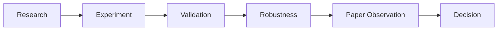

# Research Workflow

Product spine used by the Research Workspace:

Navigation uses workspace tabs. URL `?tab=evaluation` maps to Validation for compatibility. Copilot remains a supporting tool, not a spine stage.

---

## Research

**Purpose:** define what is being studied.

Typical content:

- research question and hypothesis
- objective and ownership metadata
- configured symbol, windows, costs (protocol inputs)

No calculated performance belongs here until execution succeeds.

---

## Experiment

**Purpose:** run or review the historical protocol.

In the current runtime, the executable template is the MA crossover research definition. Historical metrics come from `POST /api/v1/research/execution` using live provider data.

If execution has not run or the provider fails, the UI shows honest empty/error states — never substitute numbers.

---

## Validation

**Purpose:** apply deterministic checks to execution evidence.

Backend: `POST /api/v1/research/validation`.

Includes chronological out-of-sample evidence, bounded parameter/cost sensitivity, and data-quality checks. Outcomes are completed / incomplete / failed / unavailable based on real results.

A related **evaluation** endpoint (`POST /api/v1/research/evaluation`) summarises validation evidence for governance display. It does not recalculate metrics or issue trading recommendations.

---

## Robustness

**Purpose:** organise robustness work after Validation.

The Robustness Center is an **evidence review**. It shows four implemented checks from Validation / Evaluation: parameter sensitivity, benchmark comparison, transaction-cost stress, and data quality.

Regime analysis, rolling walk-forward validation, Monte Carlo analysis, and liquidity/capacity modelling are disclosed separately as scope boundaries. They are not executable checklist items and are never counted as completed evidence.

---

## Paper Observation

**Purpose:** record a bounded forward-observation process after Robustness.

When the implemented evidence is complete, a reviewer can create a browser-local session with cadence, minimum duration, and explicit exit criteria. The reviewer can then append dated notes and close the session.

It is not a broker terminal and never invents fills, positions, trades, returns, or P&L.

---

## Decision

**Purpose:** preserve the human judgment after evidence review.

The Decision Center lists evidence readiness, incomplete implemented checks, and review checklist state. A reviewer selects Advance, Hold, or Reject and writes the rationale; that record is stored in browser-local storage.

The system never generates an approval outcome.

---

## Archive action

**Purpose:** remove a finished browser-local research thread from the active library.

Archive is an action in the research header, not a lifecycle content tab. Cross-browser durable archival and server-side lineage remain outside the current implementation.

---

## Related backend slices

| Stage | Backend slice | Notes |
| --- | --- | --- |
| Experiment / Research execution | `/api/v1/research/execution` | Real historical calculation |
| Validation | `/api/v1/research/validation` | Deterministic evidence |
| Evaluation summary | `/api/v1/research/evaluation` | Folded into Validation UX |
| Copilot | `/api/v1/research/copilot/query` | Interpretation only |

Slice notes live under [`docs/slices/`](slices/).
