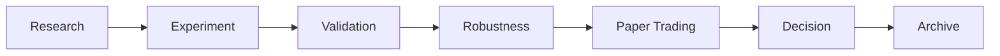

# Research Workflow

Product spine used by the Research Workspace:

Navigation uses workspace tabs. URL `?tab=evaluation` maps to Validation for compatibility. Copilot remains a supporting tool, not a spine stage.

---

## Research

**Purpose:** define what is being studied.

Typical content:

- research question and hypothesis
- objective and ownership metadata
- configured symbol, windows, costs (protocol inputs)

No calculated performance belongs here until execution succeeds.

---

## Experiment

**Purpose:** run or review the historical protocol.

In the current runtime, the executable template is the MA crossover research definition. Historical metrics come from `POST /api/v1/research/execution` using live provider data.

If execution has not run or the provider fails, the UI shows honest empty/error states — never substitute numbers.

---

## Validation

**Purpose:** apply deterministic checks to execution evidence.

Backend: `POST /api/v1/research/validation`.

Includes chronological out-of-sample evidence, bounded parameter/cost sensitivity, and data-quality checks. Outcomes are completed / incomplete / failed / unavailable based on real results.

A related **evaluation** endpoint (`POST /api/v1/research/evaluation`) summarises validation evidence for governance display. It does not recalculate metrics or issue trading recommendations.

---

## Robustness

**Purpose:** organise robustness work after Validation.

The Robustness Center is a **management view**. Status for supported checks comes from existing Validation / Evaluation evidence. Unimplemented stress/regime/capacity work stays **Planned**.

It does not run a separate stress engine in the current demo path.

---

## Paper Trading

**Purpose:** observation staging after Robustness.

The Paper Trading / Research Deployment Center shows eligibility and an observation plan derived from existing evidence. If no real paper session exists, the session area stays empty.

It is not a broker terminal and must not invent fills, positions, or session P&L.

---

## Decision

**Purpose:** approval staging after Paper Trading.

The Decision Center lists evidence readiness, remaining risks implied by incomplete robustness coverage, and checklist state. Status stays Not Started / Pending until Validation exists.

It never invents Approved or Rejected without lifecycle evidence.

---

## Archive

**Purpose:** close a finished research thread.

Archive preserves definition, evidence, and decision provenance. When no archived session exists, the UI states that plainly (placeholder / deferred capabilities where still unfinished).

---

## Related backend slices

| Stage | Backend slice | Notes |
| --- | --- | --- |
| Experiment / Research execution | `/api/v1/research/execution` | Real historical calculation |
| Validation | `/api/v1/research/validation` | Deterministic evidence |
| Evaluation summary | `/api/v1/research/evaluation` | Folded into Validation UX |
| Copilot | `/api/v1/research/copilot/query` | Interpretation only |

Slice notes live under [`docs/slices/`](slices/).
