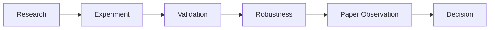

# Research Workflow

Product spine used by the Research Workspace:

```mermaid
flowchart LR
  R[Research] --> E[Experiment]
  E --> V[Validation]
  V --> Rb[Robustness]
  Rb --> P[Paper Observation]
  P --> D[Decision]
```

Navigation uses workspace tabs. URL `?tab=evaluation` maps to Validation for compatibility. Copilot and the Quant Research Governance Agent remain supporting tools, not spine stages. The Agent supports the lifecycle; it does not replace Experiment, Validation, Robustness, Paper, or Decision.

---

## Research

**Purpose:** define what is being studied.

Typical content:

- research question, falsifiable hypothesis, and null hypothesis
- mechanism / rationale
- research-type-specific primary benchmark
- pre-committed success and failure criteria
- required validation and known limitations
- objective and ownership metadata
- configured symbol, windows, costs (protocol inputs)

No calculated performance belongs here until execution succeeds.

The Research Guidance panel starts from deterministic editable templates and
saves user changes in the current browser. The optional AI Reviewer can draft a
definition, review the hypothesis, propose inactive success criteria, or
identify missing steps. Each result remains a separate unsaved card until the
researcher chooses Apply or Edit. AI proposals never choose a threshold or
activate themselves.

---

## Experiment

**Purpose:** run or review the historical protocol.

In the current runtime, executable templates are:

- **Trend Following** — MA crossover; historical metrics from `POST /api/v1/research/execution` / `.../validation`
- **Cross-Sectional Momentum / Low Volatility** — RankIC + quantile portfolios from `POST /api/v1/research/factor-validation`

Both use live provider data through MarketDataRouter. Metrics are never fabricated in the UI.

If execution has not run or the provider fails, the UI shows honest empty/error states — never substitute numbers.

### Benchmark framework

- Trend Following uses same-asset **Buy and Hold** over the identical price
  series and aligned period. Cash / zero return is a secondary reference only.
- Cross-Sectional Factor research uses the **Equal-Weight Universe** as the
  primary benchmark, with zero RankIC and zero long-short spread as validation
  baselines.
- Low Volatility is normalized as `-realized_volatility`, so Q5 always means the
  strongest expected factor exposure and Q1 the weakest.

Every benchmark verdict is `Pass`, `Partial`, `Fail`, `Inconclusive`, or
`Unavailable`. It retains observed values, configured thresholds, explanations,
and evidence sources; there is no opaque score.

---

## Validation

**Purpose:** apply deterministic checks to execution evidence.

Backend: `POST /api/v1/research/validation`.

Includes chronological out-of-sample evidence, bounded parameter/cost sensitivity, and data-quality checks. Outcomes are completed / incomplete / failed / unavailable based on real results.

A related **evaluation** endpoint (`POST /api/v1/research/evaluation`) summarises validation evidence for governance display. It does not recalculate metrics or issue trading recommendations.

---

## Robustness

**Purpose:** organise robustness work after Validation.

The Robustness Center is an **evidence review**. It shows four implemented checks from Validation / Evaluation: parameter sensitivity, benchmark comparison, transaction-cost stress, and data quality.

Regime analysis, rolling walk-forward validation, Monte Carlo analysis, and liquidity/capacity modelling are disclosed separately as scope boundaries. They are not executable checklist items and are never counted as completed evidence.

---

## Paper Observation

**Purpose:** record a bounded forward-observation process after Robustness.

When the implemented evidence is complete, a reviewer can create a browser-local session with cadence, minimum duration, and explicit exit criteria. The reviewer can then append dated notes and close the session.

It is not a broker terminal and never invents fills, positions, trades, returns, or P&L.

---

## Decision

**Purpose:** preserve the human judgment after evidence review.

The Decision Center lists each deterministic check as pass / fail /
inconclusive / unavailable, then presents a transparent suggested decision.
Mixed or missing core evidence defaults to Hold; blocking failures or uniformly
failed available core evidence can suggest Reject; complete passing core
evidence with completed robustness can suggest Promote.

A reviewer still selects Promote, Hold, Reject, or Archive and writes the
rationale. If the human outcome differs from the suggestion, the override is
stored explicitly with the reviewer, note, benchmark verdict, timestamp, and
evidence snapshot reference. Each save appends a record. A later validation run
marks the prior record as old; it never silently rewrites historical decisions.

Promote means “advance to the next controlled research or paper-observation
stage.” It never means deploy capital or send orders. Archive is a lifecycle /
relevance action and is not equivalent to Reject.

## Separation of authority

1. **Deterministic evidence** — code calculates returns, benchmark comparisons,
   RankIC, costs, validation checks, and readiness inputs.
2. **Research guidance** — templates or an optional LLM help frame the question,
   explain evidence, and identify missing work.
3. **Human decision** — the researcher records the final lifecycle outcome.

The LLM is never called by the calculation engine and cannot fabricate metrics,
alter evidence, approve research, or issue buy / sell recommendations.

---

## Archive action

**Purpose:** remove a finished browser-local research thread from the active library.

Archive is an action in the research header, not a lifecycle content tab. Cross-browser durable archival and server-side lineage remain outside the current implementation.

---

## Related backend slices

| Stage | Backend slice | Notes |
| --- | --- | --- |
| Experiment / Research execution | `/api/v1/research/execution` | Real historical calculation |
| Validation | `/api/v1/research/validation` | Deterministic evidence |
| Evaluation summary | `/api/v1/research/evaluation` | Folded into Validation UX |
| Definition guidance | `/api/v1/research/guidance/definition` | Deterministic template; optional constrained LLM |
| AI Reviewer | `/api/v1/research/reviewer/*` | Four focused strict-JSON interpretation actions |
| Copilot | `/api/v1/research/copilot/query` | Interpretation only |
| Governance Agent | `/api/v1/research/agent/runs` | Controlled LangGraph workflow + human approval |

Slice notes live under [`docs/slices/`](slices/).
