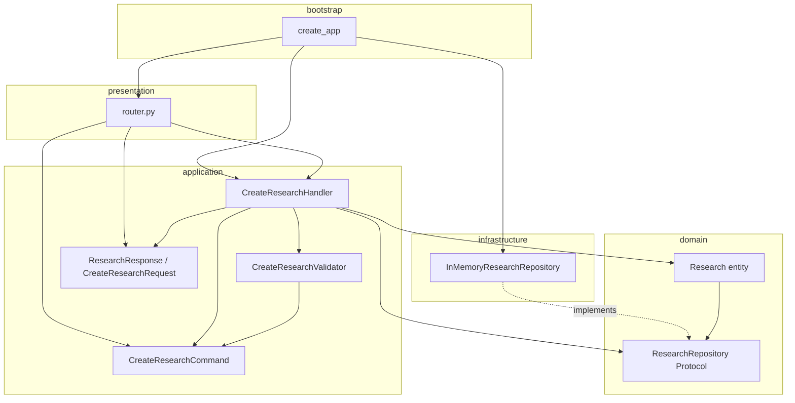
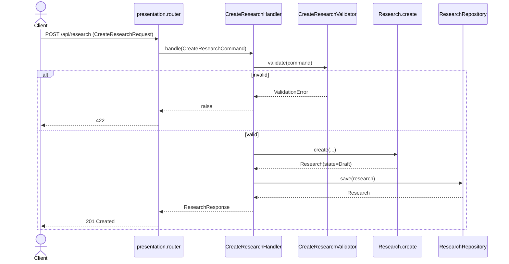

# Slice: Research / CreateResearch

First vertical slice of the modular monolith. Coding standard for all future use cases.

## 1. Folder tree

```text
apps/api/
├── pytest.ini
├── src/
│   ├── bootstrap/
│   │   ├── __init__.py
│   │   └── create_app.py
│   ├── modules/
│   │   └── research/
│   │       ├── domain/
│   │       │   ├── research.py              # Entity + ResearchState
│   │       │   └── repository.py            # ResearchRepository port
│   │       ├── application/
│   │       │   ├── commands/
│   │       │   │   ├── create_research_command.py
│   │       │   │   ├── create_research_validator.py
│   │       │   │   └── create_research_handler.py
│   │       │   └── dto/
│   │       │       └── research_dto.py
│   │       ├── infrastructure/
│   │       │   └── repositories/
│   │       │       └── in_memory_research_repository.py
│   │       └── presentation/
│   │           └── router.py                # POST /api/research
│   └── shared/
│       └── errors/
│           └── domain_error.py
└── tests/
    ├── unit/research/test_create_research.py
    └── integration/research/test_create_research_api.py
```

## 2. Dependency graph



Allowed dependencies: `presentation → application → domain ← infrastructure`.  
Forbidden: domain importing FastAPI/Pydantic HTTP models; application importing concrete repositories.

## 3. Sequence diagram



## 4. Test coverage checklist

| Layer | Case | Status |
|-------|------|--------|
| Domain | CreateResearch yields `Draft` | Covered |
| Domain | Blank title / objective / owner rejected | Covered |
| Application | Validator rejects oversized title | Covered |
| Application | Handler persists and maps DTO | Covered |
| Application | Invalid command never hits repository | Covered |
| Infrastructure | In-memory save/get used by handler & API | Covered (via handler/API) |
| Presentation | POST 201 happy path | Covered |
| Presentation | POST 422 empty title (Pydantic) | Covered |
| Presentation | POST 422 unknown fields (`extra=forbid`) | Covered |
| Out of scope | State transitions beyond Draft | Not in this slice |
| Out of scope | Postgres adapter | Stub only |

Run:

```bash
cd apps/api && python -m pytest -q
```

## 5. ADR notes

See [ADR-0005](../adr/ADR-0005-create-research-vertical-slice.md) and [ADR-0006](../adr/ADR-0006-research-initial-state-draft.md).
